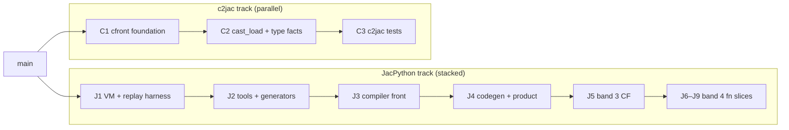

# PR split plan for #6973 (`jac-python`)

Generated: 2026-08-18. Branch workspace: `jac-python` at `fbf0e899b`.

This document is planning-only. No split branches have been pushed and no child PRs have been opened.

---

## 1. Current state

| Item | Value |
|------|--------|
| PR | [#6973](https://github.com/jaseci-labs/jac/pull/6973) — `feat(jac-py): band-3 control flow with parser and codegen fixes` (**title stale**; branch now through Band 7) |
| State | **OPEN**, GitHub `mergeable`: **CONFLICTING**, `mergeStateStatus`: **DIRTY** |
| Base / head | `main` ← `jac-python` |
| Remote PR head | `origin/jac-python` = `243b0e649` (`feat(jac-py): band-7 await`) |
| Local `HEAD` | `fbf0e899b` (**1 commit ahead** of `origin/jac-python`) |
| `origin/main` | `454ac3d8f` |
| Merge-base (`main` ∩ branch) | `1b579d109` |
| Commits on branch vs `main` | **265** local / **264** on remote |
| Diff vs `main` (remote head) | **415 files**, **+85,311 / −299** |
| Diff vs `main` (local `HEAD`) | **415 files**, **+85,681 / −299** (+370 lines vs remote) |
| pre-commit.ci | **ERROR** — mergeable check fails (`CONFLICTING` with `main`) |
| CODEOWNERS / PRODUCTOWNERS | Not present in repo — split by **product boundary** (jac-py vs c2jac vs jaclang core) |

### Compiler band status (local `jac-python`)

| Band | Scope | Status |
|------|-------|--------|
| **3** | Control flow (if/while/for/comprehensions) | **Committed** (`38ceb1607` and earlier) |
| **4** | Functions (thin → closures → defaults → `*args`/`**kwargs` → decorators → `CALL_KW`) | **Committed** (8 logical slices; see `TODO.md`) |
| **5** | Imports, classes, mangling, inheritance | **Committed** (`ff4014135`) |
| **6** | try/except, raise, except-as, try/finally, with, assert | **Committed** (6 slices + learnings doc) |
| **7** | `yield`, `yield from`, `async def`, `await` | **Committed** (`8e80c7792` … `243b0e649`) |
| **7** | `async for` | **Dirty tree only** (slice 5; 13 modified `jac-py/` files) |

See `PROGRESS.md` for gate status, parser drift, and blockers on the dirty tree.

### File-area breakdown (full PR, `origin/main…fbf0e899b`)

| Area | Files | Notes |
|------|-------|--------|
| `jac-py/` | **64** (~55k insertions) | Entire JacPython tree; **does not exist on `main`** |
| `jac/jaclang/compiler/c2jac` + `cfront` + `vendor/pcpp` | **38** (~11k insertions) | c2jac transpiler foundation |
| `jac/jaclang/` (other) + `jac/tests/` | ~313 | c2jac tests, type-facts, jac2c, jaclang core sync |
| CI / config | ~10 | `.github/workflows/ci.yml`, `jac.toml`, `.jacignore`, etc. |
| docs / release notes | small | Band slice learnings, `6973` / `7447` release-note fragments |

**Key insight:** `jac-py/` has **zero** references to `c2jac`, `cfront`, or `cast_load`. The megapr is a **historical branch merge**, not a hard compile-time dependency.

### Local unpushed commit (1)

| Commit | Message | Scope |
|--------|---------|-------|
| `fbf0e899b` | fix(jac-py): parse and raise assert messages with string literals | **jac-py** — `tokenizer.jac`, `parser_actions.jac`, `parser.jac`, `pyc_first.jac`, `grammar2jac.py` (+385 / −15 vs `origin/jac-python`) |

### Uncommitted working tree (Band 7 `async for` — not on any commit)

| File | Role |
|------|------|
| `jac-py/jacpython/compiler_codegen.jac` | `async for` CFG lowering |
| `jac-py/jacpython/compiler_slice.jac` | Oracle tests for async-for slice |
| `jac-py/jacpython/compiler_ir.jac`, `compiler_symtable.jac`, `flowgraph.jac` | Supporting compiler plumbing |
| `jac-py/jacpython/layer9_product_exec.jac`, `layer_vm_conformance.jac` | Product / VM conformance gates |
| `jac-py/jacpython/objects.jac`, `opcode_meta.jac`, `pyc_first.jac` | VM async-for opcodes (`GET_AITER`, `GET_ANEXT`, `END_ASYNC_FOR`) |
| `jac-py/jacpython/parser.jac` | **Regeneration** (large diff vs index; overlaps `fbf0e899b` drift) |
| `jac-py/tools/grammar2jac.py`, `vm_opcode_fixtures.py` | Generator / fixture registry sync |

Dirty-tree delta: **13 files**, **+1,580 / −965** vs `HEAD`. Known reds on dirty tree: `grammar2jac.py --check`, `vm_opcode_fixtures.py --check` (`LOAD_FAST`, `NOT_TAKEN` missing); `compiler_slice.jac` blocked by `ExceptHandler` import gap in `parser.jac` (see `PROGRESS.md`).

### Recoverable snapshot (Aug 16 dirty tree)

```text
refs/backup/pre-split-20260816  →  66762f4a9e825ad96f70748d30f02373f669c3f0
```

Restore pattern (does not touch working tree until you apply):

```bash
git stash apply 66762f4a9e825ad96f70748d30f02373f669c3f0
# or: git checkout 66762f4a9 -- <paths>
```

### Suggested split units for review (Aug 18, based on actual commits)

Path export from current tree (`git checkout jac-python -- <paths>`), not cherry-pick of all 265 commits. Group by product boundary:

**JacPython track** (stack on `main`; no c2jac paths):

| Unit | Commits / anchor | Export scope (indicative) |
|------|------------------|---------------------------|
| **J-bootstrap** | Through `38ceb1607` + `6de661cb9`, `7e94a5b78`, `53bbc7706` | VM (`objects.jac`, `pyc_first.jac`, `ceval_slice.jac`), tools/generators, parser infra, symtable/validate, CFG codegen through Band 3, `jac-py-gates` CI |
| **J-band-4** | `7e94a5b78` … `89320d8e6`, `e573b5857`, `f6efa3cdf` | Function-band slices (thin → `CALL_KW`); `vm_opcode_fixtures.py` closure opcodes |
| **J-band-5** | `ff4014135`, `fe9ccd2f5` | Classes, imports, mangling; `BAND5_SLICE_LEARNINGS.md` |
| **J-band-6** | `2094513ce` … `21111b1ab`, `2d0b49b04` | Exceptions, with, assert; `BAND6_SLICE_LEARNINGS.md` |
| **J-band-7** | `8e80c7792` … `243b0e649`, `fbf0e899b` (+ dirty async-for when green) | Generators, async def/await, assert string-literal fix; async-for slice last |

**c2jac track** (parallel to JacPython; resolve conflict hotspots per PR):

| Unit | Commits / anchor | Export scope (indicative) |
|------|------------------|---------------------------|
| **C-foundation** | Early c2jac history through pcpp vendor | `jac/jaclang/compiler/cfront/**`, `c2jac/**`, `vendor/pcpp/**`, CLI transform hooks |
| **C-cast-load** | cast_load / type-facts / ownership passes | `cast_load_pass*`, `type_facts_pass*`, `ownership_facts_pass*`, type registry |
| **C-tests** | c2jac test suites | `jac/tests/compiler/c2jac/**`, related pass tests |
| **C-sync** | `04d2b31c2`, `2f954d9e7` | `jir_registry.jac`, langserve, k8s target, parser backtrack / CPython bridge — **isolate from jac-py PRs** |

**Pragmatic collapse options:** J-bootstrap + J-band-4 as one ~64-file jac-py PR; or single jac-py export through Band 6 (~64 files, still zero c2jac conflict files). Band 7 and async-for can land as a follow-on stack after stabilization.

---

## 2. Why #6973 is stuck

1. **Merge conflicts with `main`** in **36** shared jaclang / CI / config files (not in `jac-py/`).
2. pre-commit.ci runs a mergeable check against `main`; with `CONFLICTING`, the job errors before hooks run.
3. **Review surface** (~77k additions, 242 commits) mixes two products: **JacPython** and **c2jac/jac2c**.
4. **Local commit hygiene**: unpushed `04d2b31c2` couples c2jac sync to a “band 3” message.

### Conflict hotspots (`git merge-tree` vs `origin/main`)

All **36** paths are outside `jac-py/`:

```text
.github/workflows/ci.yml
.gitignore
.jacignore
jac.toml
jac/jac.toml
jac/jaclang/cli/commands/impl/project.impl.jac
jac/jaclang/cli/commands/impl/tools.impl.jac
jac/jaclang/cli/commands/impl/transform.impl.jac
jac/jaclang/cli/docs/internals/compiler_architecture.md
jac/jaclang/cli/docs/reference/cli/index.md
jac/jaclang/compiler/passes/main/layout_pass.jac
jac/jaclang/compiler/passes/main/impl/layout_pass.impl.jac
jac/jaclang/compiler/passes/main/pyast_load_pass.jac
jac/jaclang/compiler/passes/main/impl/pyast_load_pass.impl.jac
jac/jaclang/compiler/passes/native/na_ir_gen_pass.impl/vtable.impl.jac
jac/jaclang/compiler/passes/tool/doc_ir_gen_pass.jac
jac/jaclang/compiler/passes/tool/impl/doc_ir_gen_pass.impl.jac
jac/jaclang/compiler/passes/tool/normalize_pass.jac
jac/jaclang/compiler/passes/tool/impl/normalize_pass.impl.jac
jac/jaclang/compiler/type_system/type_evaluator.impl/construct_types.impl.jac
jac/jaclang/compiler/type_system/type_evaluator.impl/type_evaluator.impl.jac
jac/jaclang/jac0core/codeinfo.jac
jac/jaclang/jac0core/constant.jac
jac/jaclang/jac0core/diagnostics.jac
jac/jaclang/jac0core/impl/compiler.impl.jac
jac/jaclang/jac0core/impl/unitree.impl.jac
jac/jaclang/jac0core/jir.jac
jac/jaclang/jac0core/modresolver.jac
jac/jaclang/jac0core/parser/impl/parser.impl.jac
jac/jaclang/jac0core/passes/impl/pyast_gen_pass.impl.jac
jac/jaclang/jac0core/passes/pyast_gen_pass.jac
jac/jaclang/jac0core/unitree.jac
jac/jaclang/jac.spec
jac/jaclang/langserve/impl/engine.impl.jac
jac/jaclang/scale/deploy/target/kubernetes/target.jac
jac/launcher/payload.zig
```

Resolving these once per **c2jac track** PR is unavoidable. Resolving them inside a 408-file umbrella makes every JacPython iteration wait on unrelated c2jac conflict resolution.

---

## 3. Recommendation: close #6973 as umbrella; split into two parallel tracks

| Option | Verdict |
|--------|---------|
| Keep #6973, rebase once, land everything | **Reject** — review and CI remain blocked by unrelated c2jac mass; conflicts recur on every `main` advance |
| Keep #6973, mark draft, land only via split children | **Acceptable** — use #6973 as tracking issue / meta-PR description, but **do not merge it** |
| Close #6973; open focused PRs from `main` | **Preferred** — independent review, parallel c2jac vs jac-py velocity |

**Stack PRs only where dependency is real.** JacPython compiler phases are genuinely stacked; c2jac and jac-py are **not**.



---

## 4. Ordered PR slices

### Track A — JacPython (base: `main`, then stack)

Use **path-filtered export** from current tree (`git checkout jac-python -- jac-py/…` plus minimal config), not replay of all 242 commits. Stage **named paths only** (never `git add -A`).

| # | Title | Base | File scope (indicative) | Status on current branch |
|---|--------|------|-------------------------|---------------------------|
| **J1** | `feat(jac-py): VM runtime, objects, and host-oracle replay harness` | `main` | `jac-py/jacpython/objects.jac`, `pyc_first.jac`, `ceval_slice.jac`, `layer0_replay.jac`, `layer2_unittest.jac`, `layer3_import.jac`, `jac-py/tests/na_cliffs/**`, `jac-py/tools/na_concat.py`, `fetch_cpython_reference.py` | **Committed** (early jac-py history through P3.x VM work) |
| **J2** | `feat(jac-py): pinned CPython token/ASDL/opcode generators` | `main` or J1 | `jac-py/tools/tokens2jac.py`, `asdl2jac.py`, `opcode_meta2jac.py`, `test_*.py`, generated `token_model.jac`, `ast_nodes.jac`, `opcode_meta.jac`, `layer5_token_model.jac` | **Committed** |
| **J3** | `feat(jac-py): parser infra — tokenizer, PEG runtime, grammar pipeline` | J2 | `tokenizer.jac`, `peg_runtime.jac`, `grammar2jac.py`, `action_translate.py`, `parser_actions.jac`, `layer5_tokenizer.jac`, `layer6_peg_runtime.jac`, `layer7_parser_expr.jac` (expr-only parser subset if splitting parser) | **Committed** (parser grows in later PRs) |
| **J4** | `feat(jac-py): validation, symtable, compiler diagnostics` | J3 | `compiler_validate.jac`, `compiler_symtable.jac`, `compiler_diagnostics.jac`, `compiler_validate` / `compiler_symtable` / `layer4_compile.jac` tests | **Committed** |
| **J5** | `feat(jac-py): CFG codegen, flowgraph verify, assembler, product_compile` | J4 | `compiler_codegen.jac` (pre-control-flow), `compiler_ir.jac`, `flowgraph.jac`, `assembler.jac`, `product_compile.jac`, `host_oracle.jac`, `pycode_diff.jac`, `layer_flowgraph_verify.jac`, `layer8_product_expr.jac`, `layer9_product_exec.jac` (expr band only), `compiler_slice.jac` (pre-fn), `vm_opcode_fixtures.py` | **Committed** through `38ceb1607` partial; extended in unpushed `6de661cb9`, `7e94a5b78` |
| **J6** | `feat(jac-py): band-3 control flow (if/while/for/comprehensions)` | J5 | `layer10_product_controlflow.jac`, control-flow regions in `compiler_codegen.jac`, `parser.jac` regen for stmt grammar, `tokenizer.jac`, `parser_actions.jac`, CI path already in `ci.yml` | **Committed** at `38ceb1607`; **extended** unpushed `6de661cb9`, `7e94a5b78` |
| **J7** | `feat(jac-py): band-4 thin functions` | J6 | `compiler_codegen.jac`, `compiler_symtable.jac`, `compiler_slice.jac`, `layer9_product_exec.jac`, parser tweaks for `def` | **Uncommitted** (dirty tree) |
| **J8** | `feat(jac-py): band-4 recursion` | J7 | Same files, recursion oracle only | **Uncommitted** |
| **J9** | `feat(jac-py): band-4 lambdas` | J8 | Same files + lambda parser actions | **Uncommitted** |
| **J10** | `feat(jac-py): band-4 closures` | J9 | Same files + `vm_opcode_fixtures.py`, `layer_vm_conformance.jac`, `opcode_meta.jac` closure opcodes | **Uncommitted** + fixture gate fixes |
| **J-CI** | `ci(jac-py): jac-py-gates job and path filters` | **With J1** (minimal) or J5 (full gate list) | `.github/workflows/ci.yml` (`jac-py-gates` job), `jac.toml` / `jac/jac.toml` / `.jacignore` entries for `jac-py/**` | **Committed** (`2e3136c3e` + `38ceb1607` tweak) |

**CI note:** Today `jac-py-gates` runs the **full** gate ladder (through `layer10`). Options:

- Land **J-CI** with J5/J6 when all prior layers exist on the branch, **or**
- Split the workflow into `jac-py-vm-gates` vs `jac-py-compiler-gates` jobs (extra work, smaller early PRs).

**Pragmatic shortcut:** If review time matters less than merge latency, collapse J1–J6 into **one** `feat(jac-py): bootstrap VM + native compiler through band 3` PR (~61 files, no c2jac) — still **~10× smaller** than #6973 and **zero** of the 36 conflict files.

### Track B — c2jac / jac2c (base: `main`, parallel to Track A)

| # | Title | Base | File scope (indicative) | Status |
|---|--------|------|-------------------------|--------|
| **C1** | `feat(c2jac): cfront transpiler foundation + vendored pcpp` | `main` | `jac/jaclang/compiler/cfront/**`, `jac/jaclang/compiler/c2jac/**`, `jac/jaclang/vendor/pcpp/**`, CLI transform hooks | **Committed** |
| **C2** | `feat(c2jac): cast_load pass + jac2c type/ownership facts` | C1 | `cast_load_pass*`, `type_facts_pass*`, `ownership_facts_pass*`, `type_registry.jac`, `type_evaluator` tweaks | **Committed** + unpushed `04d2b31c2` |
| **C3** | `test(c2jac): lift/emit oracle suites` | C2 | `jac/tests/compiler/c2jac/**`, `jac/tests/compiler/passes/**`, `jac/tests/compiler/test_type_registry.jac` | **Committed** |
| **C4** | `chore(jaclang): jir_registry / langserve / k8s sync from c2jac` | C2 | `jir_registry.jac`, `gen_jir_registry.jac`, `langserve`, `scale/deploy`, `registry.impl.jac` deletion | **Partially** in unpushed `04d2b31c2` — **isolate here**, not on jac-py branches |

Each C-track PR must resolve its subset of the **36 conflict files** against current `main`.

---

## 5. Rebase / conflict resolution strategy

### If continuing on `jac-python` temporarily

1. **Do not push** `04d2b31c2` / `6de661cb9` / `7e94a5b78` until reordered onto correct tracks.
2. `git fetch origin && git rebase origin/main` on a **throwaway** branch first; catalog conflict resolutions.
3. For each conflict file, prefer **`origin/main` + re-apply branch intent** for c2jac files; for files only touched by mistake (e.g. `jir_registry` on a band-3 commit), take **main** and move work to C4.
4. After rebase, run `jac-py-gates` locally (venv `jac`) before pushing.
5. pre-commit.ci should pass once GitHub reports `mergeable: MERGEABLE`.

### If executing the split (recommended)

1. Leave `jac-python` and backup ref as archive; work from fresh branches off `origin/main`.
2. For each slice: `git switch -c slice-name origin/main` → `git checkout jac-python -- <paths>` → stage **only** planned paths → commit → push.
3. Resolve the **36 conflicts** incrementally per C-track PR (smaller surface than monolith).
4. JacPython slices avoid those 36 files until J-CI (only `ci.yml` / toml / ignore).

### Merge commits in history

Five merge commits from `main` / `jac2c-value-arch-alias-divergence` inflate diff noise. Split export **ignores** commit boundaries — desirable.

---

## 6. Band 4: commit order before new PRs

On top of J6 (or collapsed bootstrap PR), before opening J7–J10:

1. **Regenerate `parser.jac`** — already in dirty tree; verify `python3 jac-py/tools/grammar2jac.py --check`.
2. **Extend `vm_opcode_fixtures.py`** (+ tests + `layer_vm_conformance.jac` markers) for closure opcodes.
3. **Commit slices separately** (thin → recursion → lambdas → closures) per `TODO.md` / `PROGRESS.md` — matches reviewable units.
4. Add release-note fragments per PR (CI `check-release-notes.sh`).

---

## 7. What to do with PR #6973

| Action | Detail |
|--------|--------|
| Update PR description | Point to this file and list child PR URLs as they open |
| Convert to draft | Optional — stops accidental merge |
| Close when J6 + C3 (or collapsed equivalents) are open | Link children in closing comment |
| Do **not** force-push `jac-python` to “fix” #6973 | Use new branch names (`jac-py/bootstrap`, `c2jac/foundation`, etc.) |

---

## 8. Recommended next actions (user)

1. **Approve split plan** (full J1–J10 + C1–C4 vs collapsed jac-py bootstrap).
2. **Preserve dirty Band 4** — backup already at `refs/backup/pre-split-20260816` (`66762f4a9`).
3. **Fix local gates** on dirty tree: `grammar2jac --check`, `vm_opcode_fixtures --check`.
4. **Create `jac-py/bootstrap` from `main`**: export `jac-py/**` at `38ceb1607` + unpushed jac-py commits (`6de661cb9`, `7e94a5b78`), **exclude** `04d2b31c2`.
5. **Create `c2jac/foundation` from `main`**: export c2jac paths + `04d2b31c2` as C4 commit.
6. **Open first PRs** (suggested): collapsed **J-bootstrap** + **C1** in parallel.
7. **Band 4**: after J-bootstrap merges, branch J7–J10 from `main` with dirty-tree commits.
8. **Close #6973** once children carry the work.

---

## 9. Risk register

| Risk | Mitigation |
|------|------------|
| Lost uncommitted Band 4 | `refs/backup/pre-split-20260816`; do not `reset --hard` |
| c2jac and jac-py CI both touch `ci.yml` | Land J-CI and C-track CI edits in separate commits; reconcile when merging both tracks |
| `jir_registry.jac` huge diff | Isolate in C4; never mix with jac-py PRs |
| Generator drift | Every parser-touching PR runs `grammar2jac --check` in CI |
| Review fatigue | Prefer collapsed J-bootstrap (~61 files) over 10 jac-py PRs if reviewers prefer one VM+compiler story |

---

## Appendix: commit inventory (recent tip, `origin/main…HEAD`)

### Tip commits (local `HEAD` = `fbf0e899b`, 265 total vs `main`)

```text
fbf0e899b fix(jac-py): parse and raise assert messages with string literals   [unpushed]
243b0e649 feat(jac-py): band-7 await
d4455dba5 feat(jac-py): band-7 async def
7c03ec745 feat(jac-py): band-7 yield from
8e80c7792 feat(jac-py): band-7 generator yield
2d0b49b04 docs(jac-py): add Band 6 slice learnings for exceptions and with
21111b1ab feat(jac-py): band-6 assert
f42db58ef feat(jac-py): band-6 with
bd846d67d feat(jac-py): band-6 try/finally
e83165e1e feat(jac-py): band-6 except as
fd9c3690c feat(jac-py): band-6 raise
2094513ce feat(jac-py): band-6 try/except typed handler
fe9ccd2f5 docs(jac-py): add Band 5 slice learnings for classes and imports
ff4014135 feat(jac-py): band-5 imports, classes, mangling, and inheritance
f6efa3cdf fix(jac-py): parser regen for store targets and import locations
2f954d9e7 parser backtrack, cpytthon bridge                        [c2jac / jaclang sync]
89320d8e6 feat: kw decs
95db02261 feat: decorators
9b29c1976 feat(jac-py): band-4 *args, **kwargs, and kw-only parameters
0ce9ade44 default args
e573b5857 feat(jac-py): VM opcode fixtures for closure opcodes
20b16bfb4 feat(jac-py): band-4 recursion, lambdas, and closures
53bbc7706 chore(jac-py): regenerate parser.jac for grammar2jac check
7e94a5b78 checkpoint                                              [band-4 thin functions]
6de661cb9 fmt
04d2b31c2 band 3 lowering for more stmt types                    [c2jac / jaclang — mislabeled]
38ceb1607 feat(jac-py): band-3 control flow with parser and codegen fixes
75ef31fec phase 3: reject dead code after CFG terminator
2e3136c3e ci(jac-py): wire Phase 1–6 gates into jac-py-gates job
… (232 more)
```

### Band 4 commit map (from `TODO.md`)

```text
7e94a5b78  thin functions
20b16bfb4  recursion, lambdas, closures
0ce9ade44  default arguments
9b29c1976  *args / **kwargs / kw-only
95db02261  decorators
89320d8e6  keyword calls / CALL_KW
```

### Remote PR head (`origin/jac-python` = `243b0e649`)

GitHub #6973 still points at `243b0e649` (Band 7 await). Local-only `fbf0e899b` is not on the remote.

### First commits on branch (c2jac + early jac-py interleaved)

```text
da5052166 feat(c2jac): C-to-Jac transpiler …
…
ec086400f feat(jac-py): stage rotatingtree CPython module port
53bc7742b feat(jac-py): P3.0 object-model slot pivot …
```

This interleaving is why **path export beats cherry-pick** for the split.
