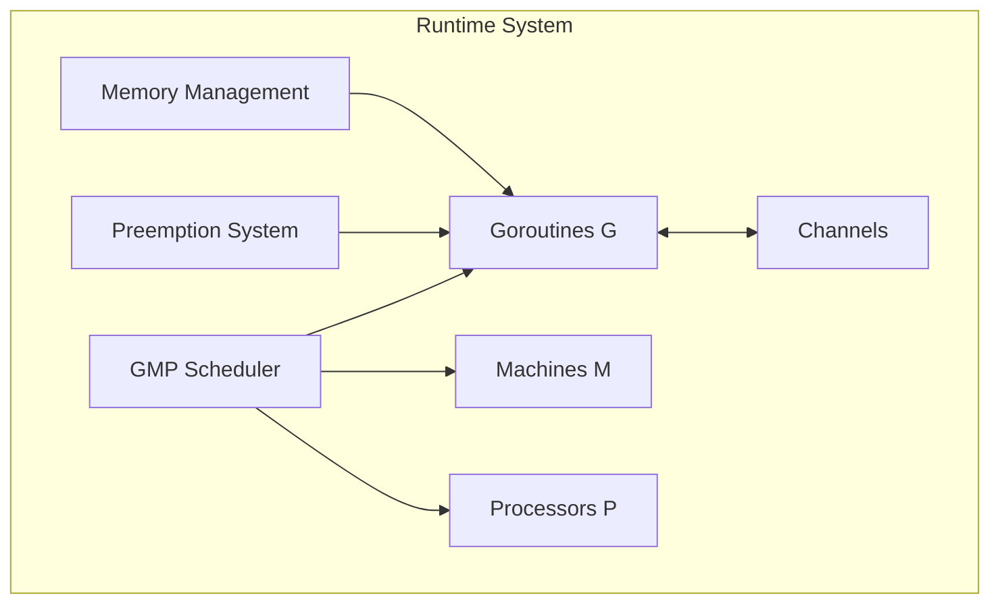
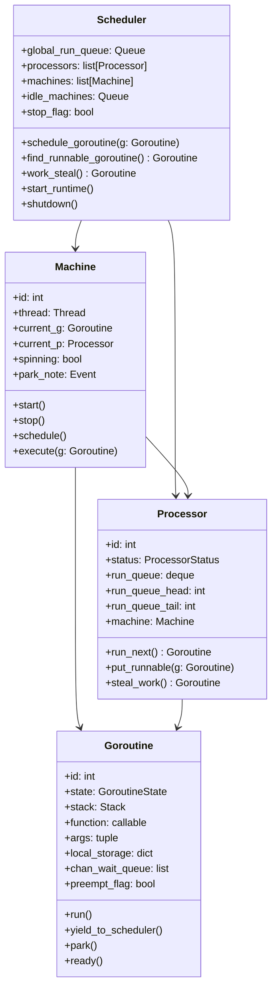
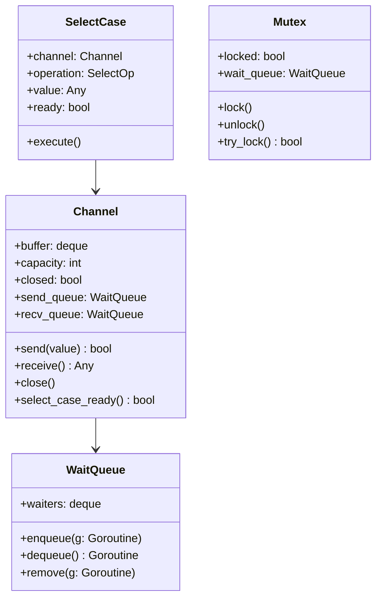

# Go-Style Concurrency Model for Jac

## 1. Introduction

This document outlines the design and implementation of a Go-inspired concurrency model for the Jac programming language. The goal is to create a complete Python-based runtime that simulates Go's M:N concurrency system, providing lightweight goroutines, efficient scheduling, and channel-based communication.

### 1.1 Objectives

- **Educational Understanding**: Gain deep insights into Go's runtime internals from a compiler and systems design perspective
- **Performance**: Achieve efficient concurrent execution with minimal overhead
- **Scalability**: Support thousands of concurrent goroutines on limited OS threads
- **Compatibility**: Provide familiar Go-like concurrency primitives for Jac developers
- **Integration**: Seamlessly integrate with Jac's compiler and type system

### 1.2 Key Components

The concurrency model consists of several core components that work together:

## 2. Architecture Overview

### 2.1 The GMP Model

Our implementation follows Go's GMP (Goroutines, Machines, Processors) model:

### 2.2 Concurrency Primitives

The system provides Go-like concurrency primitives:

