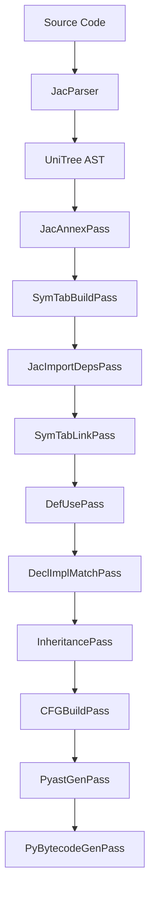
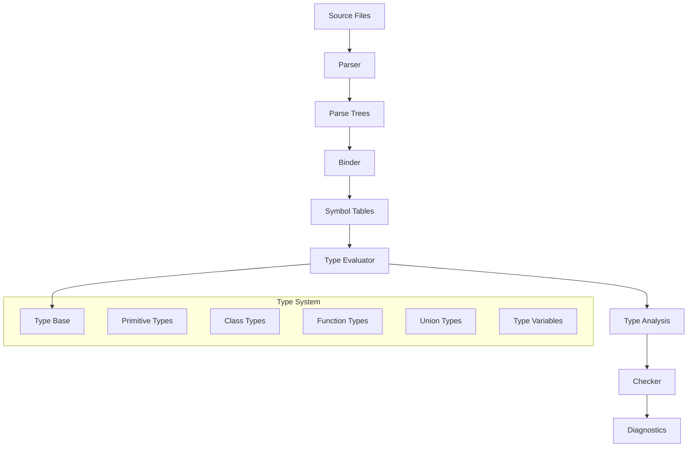
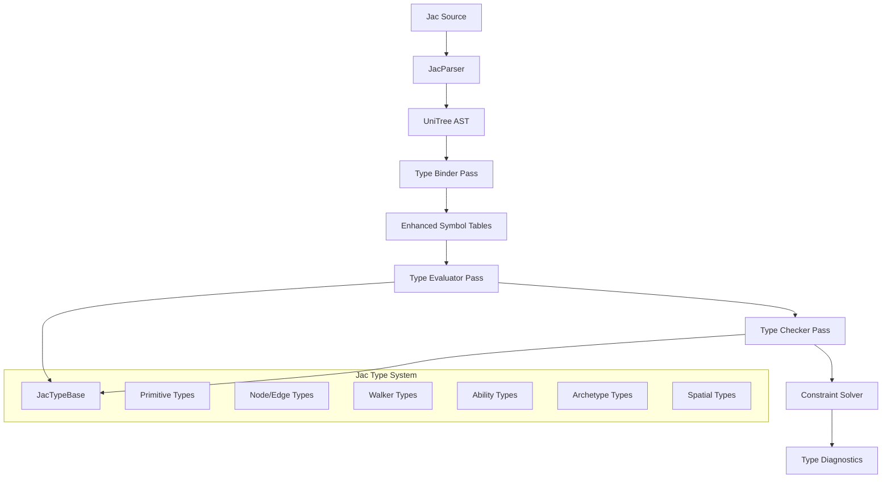
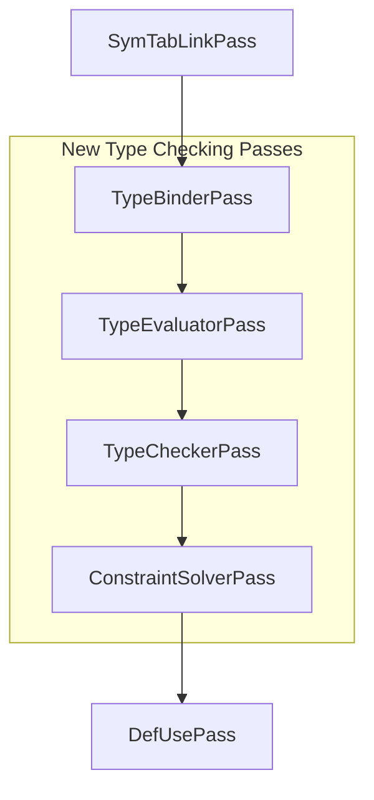
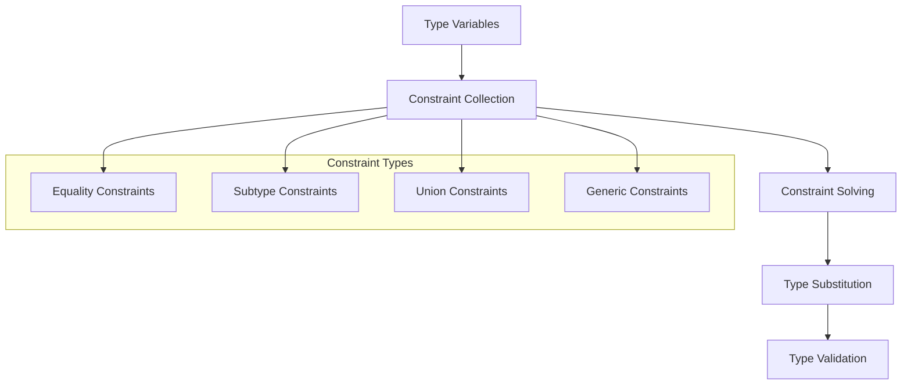
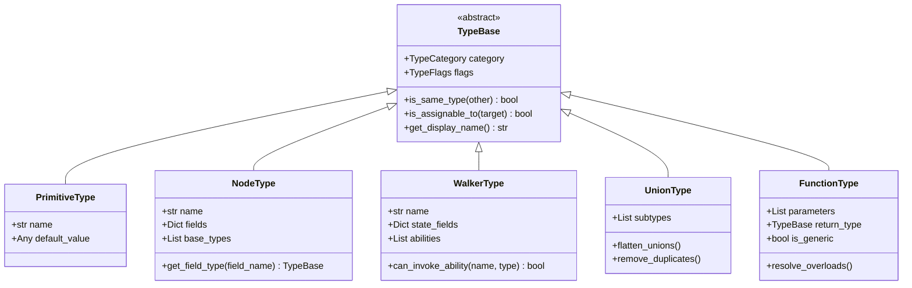
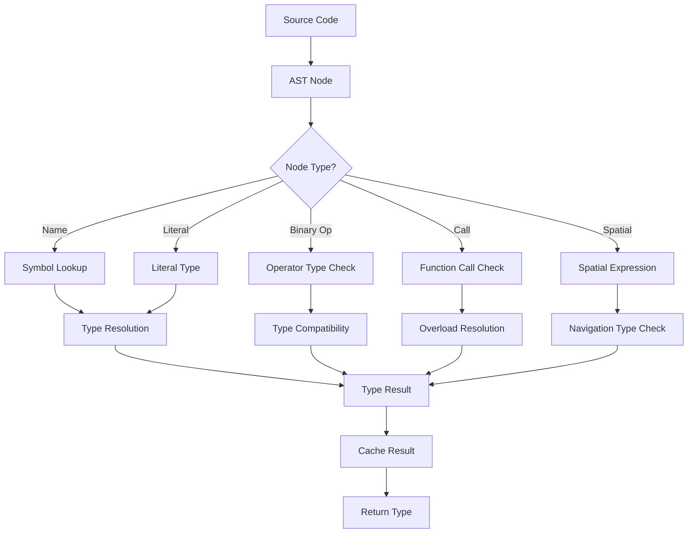
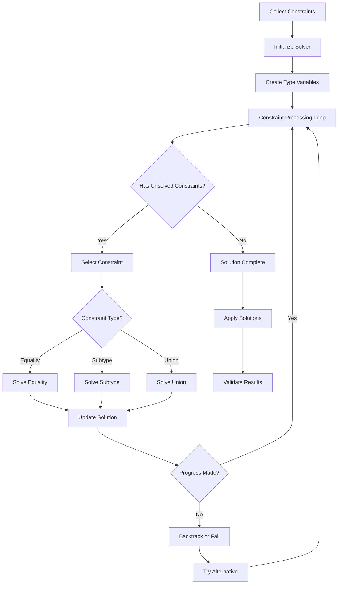

# Implementing a Pyright-Inspired Type Checker for Jac

## Table of Contents
1. [Overview](#overview)
2. [Architecture Analysis](#architecture-analysis)
3. [Implementation Roadmap](#implementation-roadmap)
4. [Core Components](#core-components)
5. [Integration with Existing Compiler](#integration-with-existing-compiler)
6. [Commit Journey](#commit-journey)
7. [Jac-Specific Type System](#jac-specific-type-system)
8. [Constraint Solving](#constraint-solving)
9. [Testing Strategy](#testing-strategy)

## Overview

This document outlines a comprehensive plan for implementing a full-featured type checker for the Jac programming language, inspired by Microsoft's Pyright type checker. The implementation will be built upon the existing Jac compiler infrastructure and will provide advanced type checking capabilities including type inference, constraint solving, and comprehensive error reporting.

### Goals

- **Static Type Safety**: Provide comprehensive static type checking for Jac programs
- **Type Inference**: Implement sophisticated type inference to minimize annotation burden
- **Performance**: Ensure type checking scales to large codebases
- **IDE Integration**: Support language server protocol for rich IDE experiences
- **Incremental Checking**: Support incremental type checking for fast development cycles

## Architecture Analysis

### Current Jac Compiler Architecture

The existing Jac compiler follows a traditional multi-pass architecture:



### Pyright Architecture Inspiration

Pyright's architecture provides several key insights:



### Proposed Jac Type Checker Architecture



## Implementation Roadmap

### Phase 1: Foundation (Commits 1-10)
**Goal**: Establish the core type system infrastructure

### Phase 2: Basic Type Checking (Commits 11-25)
**Goal**: Implement basic type checking for primitive types and simple expressions

### Phase 3: Advanced Types (Commits 26-45)
**Goal**: Support for Jac-specific types (nodes, edges, walkers, abilities)

### Phase 4: Type Inference (Commits 46-65)
**Goal**: Implement sophisticated type inference and constraint solving

### Phase 5: Integration & Optimization (Commits 66-80)
**Goal**: Integrate with existing compiler and optimize performance

## Core Components

### 1. Type System Foundation

#### JacTypeBase - Core Type Interface

Create `jac/jaclang/compiler/type_system/types.py`:

```python
"""
Core type system for Jac language type checker.
Inspired by Pyright's type system architecture.
"""

from abc import ABC, abstractmethod
from enum import Enum
from typing import Any, Dict, List, Optional, Set, Union
from dataclasses import dataclass

class TypeCategory(Enum):
    """Categories of types in the Jac type system."""
    UNKNOWN = "unknown"
    ANY = "any"
    NEVER = "never"
    PRIMITIVE = "primitive"
    NODE = "node"
    EDGE = "edge"
    WALKER = "walker"
    ABILITY = "ability"
    ARCHETYPE = "archetype"
    UNION = "union"
    FUNCTION = "function"
    GENERIC = "generic"
    TYPE_VAR = "type_var"

class TypeFlags(Enum):
    """Flags for type instances."""
    NONE = 0
    INSTANTIABLE = 1 << 0
    INSTANCE = 1 << 1
    AMBIGUOUS = 1 << 2

@dataclass
class TypeBase(ABC):
    """Base class for all types in the Jac type system."""
    category: TypeCategory
    flags: TypeFlags = TypeFlags.NONE

    @abstractmethod
    def is_same_type(self, other: 'TypeBase') -> bool:
        """Check if this type is the same as another type."""
        pass

    @abstractmethod
    def is_assignable_to(self, target: 'TypeBase') -> bool:
        """Check if this type can be assigned to the target type."""
        pass

    @abstractmethod
    def get_display_name(self) -> str:
        """Get the display name for this type."""
        pass
```

### 2. Type Evaluator

#### Core Type Evaluation Engine

Create `jac/jaclang/compiler/type_system/type_evaluator.py`:

```python
"""
Type evaluator for analyzing expressions and statements.
Core engine for type checking in Jac.
"""

import jaclang.compiler.unitree as uni
from jaclang.compiler.passes import UniPass
from .types import TypeBase, TypeCategory
from .type_factory import TypeFactory
from .symbol_table import EnhancedSymbolTable

class TypeEvaluator(UniPass):
    """
    Main type evaluator that walks the AST and computes types.
    Inspired by Pyright's TypeEvaluator architecture.
    """

    def __init__(self, ir_in: uni.Module, prog: 'JacProgram'):
        super().__init__(ir_in, prog)
        self.type_factory = TypeFactory()
        self.diagnostic_sink = []
        self.current_scope: Optional[EnhancedSymbolTable] = None

    def get_type_of_expression(self, node: uni.ExprNode) -> TypeBase:
        """Get the type of an expression node."""
        return self._evaluate_expression_type(node)

    def _evaluate_expression_type(self, node: uni.ExprNode) -> TypeBase:
        """Internal method to evaluate expression types."""
        match type(node):
            case uni.Name:
                return self._evaluate_name_type(node)
            case uni.BinaryExpr:
                return self._evaluate_binary_expr_type(node)
            case uni.AtomLit:
                return self._evaluate_literal_type(node)
            case _:
                return self.type_factory.create_unknown_type()
```

### 3. Enhanced Symbol Tables

#### Extended Symbol Table with Type Information

Create `jac/jaclang/compiler/type_system/symbol_table.py`:

```python
"""
Enhanced symbol table with comprehensive type information.
Extends the existing symbol table infrastructure.
"""

from typing import Dict, List, Optional, Set
import jaclang.compiler.unitree as uni
from .types import TypeBase

class TypedSymbol:
    """Symbol with associated type information."""

    def __init__(self,
                 name: str,
                 symbol_type: TypeBase,
                 declaration_node: uni.AstSymbolNode,
                 scope_id: str):
        self.name = name
        self.symbol_type = symbol_type
        self.declaration_node = declaration_node
        self.scope_id = scope_id
        self.is_type_inferred = False
        self.type_constraints: List[TypeBase] = []

class EnhancedSymbolTable:
    """Enhanced symbol table with type checking capabilities."""

    def __init__(self, scope_node: uni.UniScopeNode):
        self.scope_node = scope_node
        self.symbols: Dict[str, TypedSymbol] = {}
        self.parent_table: Optional['EnhancedSymbolTable'] = None
        self.child_tables: List['EnhancedSymbolTable'] = []

    def define_symbol(self, name: str, symbol_type: TypeBase,
                     declaration_node: uni.AstSymbolNode) -> TypedSymbol:
        """Define a new symbol with type information."""
        typed_symbol = TypedSymbol(name, symbol_type, declaration_node,
                                 self.scope_node.sym_tab.scope_id)
        self.symbols[name] = typed_symbol
        return typed_symbol

    def lookup_symbol(self, name: str) -> Optional[TypedSymbol]:
        """Look up a symbol, searching parent scopes if necessary."""
        if name in self.symbols:
            return self.symbols[name]
        elif self.parent_table:
            return self.parent_table.lookup_symbol(name)
        return None
```

### 4. Type Factory

#### Factory for Creating Type Instances

Create `jac/jaclang/compiler/type_system/type_factory.py`:

```python
"""
Factory for creating and managing type instances.
Provides centralized type creation and caching.
"""

from typing import Dict, List, Optional
from .types import TypeBase, TypeCategory, TypeFlags
from .primitive_types import *
from .jac_specific_types import *

class TypeFactory:
    """Factory for creating and caching type instances."""

    def __init__(self):
        self._type_cache: Dict[str, TypeBase] = {}
        self._primitive_types = self._create_primitive_types()

    def _create_primitive_types(self) -> Dict[str, TypeBase]:
        """Create the built-in primitive types."""
        return {
            'int': IntType(),
            'float': FloatType(),
            'str': StrType(),
            'bool': BoolType(),
            'list': ListType(),
            'dict': DictType(),
            'set': SetType(),
            'any': AnyType(),
            'unknown': UnknownType(),
            'never': NeverType(),
        }

    def get_primitive_type(self, name: str) -> TypeBase:
        """Get a primitive type by name."""
        return self._primitive_types.get(name, self._primitive_types['unknown'])

    def create_node_type(self, node_name: str,
                        fields: Dict[str, TypeBase] = None) -> 'NodeType':
        """Create a node type with specified fields."""
        return NodeType(node_name, fields or {})

    def create_union_type(self, types: List[TypeBase]) -> 'UnionType':
        """Create a union type from a list of types."""
        # Remove duplicates and flatten nested unions
        flattened_types = []
        for t in types:
            if isinstance(t, UnionType):
                flattened_types.extend(t.subtypes)
            else:
                flattened_types.append(t)

        # Remove duplicates
        unique_types = []
        for t in flattened_types:
            if not any(t.is_same_type(existing) for existing in unique_types):
                unique_types.append(t)

        if len(unique_types) == 1:
            return unique_types[0]

        return UnionType(unique_types)
```

## Integration with Existing Compiler

### Type Checking Pass Integration

The type checker will be integrated as a new pass in the compilation pipeline:



### Enhanced Pass Schedule

Modify `jac/jaclang/compiler/program.py` to include type checking:

```python
# Enhanced compilation schedule
type_check_sched = [
    TypeBinderPass,      # Bind types to symbols
    TypeEvaluatorPass,   # Evaluate expression types
    TypeCheckerPass,     # Perform type checking
    ConstraintSolverPass, # Solve type constraints
]

# Update the existing schedules
ir_gen_sched = [
    DeclImplMatchPass,
    *type_check_sched,   # Insert type checking here
    DefUsePass,
    CFGBuildPass,
    InheritancePass,
]
```

## Commit Journey

### Phase 1: Foundation (Commits 1-10)

#### Commit 1: Create Core Type System Structure
```bash
git commit -m "feat: create core type system foundation

- Add TypeBase abstract class with category and flags
- Create TypeCategory and TypeFlags enums
- Establish basic type interface methods
- Add type_system package structure

Files:
- jac/jaclang/compiler/type_system/__init__.py
- jac/jaclang/compiler/type_system/types.py"
```

#### Commit 2: Implement Primitive Types
```bash
git commit -m "feat: implement primitive type classes

- Add IntType, FloatType, StrType, BoolType classes
- Implement basic collection types (List, Dict, Set)
- Add AnyType, UnknownType, NeverType special types
- Create type comparison and assignability logic

Files:
- jac/jaclang/compiler/type_system/primitive_types.py
- jac/jaclang/compiler/type_system/special_types.py"
```

#### Commit 3: Add Type Factory
```bash
git commit -m "feat: create type factory for centralized type management

- Implement TypeFactory with primitive type caching
- Add methods for creating common type combinations
- Include type deduplication and normalization
- Support for type instance reuse

Files:
- jac/jaclang/compiler/type_system/type_factory.py"
```

#### Commit 4: Enhanced Symbol Tables
```bash
git commit -m "feat: create enhanced symbol tables with type information

- Add TypedSymbol class with type metadata
- Implement EnhancedSymbolTable with type checking support
- Extend existing symbol table integration
- Add type constraint tracking

Files:
- jac/jaclang/compiler/type_system/symbol_table.py"
```

#### Commit 5: Type Evaluator Framework
```bash
git commit -m "feat: implement core type evaluator framework

- Create TypeEvaluator pass class
- Add expression type evaluation infrastructure
- Implement basic literal type detection
- Add diagnostic reporting framework

Files:
- jac/jaclang/compiler/type_system/type_evaluator.py
- jac/jaclang/compiler/type_system/diagnostics.py"
```

#### Commit 6: Basic Type Checker Pass
```bash
git commit -m "feat: create basic type checker pass

- Implement TypeCheckerPass that integrates with compilation pipeline
- Add basic expression type checking
- Include assignment compatibility checking
- Create foundation for type error reporting

Files:
- jac/jaclang/compiler/passes/main/type_checker_pass.py"
```

#### Commit 7: Type Binder Pass
```bash
git commit -m "feat: implement type binder pass for symbol type association

- Create TypeBinderPass to bind types to symbols
- Add support for explicit type annotations
- Implement initial type inference for simple cases
- Integrate with existing symbol table building

Files:
- jac/jaclang/compiler/passes/main/type_binder_pass.py"
```

#### Commit 8: Union Type Implementation
```bash
git commit -m "feat: implement union types with proper semantics

- Add UnionType class with subtype management
- Implement union flattening and normalization
- Add union type assignability and comparison
- Support for type narrowing in unions

Files:
- jac/jaclang/compiler/type_system/union_types.py"
```

#### Commit 9: Function Type System
```bash
git commit -m "feat: implement function types and signatures

- Add FunctionType with parameter and return types
- Implement overloaded function support
- Add function type compatibility checking
- Support for generic function types

Files:
- jac/jaclang/compiler/type_system/function_types.py"
```

#### Commit 10: Integration with Compilation Pipeline
```bash
git commit -m "feat: integrate type checking passes into compiler pipeline

- Update JacProgram to include type checking phases
- Add type checking to CompilerMode enum
- Modify pass scheduling for type checking integration
- Add basic error handling for type checker

Files:
- jac/jaclang/compiler/program.py
- jac/jaclang/compiler/passes/main/__init__.py"
```

### Phase 2: Basic Type Checking (Commits 11-25)

#### Commit 11: Binary Expression Type Checking
```bash
git commit -m "feat: implement binary expression type checking

- Add type checking for arithmetic operations
- Implement comparison operator type validation
- Support for logical operator type checking
- Add operator overloading support

Files:
- jac/jaclang/compiler/type_system/operator_types.py"
```

#### Commit 12: Assignment Type Checking
```bash
git commit -m "feat: implement assignment type checking and validation

- Add assignment compatibility checking
- Implement type narrowing for assignments
- Support for tuple unpacking type checking
- Add augmented assignment type validation

Files:
- jac/jaclang/compiler/type_system/assignment_checker.py"
```

#### Commit 13: Function Call Type Checking
```bash
git commit -m "feat: implement function call type checking

- Add argument type validation against parameters
- Implement overload resolution for function calls
- Support for keyword argument type checking
- Add variadic argument type validation

Files:
- jac/jaclang/compiler/type_system/call_checker.py"
```

#### Commit 14: Control Flow Type Checking
```bash
git commit -m "feat: implement control flow statement type checking

- Add if/else condition type validation
- Implement loop variable type checking
- Support for match statement type checking
- Add return statement type validation

Files:
- jac/jaclang/compiler/type_system/control_flow_checker.py"
```

#### Commit 15: Collection Type Checking
```bash
git commit -m "feat: implement collection type checking and indexing

- Add list/dict/set literal type checking
- Implement indexing operation type validation
- Support for slice operation type checking
- Add comprehension type checking

Files:
- jac/jaclang/compiler/type_system/collection_checker.py"
```

### Phase 3: Jac-Specific Types (Commits 26-45)

#### Commit 26: Node Type Implementation
```bash
git commit -m "feat: implement Jac node types with field tracking

- Add NodeType class for Jac node archetypes
- Implement node field type checking
- Support for node inheritance and composition
- Add node instantiation type validation

Files:
- jac/jaclang/compiler/type_system/jac_types/node_types.py"
```

#### Commit 27: Edge Type Implementation
```bash
git commit -m "feat: implement Jac edge types with connection semantics

- Add EdgeType class for Jac edge archetypes
- Implement edge connection type validation
- Support for directional edge type checking
- Add edge traversal type semantics

Files:
- jac/jaclang/compiler/type_system/jac_types/edge_types.py"
```

#### Commit 28: Walker Type Implementation
```bash
git commit -m "feat: implement Jac walker types with traversal semantics

- Add WalkerType class for Jac walker archetypes
- Implement walker ability type checking
- Support for walker state type validation
- Add walker traversal pattern type checking

Files:
- jac/jaclang/compiler/type_system/jac_types/walker_types.py"
```

#### Commit 29: Ability Type System
```bash
git commit -m "feat: implement ability types with dispatch semantics

- Add AbilityType class for Jac abilities
- Implement ability dispatch type checking
- Support for ability overloading validation
- Add ability inheritance type checking

Files:
- jac/jaclang/compiler/type_system/jac_types/ability_types.py"
```

#### Commit 30: Spatial Type System
```bash
git commit -m "feat: implement spatial types for graph traversal

- Add SpatialType for here/visit operations
- Implement spatial expression type checking
- Support for graph navigation type validation
- Add spatial context type tracking

Files:
- jac/jaclang/compiler/type_system/jac_types/spatial_types.py"
```

#### Commits 31-45: Additional Phase 3 Features

**Commit 31**: Generic Type System Foundation
**Commit 32**: Archetype Inheritance Type Checking
**Commit 33**: Ability Dispatch Resolution
**Commit 34**: Data Spatial Navigation Types
**Commit 35**: Enum Type Implementation
**Commit 36**: Module and Import Type Checking
**Commit 37**: Exception Type System
**Commit 38**: Decorator Type Checking
**Commit 39**: Async/Await Type Support
**Commit 40**: Pattern Matching Types
**Commit 41**: Context Manager Types
**Commit 42**: Iterator Protocol Types
**Commit 43**: Type Narrowing Improvements
**Commit 44**: Advanced Union Type Handling
**Commit 45**: Performance Optimizations

### Phase 4: Type Inference (Commits 46-65)

#### Commit 46: Basic Type Inference Engine
```bash
git commit -m "feat: implement basic type inference engine

- Add TypeInferenceEngine with variable tracking
- Implement flow-sensitive type inference
- Support for local variable type inference
- Add inference confidence scoring

Files:
- jac/jaclang/compiler/type_system/inference/inference_engine.py"
```

#### Commit 47: Control Flow Analysis
```bash
git commit -m "feat: implement control flow type analysis

- Add control flow graph integration with type system
- Implement type state tracking across branches
- Support for conditional type narrowing
- Add unreachable code detection based on types

Files:
- jac/jaclang/compiler/type_system/inference/control_flow_analysis.py"
```

#### Commit 48: Generic Type Inference
```bash
git commit -m "feat: implement generic type parameter inference

- Add automatic generic type parameter inference
- Implement constraint-based generic resolution
- Support for higher-kinded type inference
- Add variance inference for generic types

Files:
- jac/jaclang/compiler/type_system/inference/generic_inference.py"
```

#### Commit 49: Advanced Constraint Solver
```bash
git commit -m "feat: implement advanced constraint solving algorithm

- Add sophisticated constraint solving with backtracking
- Implement constraint propagation and simplification
- Support for recursive constraint solving
- Add performance optimizations for large constraint sets

Files:
- jac/jaclang/compiler/type_system/constraint_solver.py (enhanced)"
```

#### Commit 50: Return Type Inference
```bash
git commit -m "feat: implement function return type inference

- Add automatic return type inference for functions
- Implement yield type inference for generators
- Support for recursive function type inference
- Add mutual recursion handling

Files:
- jac/jaclang/compiler/type_system/inference/return_type_inference.py"
```

### Phase 5: Integration & Optimization (Commits 66-80)

#### Commit 66: Incremental Type Checking
```bash
git commit -m "feat: implement incremental type checking system

- Add file dependency tracking for incremental updates
- Implement selective type cache invalidation
- Support for partial re-analysis of modified files
- Add performance monitoring and metrics

Files:
- jac/jaclang/compiler/type_system/incremental_checker.py"
```

#### Commit 67: IDE Language Server Integration
```bash
git commit -m "feat: integrate type checker with language server

- Add Language Server Protocol support for type checking
- Implement hover type information
- Support for go-to-definition with type information
- Add real-time error reporting

Files:
- jac/jaclang/language_server/type_service.py"
```

#### Commit 68: Type Cache Optimization
```bash
git commit -m "feat: optimize type caching and memory usage

- Implement LRU cache for type instances
- Add memory-efficient type representation
- Support for type cache persistence
- Add cache hit rate monitoring

Files:
- jac/jaclang/compiler/type_system/cache_manager.py"
```

## Jac-Specific Type System

### Node Types

```python
class NodeType(TypeBase):
    """Type for Jac node archetypes."""

    def __init__(self, name: str, fields: Dict[str, TypeBase],
                 base_types: List['NodeType'] = None):
        super().__init__(TypeCategory.NODE)
        self.name = name
        self.fields = fields
        self.base_types = base_types or []

    def get_field_type(self, field_name: str) -> Optional[TypeBase]:
        """Get the type of a specific field."""
        if field_name in self.fields:
            return self.fields[field_name]

        # Check base types for inherited fields
        for base in self.base_types:
            field_type = base.get_field_type(field_name)
            if field_type:
                return field_type

        return None

    def is_assignable_to(self, target: TypeBase) -> bool:
        """Check if this node type can be assigned to target."""
        if isinstance(target, NodeType):
            return self._is_subtype_of(target)
        return super().is_assignable_to(target)

    def _is_subtype_of(self, other: 'NodeType') -> bool:
        """Check if this is a subtype of another node type."""
        if self.name == other.name:
            return True

        return any(base._is_subtype_of(other) for base in self.base_types)
```

### Walker Types

```python
class WalkerType(TypeBase):
    """Type for Jac walker archetypes."""

    def __init__(self, name: str, state_fields: Dict[str, TypeBase],
                 abilities: List['AbilityType'] = None):
        super().__init__(TypeCategory.WALKER)
        self.name = name
        self.state_fields = state_fields
        self.abilities = abilities or []

    def can_invoke_ability(self, ability_name: str,
                          on_type: TypeBase) -> bool:
        """Check if walker can invoke ability on given type."""
        for ability in self.abilities:
            if (ability.name == ability_name and
                ability.can_apply_to(on_type)):
                return True
        return False
```

### Spatial Expression Types

```python
class SpatialType(TypeBase):
    """Type for spatial expressions in Jac."""

    def __init__(self, node_type: NodeType,
                 edge_type: Optional[EdgeType] = None,
                 is_here: bool = False):
        super().__init__(TypeCategory.SPATIAL)
        self.node_type = node_type
        self.edge_type = edge_type
        self.is_here = is_here

    def traverse_with_edge(self, edge_type: EdgeType) -> 'SpatialType':
        """Create new spatial type after edge traversal."""
        # Determine target node type based on edge connections
        target_node = edge_type.get_target_node_type()
        return SpatialType(target_node, edge_type)
```

## Constraint Solving

### Type Constraint System



### Constraint Solver Implementation

Create `jac/jaclang/compiler/type_system/constraint_solver.py`:

```python
"""
Type constraint solver for advanced type inference.
Inspired by Pyright's constraint solving algorithm.
"""

from typing import Dict, List, Set, Optional, Tuple
from enum import Enum
from .types import TypeBase, TypeCategory
from .type_variables import TypeVar, TypeVarType

class ConstraintKind(Enum):
    EQUALITY = "equality"
    SUBTYPE = "subtype"
    SUPERTYPE = "supertype"
    UNION = "union"

class TypeConstraint:
    """Represents a constraint between types."""

    def __init__(self, kind: ConstraintKind,
                 left: TypeBase, right: TypeBase,
                 source_node: Optional['uni.AstNode'] = None):
        self.kind = kind
        self.left = left
        self.right = right
        self.source_node = source_node

class ConstraintSolver:
    """Solves type constraints to infer concrete types."""

    def __init__(self):
        self.constraints: List[TypeConstraint] = []
        self.type_var_solutions: Dict[TypeVar, TypeBase] = {}
        self.pending_type_vars: Set[TypeVar] = set()

    def add_constraint(self, constraint: TypeConstraint) -> None:
        """Add a constraint to the solver."""
        self.constraints.append(constraint)

        # Collect type variables
        self._collect_type_vars(constraint.left)
        self._collect_type_vars(constraint.right)

    def solve(self) -> Dict[TypeVar, TypeBase]:
        """Solve all constraints and return type variable solutions."""
        # Iteratively solve constraints until no progress
        changed = True
        while changed and self.pending_type_vars:
            changed = self._solve_iteration()

        return self.type_var_solutions

    def _solve_iteration(self) -> bool:
        """Perform one iteration of constraint solving."""
        progress = False

        for constraint in self.constraints:
            if self._solve_constraint(constraint):
                progress = True

        return progress

    def _solve_constraint(self, constraint: TypeConstraint) -> bool:
        """Attempt to solve a single constraint."""
        match constraint.kind:
            case ConstraintKind.EQUALITY:
                return self._solve_equality_constraint(constraint)
            case ConstraintKind.SUBTYPE:
                return self._solve_subtype_constraint(constraint)
            case ConstraintKind.UNION:
                return self._solve_union_constraint(constraint)
            case _:
                return False
```

### Type Variable System

Create `jac/jaclang/compiler/type_system/type_variables.py`:

```python
"""
Type variable system for generic types and inference.
"""

from typing import List, Optional, Set
from .types import TypeBase, TypeCategory

class TypeVar(TypeBase):
    """Represents a type variable for generic types."""

    def __init__(self, name: str,
                 bounds: List[TypeBase] = None,
                 constraints: List[TypeBase] = None,
                 scope_id: Optional[str] = None):
        super().__init__(TypeCategory.TYPE_VAR)
        self.name = name
        self.bounds = bounds or []
        self.constraints = constraints or []
        self.scope_id = scope_id
        self.is_solved = False
        self.solution: Optional[TypeBase] = None

    def bind_to_type(self, type_instance: TypeBase) -> bool:
        """Attempt to bind this type variable to a concrete type."""
        if self.is_solved:
            return self.solution.is_same_type(type_instance)

        # Check bounds and constraints
        if self._satisfies_bounds(type_instance):
            self.solution = type_instance
            self.is_solved = True
            return True

        return False

    def _satisfies_bounds(self, type_instance: TypeBase) -> bool:
        """Check if type satisfies all bounds and constraints."""
        # Check upper bounds
        for bound in self.bounds:
            if not type_instance.is_assignable_to(bound):
                return False

        # Check constraints (type must be assignable to at least one)
        if self.constraints:
            return any(type_instance.is_assignable_to(c)
                      for c in self.constraints)

        return True
```

## Testing Strategy

### Unit Tests Structure

Create comprehensive test suite covering:

1. **Type System Tests**
   - Primitive type behavior
   - Union type operations
   - Function type checking
   - Jac-specific types

2. **Type Checker Tests**
   - Expression type inference
   - Assignment validation
   - Function call checking
   - Control flow analysis

3. **Constraint Solver Tests**
   - Simple constraint solving
   - Complex generic inference
   - Circular constraint detection
   - Performance benchmarks

### Integration Tests

Create end-to-end tests with sample Jac programs:

```python
# tests/type_checker/test_jac_programs.py

class TestJacTypeChecking:
    """Integration tests for complete Jac programs."""

    def test_node_walker_interaction(self):
        """Test type checking for node-walker interactions."""
        jac_code = """
        node Person {
            has name: str;
            has age: int;
        }

        walker Greet {
            can speak with Person entry {
                print(f"Hello {here.name}!");
            }
        }

        with entry {
            person = Person(name="Alice", age=30);
            Greet() spawn person;
        }
        """

        result = compile_and_check_types(jac_code)
        assert_no_type_errors(result)

    def test_spatial_type_checking(self):
        """Test spatial expression type checking."""
        jac_code = """
        node Room {
            has name: str;
        }

        edge Connects {
            has distance: float;
        }

        walker Explorer {
            can traverse with Room entry {
                for neighbor in -->Room {
                    visit neighbor;
                }
            }
        }
        """

        result = compile_and_check_types(jac_code)
        assert_no_type_errors(result)
```

## Performance Considerations

### Caching Strategy

```python
class TypeCache:
    """Caches computed types for performance."""

    def __init__(self):
        self._expression_types: Dict[int, TypeBase] = {}
        self._symbol_types: Dict[str, TypeBase] = {}
        self._constraint_solutions: Dict[str, TypeBase] = {}

    def get_expression_type(self, node_id: int) -> Optional[TypeBase]:
        return self._expression_types.get(node_id)

    def cache_expression_type(self, node_id: int, type_result: TypeBase):
        self._expression_types[node_id] = type_result
```

### Incremental Type Checking

```python
class IncrementalTypeChecker:
    """Supports incremental type checking for IDE integration."""

    def __init__(self):
        self.file_dependencies: Dict[str, Set[str]] = {}
        self.type_cache = TypeCache()

    def invalidate_file(self, file_path: str):
        """Invalidate cached types for a modified file."""
        # Invalidate direct file cache
        self.type_cache.invalidate_file(file_path)

        # Invalidate dependent files
        for dependent in self.file_dependencies.get(file_path, set()):
            self.type_cache.invalidate_file(dependent)
```

## Advanced Implementation Details

### Type System Architecture Overview



### Type Evaluation Flow



### Constraint Solving Algorithm



## Key Implementation Classes

### TypeEvaluatorPass Implementation

Create `jac/jaclang/compiler/passes/main/type_evaluator_pass.py`:

```python
"""
Type evaluator pass for comprehensive type analysis.
Integrates with existing compilation pipeline.
"""

import jaclang.compiler.unitree as uni
from jaclang.compiler.passes import UniPass
from ..type_system.type_evaluator import TypeEvaluator
from ..type_system.diagnostics import TypeDiagnostic

class TypeEvaluatorPass(UniPass):
    """
    Main type evaluation pass that computes types for all expressions.
    """

    def __init__(self, ir_in: uni.Module, prog: 'JacProgram'):
        super().__init__(ir_in, prog)
        self.type_evaluator = TypeEvaluator(ir_in, prog)
        self.type_cache: Dict[int, TypeBase] = {}

    def before_pass(self) -> None:
        """Initialize type evaluation context."""
        self.type_evaluator.initialize_builtin_types()
        self.type_evaluator.setup_module_context(self.ir)

    def enter_module(self, node: uni.Module) -> None:
        """Process module-level type information."""
        self.type_evaluator.enter_module_scope(node)

    def exit_module(self, node: uni.Module) -> None:
        """Finalize module type checking."""
        self.type_evaluator.exit_module_scope(node)

    def enter_archetype(self, node: uni.Archetype) -> None:
        """Process archetype type definitions."""
        archetype_type = self.type_evaluator.create_archetype_type(node)
        self.type_evaluator.register_type(node.name.value, archetype_type)

    def exit_assignment(self, node: uni.Assignment) -> None:
        """Type check assignments."""
        target_type = self.type_evaluator.get_type_of_expression(node.target)
        value_type = self.type_evaluator.get_type_of_expression(node.value)

        if not value_type.is_assignable_to(target_type):
            self.error(f"Cannot assign {value_type.get_display_name()} "
                      f"to {target_type.get_display_name()}", node)

    def exit_binary_expr(self, node: uni.BinaryExpr) -> None:
        """Type check binary expressions."""
        left_type = self.type_evaluator.get_type_of_expression(node.left)
        right_type = self.type_evaluator.get_type_of_expression(node.right)

        result_type = self.type_evaluator.get_binary_operation_type(
            left_type, node.op, right_type
        )

        if result_type is None:
            self.error(f"Unsupported operation {node.op.value} "
                      f"between {left_type.get_display_name()} "
                      f"and {right_type.get_display_name()}", node)
        else:
            self.type_cache[id(node)] = result_type
```

### Enhanced Symbol Integration

Create `jac/jaclang/compiler/passes/main/type_binder_pass.py`:

```python
"""
Type binder pass that associates types with symbols.
Extends existing symbol table functionality.
"""

import jaclang.compiler.unitree as uni
from jaclang.compiler.passes import UniPass
from ..type_system.symbol_table import EnhancedSymbolTable, TypedSymbol
from ..type_system.type_factory import TypeFactory

class TypeBinderPass(UniPass):
    """
    Binds type information to symbols in the symbol table.
    Integrates with existing SymTabBuildPass.
    """

    def __init__(self, ir_in: uni.Module, prog: 'JacProgram'):
        super().__init__(ir_in, prog)
        self.type_factory = TypeFactory()
        self.enhanced_tables: Dict[str, EnhancedSymbolTable] = {}

    def before_pass(self) -> None:
        """Initialize type binding context."""
        self.current_enhanced_table: Optional[EnhancedSymbolTable] = None

    def enter_module(self, node: uni.Module) -> None:
        """Create enhanced symbol table for module."""
        enhanced_table = EnhancedSymbolTable(node)
        self.enhanced_tables[node.sym_tab.scope_id] = enhanced_table
        self.current_enhanced_table = enhanced_table

    def exit_archetype(self, node: uni.Archetype) -> None:
        """Bind archetype type to symbol."""
        if node.arch_type == uni.ArchType.NODE:
            fields = self._extract_field_types(node)
            node_type = self.type_factory.create_node_type(
                node.name.value, fields
            )
        elif node.arch_type == uni.ArchType.WALKER:
            state_fields = self._extract_field_types(node)
            abilities = self._extract_abilities(node)
            walker_type = self.type_factory.create_walker_type(
                node.name.value, state_fields, abilities
            )

        # Register with enhanced symbol table
        if self.current_enhanced_table:
            self.current_enhanced_table.define_symbol(
                node.name.value,
                archetype_type,
                node.name
            )

    def _extract_field_types(self, node: uni.Archetype) -> Dict[str, TypeBase]:
        """Extract field types from archetype definition."""
        fields = {}
        for member in node.body.statements:
            if isinstance(member, uni.HasVar):
                field_name = member.name.value
                if member.type_tag:
                    field_type = self._resolve_type_annotation(member.type_tag)
                else:
                    field_type = self.type_factory.get_primitive_type('any')
                fields[field_name] = field_type
        return fields
```

## File Structure Overview

The complete type system implementation will have the following structure:

```
jac/jaclang/compiler/type_system/
├── __init__.py
├── types.py                    # Core type system
├── type_factory.py            # Type creation and management
├── type_evaluator.py          # Expression type evaluation
├── symbol_table.py            # Enhanced symbol tables
├── diagnostics.py             # Type error reporting
├── constraint_solver.py       # Constraint solving
├── type_variables.py          # Type variable system
├── cache_manager.py           # Type caching
├── incremental_checker.py     # Incremental checking
│
├── primitive_types.py         # Built-in primitive types
├── special_types.py           # Any, Unknown, Never types
├── union_types.py             # Union type implementation
├── function_types.py          # Function type system
│
├── jac_types/                 # Jac-specific types
│   ├── __init__.py
│   ├── node_types.py          # Node archetype types
│   ├── edge_types.py          # Edge archetype types
│   ├── walker_types.py        # Walker archetype types
│   ├── ability_types.py       # Ability types
│   └── spatial_types.py       # Spatial expression types
│
├── inference/                 # Type inference engine
│   ├── __init__.py
│   ├── inference_engine.py    # Main inference logic
│   ├── control_flow_analysis.py
│   ├── generic_inference.py   # Generic type inference
│   └── return_type_inference.py
│
└── checkers/                  # Specialized type checkers
    ├── __init__.py
    ├── assignment_checker.py   # Assignment validation
    ├── call_checker.py         # Function call validation
    ├── operator_checker.py     # Operator type checking
    ├── control_flow_checker.py # Control flow validation
    └── collection_checker.py   # Collection type checking
```

## Performance Metrics and Benchmarks

### Type Checking Performance Goals

1. **Cold Start**: Type check 1000 lines of Jac code in < 500ms
2. **Incremental**: Re-check modified file in < 50ms
3. **Memory Usage**: < 100MB for typical workspace
4. **Cache Hit Rate**: > 85% for repeated type lookups

### Benchmark Suite

Create comprehensive benchmarks covering:

```python
# tests/benchmarks/type_checker_benchmarks.py

class TypeCheckerBenchmarks:
    """Performance benchmarks for type checker."""

    def benchmark_basic_type_checking(self):
        """Benchmark basic type operations."""
        # Test primitive type checking performance
        # Test simple expression evaluation
        # Test assignment validation

    def benchmark_complex_types(self):
        """Benchmark complex type scenarios."""
        # Test deep inheritance hierarchies
        # Test complex union types
        # Test generic type resolution

    def benchmark_incremental_checking(self):
        """Benchmark incremental type checking."""
        # Test file modification handling
        # Test dependency invalidation
        # Test cache efficiency

    def benchmark_memory_usage(self):
        """Benchmark memory consumption."""
        # Test type instance memory usage
        # Test cache memory efficiency
        # Test garbage collection impact
```

## Conclusion

This comprehensive implementation plan provides a roadmap for building a sophisticated type checker for the Jac language, drawing inspiration from Pyright's proven architecture while adapting to Jac's unique data-spatial programming model. The phased approach ensures steady progress while maintaining the ability to test and refine each component.

The key innovations include:

1. **Jac-Specific Type System**: Custom types for nodes, edges, walkers, and spatial expressions
2. **Advanced Constraint Solving**: Sophisticated type inference reducing annotation burden
3. **Incremental Architecture**: Support for fast IDE integration and large codebases
4. **Comprehensive Testing**: Extensive test coverage ensuring reliability
5. **Performance Optimization**: Caching and incremental checking for scalability

The resulting type checker will provide Jac developers with the same level of type safety and development experience that TypeScript developers enjoy, while respecting the unique characteristics of data-spatial programming.

### Expected Outcomes

Upon completion of this implementation:

- **Developer Experience**: Rich IDE support with real-time type checking, hover information, and intelligent code completion
- **Code Quality**: Catch type errors at compile time, reducing runtime bugs and improving code reliability
- **Maintainability**: Better code documentation through types, easier refactoring with type-safe transformations
- **Performance**: Optimized type checking that scales to large Jac codebases
- **Ecosystem**: Foundation for additional tools like automatic test generation, API documentation, and static analysis