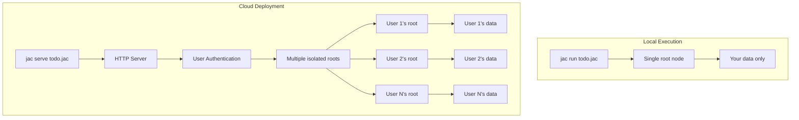

### Chapter 11: Multi-User Applications

Jac's automatic user isolation transforms single-user code into multi-user applications without modification. Each user gets their own isolated root node and data space, enabling secure multi-tenancy by default. This chapter explores how to build applications that serve multiple users simultaneously while maintaining data isolation and enabling controlled sharing.

#### 11.1 From Local to Cloud: The Transition

### The Scale-Agnostic Promise

Remember Jac's core promise from Chapter 1: write once, scale anywhere. The exact same code you've been writing for single-user applications works seamlessly for multi-user deployments. This isn't just theory—it's the fundamental design of Jac.

```jac
# This exact same code works locally AND in the cloud
walker AddTask {
    has title: str;
    has priority: str = "normal";

    can add with entry {
        # 'root' automatically refers to:
        # - Local: your machine's root
        # - Cloud: current user's isolated root
        task = root ++> Task(
            title=self.title,
            priority=self.priority,
            created_at=now()
        );

        report f"Task added: {task.title}";
    }
}

node Task {
    has title: str;
    has priority: str;
    has created_at: str;
    has completed: bool = false;
}
```

### From Script to Service: The jac serve Command

The transition from local script to multi-user service is literally one command:

**Local usage:**
```bash
# Runs once for you
jac run todo.jac
```

**Cloud deployment:**
```bash
# Serves multiple users via API
jac serve todo.jac

# Now available at:
# POST http://localhost:8000/AddTask
# Body: {"title": "Learn Jac Cloud", "priority": "high"}
```

### What Happens During jac serve

When you run `jac serve`, Jac Cloud automatically adds several layers:

1. **HTTP API Generation**: Your walkers become REST endpoints
2. **User Authentication**: Each request is automatically scoped to a user
3. **User Isolation**: Each user gets their own isolated `root` node
4. **Session Management**: User authentication and session handling
5. **Documentation**: Auto-generated API docs at `/docs`



### Your First Multi-User API

Let's enhance our task management for multi-user deployment:

```jac
import from datetime { datetime }

# The SAME task code, now multi-user ready
walker AddTask {
    has title: str;
    has priority: str = "normal";

    can add with entry {
        # This root is now user-specific!
        task = root ++> Task(
            title=self.title,
            priority=self.priority,
            created_at=now()
        );

        report {
            "success": true,
            "task": {
                "title": task.title,
                "priority": task.priority,
                "id": task.id
            }
        };
    }
}

walker ListTasks {
    can list with entry {
        # Each user sees only their tasks
        tasks = root[-->:Task:];

        report {
            "tasks": [
                {
                    "id": t.id,
                    "title": t.title,
                    "priority": t.priority,
                    "completed": t.completed
                } for t in tasks
            ],
            "count": len(tasks)
        };
    }
}

# Configuration for cloud deployment
walker ShowUserContext {
    can show with entry {
        user_id = get_current_user_id();
        tasks = root[-->:Task:];

        report {
            "message": f"You are user: {user_id}",
            "your_task_count": len(tasks),
            "note": "You can only see your own tasks!"
        };
    }
}

# Enable multi-user deployment
with entry:cloud {
    print("Task Manager API is ready!");
    print("Available endpoints:");
    print("  POST /AddTask - Add a new task");
    print("  GET  /ListTasks - List your tasks");
    print("  GET  /ShowUserContext - Show user info");
}
```

#### 11.2 Automatic User Isolation

### User-Specific Root Nodes

In Jac Cloud, each authenticated user automatically gets their own isolated root node. This happens transparently—your code doesn't change, but the behavior scales perfectly:

```jac
import from datetime { datetime }

node UserProfile {
    has created_at: str;
    has last_login: str;
    has preferences: dict = {};
    has subscription: str = "free";
}

# This same code works for ANY user
walker InitializeUser {
    can init with entry {
        # 'root' always refers to the current user's root
        profile = root[-->:UserProfile:];

        if not profile {
            # First time user
            print("Welcome! Creating your profile...");
            root ++> UserProfile(
                created_at=datetime.now(),
                last_login=datetime.now()
            );

            report {
                "status": "new_user",
                "message": "Profile created successfully"
            };
        } else {
            # Returning user
            prof = profile[0];
            print(f"Welcome back! Last login: {prof.last_login}");
            prof.last_login = datetime.now();

            report {
                "status": "returning_user",
                "last_login": prof.last_login
            };
        }
    }
}
```

When different users call this walker:
- Alice sees only Alice's data
- Bob sees only Bob's data
- No explicit user management code needed!

### Testing Multi-User Isolation

Let's test our multi-user API with different users:

```bash
# User 1 adds a task
curl -X POST http://localhost:8000/AddTask \
  -H "Content-Type: application/json" \
  -H "Authorization: Bearer user1_token" \
  -d '{"title": "Learn Jac", "priority": "high"}'

# User 2 adds a different task
curl -X POST http://localhost:8000/AddTask \
  -H "Content-Type: application/json" \
  -H "Authorization: Bearer user2_token" \
  -d '{"title": "Build an app", "priority": "normal"}'

# User 1 lists their tasks (only sees "Learn Jac")
curl http://localhost:8000/ListTasks \
  -H "Authorization: Bearer user1_token"

# User 2 lists their tasks (only sees "Build an app")
curl http://localhost:8000/ListTasks \
  -H "Authorization: Bearer user2_token"
```

### Built-in Session Management

Jac handles user sessions automatically—no session management code required:

```jac
walker TodoManager {
    has command: str;
    has task_title: str = "";

    can manage with entry {
        # Automatically executes in correct user context
        match self.command {
            case "add": self.add_task();
            case "list": self.list_tasks();
            case "stats": self.show_stats();
        }
    }

    can add_task {
        # Creates task in current user's space
        task = root ++> Task(
            title=self.task_title,
            created_at=datetime.now(),
            owner=get_current_user_id()  # Automatic!
        );

        report f"Task added: {task.title}";
    }

    can list_tasks {
        # Only sees current user's tasks
        tasks = root[-->:Task:];

        report {
            "message": f"Your tasks ({len(tasks)} total)",
            "tasks": [
                {
                    "status": "✓" if task.completed else "○",
                    "title": task.title
                } for task in tasks
            ]
        };
    }
}
```

### Security Through Topology

User isolation is enforced at the graph level, making it impossible to accidentally access another user's data:

```jac
# Security is built into the graph structure
walker SecurityTest {
    has target_user_id: str;

    can test_isolation with entry {
        # This will NEVER access another user's data
        my_data = root[-->:PrivateData:];

        report {
            "found_items": len(my_data),
            "message": "You can only see your own data"
        };

        # Even if you somehow got another user's node reference,
        # the runtime prevents cross-user traversal
        try {
            # This would be blocked by Jac's security model
            other_root = self.get_other_user_root(self.target_user_id);
            their_data = other_root[-->:PrivateData:];  # BLOCKED!
        } except SecurityError as e {
            report {
                "security": "enforced",
                "message": "Cross-user access denied"
            };
        }
    }
}

node PrivateData {
    has content: str;
    has classification: str = "confidential";
}
```

#### 11.3 Multi-User Patterns

### User Data Organization

Best practices for organizing user-specific data in a multi-user environment:

```jac
# User data hierarchy pattern
node UserSpace {
    has user_id: str;
    has created_at: str;
    has tier: str = "free";
}

node Projects {
    has active_count: int = 0;
    has archived_count: int = 0;
}

node Settings {
    has theme: str = "light";
    has language: str = "en";
    has notifications: dict = {
        "email": true,
        "push": false,
        "sms": false
    };
}

# Initialize user space on first login
walker InitializeUser {
    has user_id: str;
    has tier: str = "free";

    can setup with entry {
        # Check if already initialized
        existing = root[-->:UserSpace:];
        if existing {
            report {
                "status": "already_initialized",
                "user_id": self.user_id
            };
            return;
        }

        # Create organized structure
        space = root ++> UserSpace(
            user_id=self.user_id,
            created_at=datetime.now(),
            tier=self.tier
        );

        space ++> Projects();
        space ++> Settings();

        report {
            "status": "initialized",
            "user_id": self.user_id,
            "tier": self.tier
        };
    }
}

# Organize user projects
node Project {
    has name: str;
    has created_at: str;
    has updated_at: str;
    has description: str = "";
    has archived: bool = false;
    has collaborators: list[str] = [];
}

walker ProjectManager {
    has action: str;
    has project_name: str;
    has description: str = "";

    can manage with entry {
        # Get user's project container
        space = root[-->:UserSpace:][0];
        projects = space[-->:Projects:][0];

        match self.action {
            case "create": self.create_project(projects);
            case "list": self.list_projects(projects);
            case "archive": self.archive_project(projects);
        }
    }

    can create_project(projects: Projects) {
        project = projects ++> Project(
            name=self.project_name,
            description=self.description,
            created_at=datetime.now(),
            updated_at=datetime.now()
        );

        projects.active_count += 1;

        report {
            "success": true,
            "project": {
                "name": project.name,
                "description": project.description
            }
        };
    }

    can list_projects(projects: Projects) {
        all_projects = projects[-->:Project:];
        active = all_projects.filter(lambda p: Project -> bool : not p.archived);
        archived = all_projects.filter(lambda p: Project -> bool : p.archived);

        report {
            "active": [
                {
                    "name": p.name,
                    "description": p.description
                } for p in active
            ],
            "archived": [
                {
                    "name": p.name,
                    "description": p.description
                } for p in archived
            ],
            "counts": {
                "active": len(active),
                "archived": len(archived)
            }
        };
    }
}
```

</div>

### Shared vs Private Subgraphs

Creating controlled sharing between users:

<div class="code-block">

```jac
import uuid;

def generate_id -> str {
    return str(uuid.uuid4());
}
# Shared workspace pattern
node SharedWorkspace {
    has id: str;
    has name: str;
    has created_by: str;
    has created_at: str;
    has members: list[str] = [];
}

node WorkspaceLink {
    has workspace_id: str;
    has joined_at: str;
    has role: str = "viewer";  # viewer, editor, admin
}

edge CanAccess {
    has permissions: list[str];
}

walker WorkspaceManager {
    has action: str;
    has workspace_name: str = "";
    has workspace_id: str = "";
    has invite_user: str = "";
    has role: str = "viewer";

    can manage with entry {
        match self.action {
            case "create": self.create_workspace();
            case "invite": self.invite_to_workspace();
            case "list": self.list_workspaces();
            case "access": self.access_workspace();
        }
    }

    def create_workspace {
        # Create in shared space (not under user root)
        workspace = SharedWorkspace(
            id=generate_id(),
            name=self.workspace_name,
            created_by=get_current_user_id(),
            created_at=datetime.now(),
            members=[get_current_user_id()]
        );

        # Link to user's root
        root ++> WorkspaceLink(
            workspace_id=workspace.id,
            role="admin",
            joined_at=datetime.now()
        );

        print(f"Created workspace: {workspace.name} (ID: {workspace.id})");
        report workspace.id;
    }

    def invite_to_workspace {
        # Check if current user has permission
        links = [root -->(`?WorkspaceLink)](?workspace_id == self.workspace_id);
        if not links or links[0].role != "admin" {
            print("Only admins can invite users");
            return;
        }

        # Create invitation (would be sent to other user)
        invitation = {
            "workspace_id": self.workspace_id,
            "invited_by": get_current_user_id(),
            "role": self.role,
            "created_at": datetime.now()
        };

        # In real app, this would notify the other user
        print(f"Invitation sent to {self.invite_user}");
        report invitation;
    }

    def access_workspace {
        # Find workspace link
        links = [root -->(`?WorkspaceLink)](?workspace_id == self.workspace_id);
        if not links {
            print("You don't have access to this workspace");
            return;
        }

        link = links[0];
        print(f"Accessing workspace {self.workspace_id} as {link.role}");

        # In real app, would load shared workspace data
        # based on permissions
    }
}
```

</div>

### Cross-User Communication Patterns

Enabling users to interact while maintaining isolation:

<div class="code-block">

```jac
# Message passing between users
node Message {
    has id: str;
    has from_user: str;
    has to_user: str;
    has subject: str;
    has content: str;
    has sent_at: str;
    has read_at: str | None = None;
}

node Inbox {}
node Outbox {}

walker MessageSystem {
    has action: str;
    has to_user: str = "";
    has subject: str = "";
    has content: str = "";
    has message_id: str = "";

    can setup_messaging with entry {
        # Ensure user has inbox/outbox
        if not [root-->(`?Inbox)] {
            root ++> Inbox();
        }
        if not [root -->(`?Outbox)] {
            root ++> Outbox();
        }
    }

    can send_message with entry {
        self.setup_messaging();

        outbox = [root -->(`?Outbox)][0];
        from_user = get_current_user_id();

        # Create message in sender's outbox
        message = outbox ++> Message(
            id=generate_id(),
            from_user=from_user,
            to_user=self.to_user,
            subject=self.subject,
            content=self.content,
            sent_at=datetime.now()
        );

        # In real system, this would trigger delivery to recipient
        # For demo, we'll simulate it
        self.deliver_message(message);

        print(f"Message sent to {self.to_user}");
    }

    def deliver_message(message: Message) {
        # This would run in recipient's context
        # Simulating cross-user delivery
        print(f"[System] Delivering message {message.id} to {message.to_user}");

        # Would create a copy in recipient's inbox
        # recipient_root[-->:Inbox:][0] ++> message_copy;
    }

    can list_inbox with entry {
        self.setup_messaging();

        inbox = [root-->(`?Inbox)];
        if not inbox {
            print("No inbox found");
            return;
        }

        messages = [inbox[0] -->(`?Message)];
        print(f"\n=== Inbox ({len(messages)} messages) ===");

        for msg in messages.sorted(key=lambda m:str : m.sent_at, reverse=True) {
            status = "📬" if msg.read_at else "📨";
            print(f"{status} From: {msg.from_user}");
            print(f"   Subject: {msg.subject}");
            print(f"   Sent: {msg.sent_at}");
        }
    }
}
```

</div>

### Public Profiles and Discovery

Allowing users to discover each other:

<div class="code-block">

```jac
# Public profile system
node PublicProfile {
    has user_id: str;
    has display_name: str;
    has bio: str = "";
    has avatar_url: str = "";
    has is_public: bool = True;
    has followers_count: int = 0;
    has following_count: int = 0;
}

# Global discovery space (not under any user's root)
node GlobalDirectory {
    has profile_count: int = 0;
}

edge Follows {
    has since: str;
}

walker ProfileManager {
    has action: str;
    has display_name: str = "";
    has bio: str = "";
    has target_user: str = "";

    can manage with entry {
        match self.action {
            case "create": self.create_public_profile();
            case "update": self.update_profile();
            case "follow": self.follow_user();
            case "discover": self.discover_users();
        }
    }

    def create_public_profile {
        # Check if profile exists
        existing = [root -->(`?PublicProfile)];
        if existing {
            print("Profile already exists");
            return;
        }

        # Create profile linked to user
        profile = root ++> PublicProfile(
            user_id=get_current_user_id(),
            display_name=self.display_name,
            bio=self.bio
        );

        # Also add to global directory
        # (In real system, this would be in shared space)
        print(f"Created public profile: {profile[0].display_name}");
    }

    def follow_user {
        # Get my profile
        my_profile = [root -->(`?PublicProfile)][0];

        # In real system, would find target user's profile
        # For demo, we'll simulate
        print(f"Following user: {self.target_user}");

        # Create follow relationship
        my_profile +>:Follows(since=datetime.now()):+> self.target_user;
        my_profile.following_count += 1;

        # Target user's follower count would increase
        # target_profile.followers_count += 1;
    }

    def discover_users {
        # In real system, would search global directory
        print("\n=== Discover Users ===");
        print("Featured profiles:");
        print("  - @alice_dev - Software engineer and Jac enthusiast");
        print("  - @bob_designer - UI/UX Designer");
        print("  - @charlie_data - Data scientist");

        # Would actually search/filter profiles
    }
}
```

</div>

### Activity Feeds and Notifications

Building user-specific activity streams:

<div class="code-block">

```jac
import from datetime { datetime }
node Activity {
    has id: str;
    has type: str;  # post, comment, like, follow
    has actor_id: str;
    has actor_name: str;
    has content: dict;
    has created_at: str;
    has read: bool = False;
}

node ActivityFeed {
    has last_checked: str;
}

walker ActivityManager {
    has action: str;
    has activity_type: str = "";
    has content: dict = {};

    can manage with entry {
        # Ensure feed exists
        if not [root -->(`?ActivityFeed)] {
            root ++> ActivityFeed(last_checked=datetime.now());
        }

        match self.action {
            case "add": self.add_activity();
            case "view": self.view_feed();
            case "mark_read": self.mark_all_read();
        }
    }

    def add_activity {
        feed = [root -->(`?ActivityFeed)][0];

        feed ++> Activity(
            id=generate_id(),
            type=self.activity_type,
            actor_id=get_current_user_id(),
            actor_name="Current User",
            content=self.content,
            created_at=datetime.now()
        );

        print(f"Activity added: {self.activity_type}");
    }

    def view_feed {
        feed = [root -->(`?ActivityFeed)][0];
        activities = [feed -->(`?Activity)];

        # Sort by time, newest first
        sorted_activities = activities.sorted(
            key=lambda a:str: a.created_at,
            reverse=True
        );

        print(f"\n=== Activity Feed ===");
        print(f"Last checked: {feed.last_checked}");

        unread_count = len([a for a in activities if not a.read]);
        if unread_count > 0 {
            print(f"🔔 {unread_count} new activities\n");
        }

        for activity in sorted_activities[:10] {  # Show latest 10
            indicator = "●" if not activity.read else "○";

            match activity.type {
                case "post":
                    print(f"{indicator} {activity.actor_name} created a new post");
                case "comment":
                    print(f"{indicator} {activity.actor_name} commented on your post");
                case "like":
                    print(f"{indicator} {activity.actor_name} liked your content");
                case "follow":
                    print(f"{indicator} {activity.actor_name} started following you");
            }

            print(f"   {activity.created_at}");
        }

        # Update last checked
        feed.last_checked = datetime.now();
    }
}
```

</div>

### Permission Systems

Implementing fine-grained permissions:

<div class="code-block">

```jac
node Resource {
    has id: str;
    has type: str;  # document, folder, etc
    has name: str;
    has owner: str;
    has created_at: str;
}

edge HasPermission {
    has permissions: list[str];  # read, write, delete, share
    has granted_by: str;
    has granted_at: str;
}

walker PermissionManager {
    has action: str;
    has resource_id: str = "";
    has user_id: str = "";
    has permissions: list[str] = [];

    def check_permission(resource: Resource, permission: str) -> bool {
        current_user = get_current_user_id();

        # Owner has all permissions
        if resource.owner == current_user {
            return True;
        }

        # Check granted permissions
        perms = [resource <-:HasPermission:current_user in permissions:<-];

        return permission in perms[0].permissions if perms else False;
    }

    can grant_permission with entry {
        # Find resource
        resources = [root -->(`?Resource)](?id == self.resource_id);
        if not resources {
            print("Resource not found");
            return;
        }

        resource = resources[0];

        # Check if current user can share
        if not self.check_permission(resource, "share") {
            print("You don't have permission to share this resource");
            return;
        }

        # Grant permission
        resource +>:HasPermission(
            permissions=self.permissions,
            granted_by=get_current_user_id(),
            granted_at=datetime.now()
        ):+> self.user_id;

        print(f"Granted {self.permissions} to {self.user_id}");
    }
}
```

</div>

### Multi-User Analytics

Aggregate analytics while preserving privacy:

<div class="code-block">

```jac
import from datetime { datetime }
# User analytics node
node UserAnalytics {
    has user_id: str;
    has events: list[dict] = [];
    has summary: dict = {};
}

# Global analytics (anonymized)
node GlobalAnalytics {
    has total_users: int = 0;
    has total_events: int = 0;
    has event_types: dict = {};
    has daily_active: dict = {};
}

walker AnalyticsTracker {
    has event_type: str;
    has event_data: dict = {};

    can track_event with entry {
        # Get or create user analytics
        analytics = [root -->(`?UserAnalytics)];
        user_analytics = analytics[0] if analytics else root ++> UserAnalytics(
            user_id=get_current_user_id()
        );

        # Record event
        event = {
            "type": self.event_type,
            "data": self.event_data,
            "timestamp": datetime.now()
        };

        user_analytics.events.append(event);

        # Update user summary
        if self.event_type not in user_analytics.summary {
            user_analytics.summary[self.event_type] = 0;
        }
        user_analytics.summary[self.event_type] += 1;

        # Would also update global analytics (anonymized)
        print(f"Tracked event: {self.event_type}");
    }
}

walker AnalyticsReporter {
    has scope: str = "user";  # user or global

    can generate_report with entry {
        if self.scope == "user" {
            self.user_report();
        } else {
            self.global_report();
        }
    }

    def user_report {
        analytics = [root -->(`?UserAnalytics)];
        if not analytics {
            print("No analytics data found");
            return;
        }

        data = analytics[0];
        print(f"\n=== Your Analytics ===");
        print(f"Total events: {len(data.events)}");

        print("\nEvent breakdown:");
        for (event_type, count) in data.summary.items() {
            print(f"  {event_type}: {count}");
        }

        # Recent activity
        recent = data.events[-5:] if len(data.events) >= 5 else data.events;
        print(f"\nRecent activity:");
        for event in recent {
            print(f"  - {event['type']} at {event['timestamp']}");
        }
    }
}
```

</div>

### Best Practices for Multi-User Apps

##### 1. **Design for Isolation First**

<div class="code-block">

```jac
# Good: User data naturally isolated
node UserContent {
    has title: str;
    has content: str;
    has private: bool = True;
}

walker ContentManager {
    can create_content with entry {
        # Automatically in user's space
        root ++> UserContent(
            title=self.title,
            content=self.content
        );
    }
}

# Bad: Trying to manage users manually
node BadContent {
    has owner_id: str;  # Don't do this!
    has title: str;
}
```

</div>

##### 2. **Use Topology for Permissions**

<div class="code-block">

```jac
# Good: Permissions through graph structure
node Team {
    has name: str;
}

edge MemberOf {
    has role: str;
}

def user_can_access_team(team: Team) -> bool {
    # Check if path exists from user to team
    return len([root ->:MemberOf:->(`?Team)](?role == "team")) > 0;
}

# Bad: Storing permissions in lists
node BadTeam {
    has member_ids: list[str];  # Don't do this!
}
```

</div>

##### 3. **Plan for Sharing Early**

<div class="code-block">

```jac
# Sharing pattern
node SharedContent {
    has id: str;
    has created_by: str;
}

node ContentRef {
    has content_id: str;
    has permissions: list[str];
}

# Users have references to shared content
def share_content(content: SharedContent, with_user: str, perms: list[str]) {
    # Would create ContentRef in other user's space
    # other_user_root ++> ContentRef(content_id=content.id, permissions=perms);
}
```

</div>

##### 4. **Handle Concurrent Access**

<div class="code-block">

```jac
node Counter {
    has value: int = 0;
    has version: int = 0;
}

walker IncrementCounter {
    can increment with Counter entry {
        # Optimistic concurrency control
        expected_version = here.version;

        here.value += 1;
        here.version += 1;

        # In real system, would check version hasn't changed
        if here.version != expected_version + 1 {
            print("Concurrent modification detected!");
            # Handle conflict
        }
    }
}
```

</div>

### Summary

In this chapter, we've explored Jac's powerful multi-user capabilities:

- **Seamless Transition**: Same code works locally and in cloud with `jac serve`
- **Automatic Isolation**: Each user gets their own root and data space
- **Zero Configuration**: No user management code needed
- **Security by Design**: Cross-user access prevented at runtime
- **Sharing Patterns**: Controlled sharing through graph topology
- **Communication**: Message passing and activity feeds
- **Scale-Agnostic**: Same code works for 1 or 1 million users

Jac's multi-user support isn't bolted on—it's fundamental to the architecture. You write code as if for a single user, and Jac handles the complexity of user isolation, session management, and data security automatically.

The transition from single-user script to multi-user service requires zero code changes. Your application logic remains identical—Jac Cloud handles all the complexity of user management, data isolation, and API serving automatically.

Next, we'll see how walkers can serve as API endpoints, turning your graph traversals into web services that can serve these multiple users over the network with sophisticated API patterns.