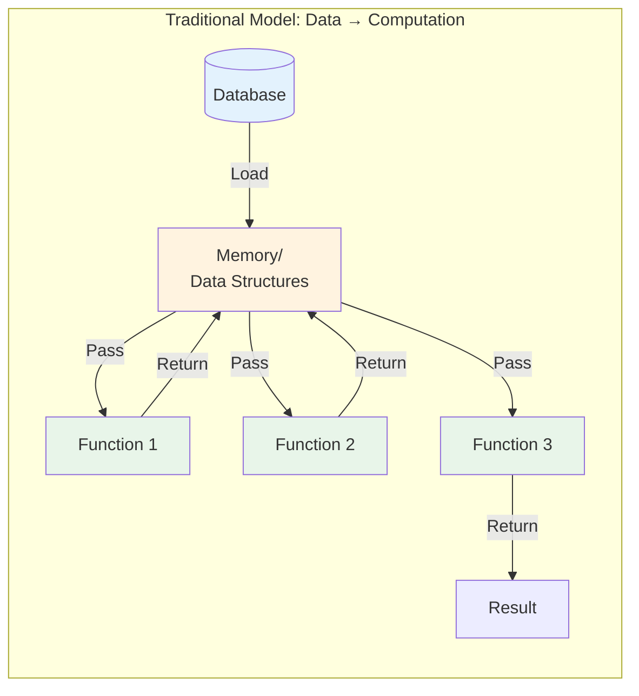
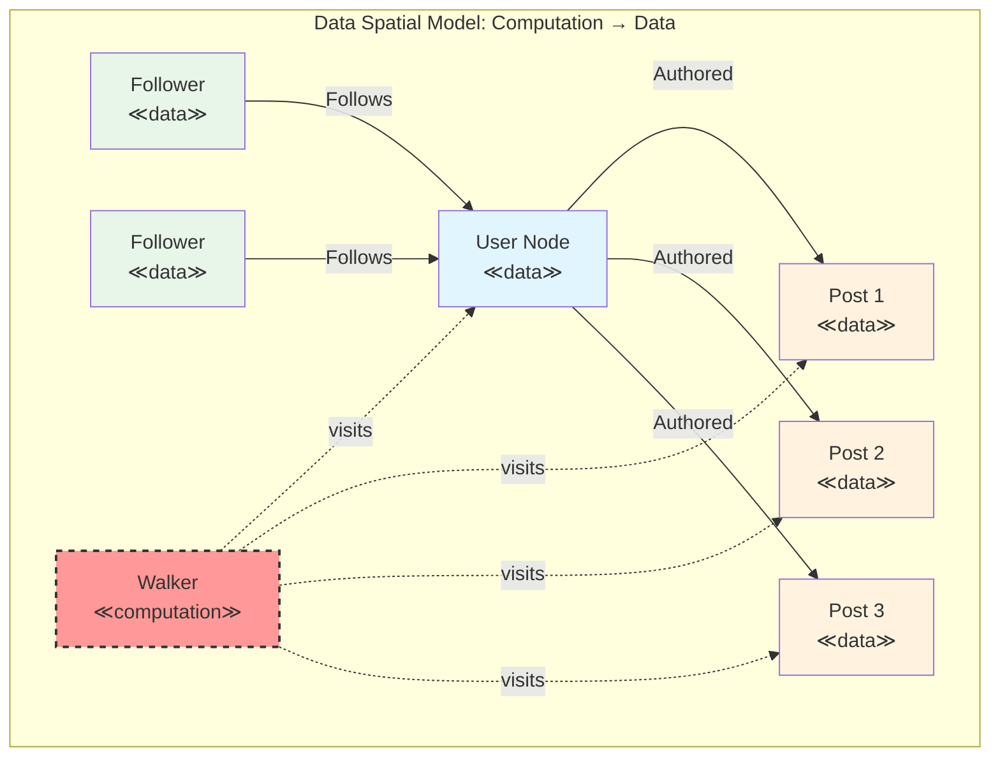
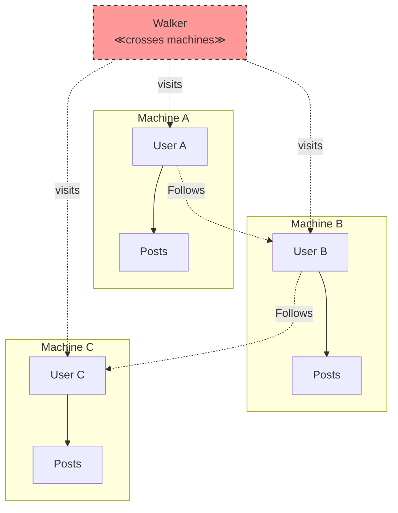
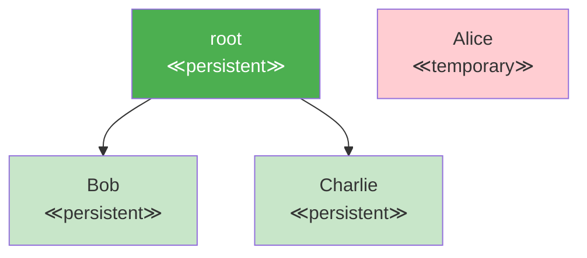
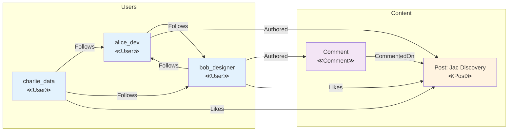

# Jac Programming Guide for Python Developers: Outline

## Part I: Introduction and Motivation

# Chapter 1: Welcome to Jac

## 1.1 What is Jac?

Jac is a programming language that extends familiar Python-like syntax with revolutionary concepts from Data Spatial Programming (DSP). While maintaining the readability and expressiveness that Python developers love, Jac introduces a fundamental paradigm shift in how we think about and structure computation.

### Evolution from Python-like Syntax to Data Spatial Programming

Jac began as an effort to address the limitations of traditional programming paradigms when dealing with inherently graph-like, interconnected systems. While you'll recognize much of the syntax from Python, Jac adds powerful new constructs that make it natural to express complex relationships and computational flows.

```python
# Traditional Python approach
class User:
    def __init__(self, name):
        self.name = name
        self.friends = []

    def add_friend(self, friend):
        self.friends.append(friend)
        friend.friends.append(self)

# Processing requires external traversal logic
def find_friends_of_friends(user):
    fof = set()
    for friend in user.friends:
        for friend_of_friend in friend.friends:
            if friend_of_friend != user:
                fof.add(friend_of_friend)
    return fof
```

```jac
# Jac's Data Spatial approach
node User {
    has name: str;
}

edge Friendship {
    has since: str;
}

walker FindFriendsOfFriends {
    has visited: set = {};
    has friends_of_friends: set = {};

    can traverse with entry {
        if here in self.visited { return; }
        self.visited.add(here);

        # First hop: direct friends
        for friend in [-->:Friendship:] {
            # Second hop: friends of friends
            for fof in friend[-->:Friendship:] {
                if fof != root {  # root is the starting user
                    self.friends_of_friends.add(fof);
                }
            }
        }
    }
}
```

### The Paradigm Shift: From "Data to Computation" to "Computation to Data"

Traditional programming paradigms operate on a fundamental assumption: data moves to computation. We pass data as arguments to functions, return data from methods, and shuttle information between computational units.


Jac inverts this relationship. In Data Spatial Programming, computation moves to data through mobile computational entities called "walkers" that traverse a graph of interconnected data locations called "nodes."


This paradigm shift has profound implications:

1. **Natural Graph Representation**: Relationships become first-class citizens through edges
2. **Localized Computation**: Logic executes where data lives, improving locality
3. **Dynamic Behavior**: Computation paths determined at runtime based on data
4. **Distributed-Ready**: Computation naturally spans machine boundaries

### Scale-Agnostic Programming: Write Once, Scale Anywhere

Perhaps Jac's most revolutionary feature is scale-agnostic programming. Applications written for a single user automatically scale to handle multiple users and distribute across machines without code changes.

```jac
# This same code works for:
# - Single user on one machine
# - Thousands of users on one machine
# - Millions of users across distributed systems

walker CreatePost {
    has content: str;
    has timestamp: str;

    can create with entry {
        # 'root' automatically refers to the current user's root node
        new_post = here ++> Post(
            content=self.content,
            timestamp=self.timestamp,
            author=here
        );

        # Notify followers - works regardless of scale
        for follower in [<--:Follows:] {
            follower ++> Notification(
                type="new_post",
                post=new_post
            );
        }
    }
}
```

## 1.2 Why Jac?

### Limitations of Traditional OOP for Graph-like Structures

Object-Oriented Programming excels at modeling entities and their behaviors, but struggles with several common patterns:

#### 1. **Complex Relationships**
Traditional OOP treats relationships as secondary concerns, typically implemented as references or collections within objects.

```python
# Python: Relationships are afterthoughts
class Person:
    def __init__(self):
        self.friends = []  # Just a list
        self.followers = []  # Another list
        self.blocking = []  # And another

# Relationship logic scattered across methods
def can_see_post(viewer, author, post):
    if viewer in author.blocking:
        return False
    if post.privacy == "friends" and viewer not in author.friends:
        return False
    # More complex logic...
```

```jac
# Jac: Relationships are first-class edges with behavior
edge Follows {
    has since: str;
    has notifications_enabled: bool = true;
}

edge Blocks {
    has reason: str;
    has timestamp: str;
}

# Relationship logic lives in the graph structure
walker CanSeePost {
    has post: Post;

    can check with entry {
        # Blocks prevent traversal naturally
        if [-->:Blocks:-->](?.target == self.post.author) {
            report false;
        }
        # Privacy emerges from graph topology
        report can_reach(here, self.post);
    }
}
```

#### 2. **Traversal Logic**
In traditional OOP, graph traversal requires explicit, often repetitive code.

```python
# Python: Manual traversal with risk of cycles, memory issues
def find_all_dependencies(package, visited=None):
    if visited is None:
        visited = set()

    if package in visited:
        return []

    visited.add(package)
    deps = []

    for dep in package.dependencies:
        deps.append(dep)
        deps.extend(find_all_dependencies(dep, visited))

    return deps
```

```jac
# Jac: Declarative traversal with built-in cycle handling
walker FindDependencies {
    has found: set = {};

    can search with entry {
        self.found.add(here);
        visit [-->:DependsOn:];  # Automatic cycle prevention
    }
}
```

#### 3. **Context-Dependent Behavior**
Objects in traditional OOP have fixed methods that execute the same regardless of context.

```python
# Python: Context requires explicit parameter passing
class Document:
    def render(self, viewer=None, device=None, locale=None):
        if viewer and not self.can_access(viewer):
            return "Access Denied"

        if device == "mobile":
            return self.render_mobile(locale)
        else:
            return self.render_desktop(locale)
```

```jac
# Jac: Context naturally flows with computation
node Document {
    has content: dict;

    # Different behavior for different visitors
    can render with MobileUser entry {
        report self.content.mobile_version;
    }

    can render with DesktopUser entry {
        report self.content.desktop_version;
    }

    can render with Translator entry {
        report translate(self.content, visitor.target_locale);
    }
}
```

### Benefits of Topological Programming

Jac's topological approach offers several key advantages:

#### 1. **Intuitive Relationship Modeling**

```mermaid
graph TB
    subgraph "Social Network Topology"
        U1[User: Alice]
        U2[User: Bob]
        U3[User: Carol]
        P1[Post: "Hello!"]
        P2[Post: "Great day!"]
        C1[Comment: "Nice!"]

        U1 -->|Follows| U2
        U2 -->|Follows| U1
        U2 -->|Follows| U3
        U1 -->|Authored| P1
        U2 -->|Authored| P2
        U3 -->|Commented| C1
        P2 -->|Has| C1
        U1 -.->|Blocked| U3

        style U1 fill:#e1f5fe
        style U2 fill:#e1f5fe
        style U3 fill:#e1f5fe
        style P1 fill:#fff3e0
        style P2 fill:#fff3e0
        style C1 fill:#f3e5f5
    end
```

#### 2. **Natural Concurrency**
Since walkers are independent computational entities, they naturally support concurrent execution:

```jac
# Multiple walkers can traverse simultaneously
walker AnalyzeUser {
    can analyze with entry {
        # Each walker instance operates independently
        report {
            "post_count": len([-->:Authored:]),
            "follower_count": len([<--:Follows:]),
            "engagement_rate": calculate_engagement(here)
        };
    }
}

# Spawn multiple walkers concurrently
with entry {
    # These execute in parallel automatically
    for user in get_active_users() {
        spawn AnalyzeUser() on user;
    }
}
```

#### 3. **Locality of Reference**
Computation happens where data lives, improving cache efficiency and reducing data movement:

```jac
# Traditional: Data gathered then processed
# Requires loading all posts and comments into memory
def calculate_thread_stats(post_id):
    post = load_post(post_id)
    comments = load_all_comments(post_id)  # Potentially huge

    stats = {
        'total_comments': len(comments),
        'unique_commenters': len(set(c.author for c in comments)),
        'max_depth': calculate_max_depth(comments)
    }
    return stats

# Jac: Process data in place
walker ThreadStats {
    has total_comments: int = 0;
    has commenters: set = {};
    has max_depth: int = 0;
    has current_depth: int = 0;

    can analyze with Comment entry {
        self.total_comments += 1;
        self.commenters.add(here.author);
        self.max_depth = max(self.max_depth, self.current_depth);

        # Traverse deeper
        self.current_depth += 1;
        visit [-->:HasReply:];
        self.current_depth -= 1;
    }
}
```

### Built-in Persistence and Multi-User Support

Unlike traditional languages that treat persistence as an external concern, Jac makes it intrinsic:

```jac
# Automatic persistence - no database required!
node UserProfile {
    has username: str;
    has email: str;
    has created_at: str;
}

with entry {
    # Connected to root = automatically persisted
    root ++> UserProfile(
        username="alice",
        email="alice@example.com",
        created_at=timestamp_now()
    );
}  # Data persists after program exits

# Next execution can access the same data
walker GetProfile {
    can get with entry {
        profile = [-->:UserProfile:][0];
        report profile;
    }
}
```

Multi-user support is equally seamless:

```jac
# Each user automatically gets their own isolated root node
walker UpdateBio {
    has new_bio: str;

    can update with entry {
        # 'root' refers to the current user's root
        # No explicit user context needed!
        profile = root[-->:UserProfile:][0];
        profile.bio = self.new_bio;
    }
}
```

### Natural Expression of Distributed Systems

Jac's topological model naturally extends across machine boundaries:


The same walker code works regardless of distribution:

```jac
walker FindMutualFollowers {
    has target_user: User;
    has mutuals: set = {};

    can find with entry {
        my_followers = set([<--:Follows:]);

        # This works even if target_user is on another machine!
        visit self.target_user {
            their_followers = set([<--:Follows:]);
            self.mutuals = my_followers.intersection(their_followers);
        };

        report self.mutuals;
    }
}
```

## 1.3 This Guide's Approach

### Leveraging Your Python Knowledge

As a Python developer, you already possess most of the knowledge needed to be productive in Jac. This guide builds on your existing expertise while introducing new concepts gradually.

#### What Transfers Directly:
- Basic syntax for expressions and statements
- Data types (with mandatory type annotations)
- Control flow concepts (with curly braces)
- Object-oriented principles (enhanced with archetypes)
- Standard library patterns (with Jac equivalents)

#### What's Enhanced:
- Functions become "abilities" with context-aware execution
- Classes become "archetypes" with richer semantics
- Decorators work with new constructs
- Type system is mandatory but more expressive

#### What's New:
- Graph-based program structure
- Mobile computation via walkers
- Automatic persistence and multi-user support
- Scale-agnostic deployment

### Progressive Learning Path

This guide follows a carefully designed progression:


1. **Start Familiar**: Begin with Python-like features to build confidence
2. **Introduce Concepts**: Learn data spatial concepts with simple examples
3. **Build Understanding**: Create increasingly complex graph structures
4. **Master Scale**: Understand persistence and distribution
5. **Apply Knowledge**: Build real-world applications

### Hands-on Examples Throughout

Every concept in this guide is illustrated with practical, runnable examples. You'll build:

- **Chapter 3-5**: A todo list app (familiar territory)
- **Chapter 6-9**: A social network (graph basics)
- **Chapter 10-13**: A multi-user blog (scale-agnostic features)
- **Chapter 14-16**: A distributed task queue (advanced patterns)
- **Chapter 17-19**: Complete applications combining all concepts

Each example builds on the previous, creating a coherent learning journey from Python developer to Jac expert.

```jac
# Your journey starts here!
with entry {
    print("Welcome to Jac!");

    # Create your first persistent node
    root ++> LearningProgress(
        developer="You",
        started_at=timestamp_now(),
        excitement_level=100
    );
}
```

Ready to begin? In the next chapter, we'll set up your Jac development environment and write your first Data Spatial program. The future of programming awaits!

# Chapter 2: Setting Up Your Jac Environment

## 2.1 Installation and Setup

Getting started with Jac is straightforward, especially for Python developers. Jac provides multiple installation methods and integrates well with familiar development tools.

### Installing Jac Compiler and Runtime

#### Method 1: Using pip (Recommended)

```bash
# Install the latest stable version
pip install jaclang

# Verify installation
jac --version
# Output: Jac 0.7.19 (or current version)

# Install with development tools
pip install jaclang[dev]
```

#### Method 2: From Source

```bash
# Clone the repository
git clone https://github.com/Jaseci-Labs/jaclang.git
cd jaclang

# Install in development mode
pip install -e .

# Run tests to verify
python -m pytest
```

#### Method 3: Docker Container

```dockerfile
# Dockerfile for Jac development
FROM python:3.10-slim

RUN pip install jaclang
WORKDIR /app

# Copy your Jac files
COPY . .

CMD ["jac", "run", "main.jac"]
```

```bash
# Build and run
docker build -t my-jac-app .
docker run -it my-jac-app
```

### System Requirements

- **Python**: 3.10 or higher (Jac compiles to Python)
- **Memory**: 4GB RAM minimum, 8GB recommended
- **OS**: Linux, macOS, Windows (WSL recommended)
- **Storage**: 500MB for Jac + dependencies

### IDE Support and Extensions

#### Visual Studio Code (Recommended)

Install the official Jac extension for syntax highlighting, auto-completion, and debugging:

```bash
# Install via VS Code marketplace
code --install-extension jaseci.jac-lang
```

**Features:**
- Syntax highlighting for `.jac` files
- IntelliSense for Jac keywords and types
- Integrated debugging support
- Graph visualization for nodes and edges
- Automatic formatting

#### JetBrains IDEs (PyCharm, IntelliJ)

```xml
<!-- Add to your .idea/fileTypes.xml -->
<component name="FileTypeManager">
  <extensionMap>
    <mapping pattern="*.jac" type="Python" />
    <mapping pattern="*.impl.jac" type="Python" />
    <mapping pattern="*.test.jac" type="Python" />
  </extensionMap>
</component>
```

#### Vim/Neovim

```vim
" Add to your .vimrc or init.vim
autocmd BufRead,BufNewFile *.jac set filetype=python
autocmd BufRead,BufNewFile *.jac set syntax=python

" Better: Install jac.vim plugin
Plug 'jaseci-labs/jac.vim'
```

### Project Structure Conventions

Jac projects follow a structured organization that supports its unique features like implementation separation:

```
my-jac-project/
│
├── src/
│   ├── main.jac                 # Main entry point
│   ├── models/
│   │   ├── user.jac            # User node definition
│   │   ├── user.impl.jac       # User implementation
│   │   └── user.test.jac       # User tests
│   │
│   ├── walkers/
│   │   ├── auth.jac            # Authentication walkers
│   │   └── auth.impl/          # Implementation folder
│   │       ├── login.impl.jac
│   │       └── register.impl.jac
│   │
│   └── edges/
│       └── relationships.jac    # Edge definitions
│
├── tests/
│   ├── integration/
│   └── unit/
│
├── data/                        # Persistent data (auto-generated)
│   └── .jac_db/                # Jac's persistence layer
│
├── jac.toml                     # Project configuration
└── README.md
```

#### jac.toml Configuration

```toml
[project]
name = "my-jac-project"
version = "0.1.0"
description = "A Jac application"

[runtime]
persist_path = "./data/.jac_db"
log_level = "INFO"
enable_distributed = false

[build]
target = "optimized"  # or "debug"
include_tests = false

[dependencies]
# External Jac modules
```

### Environment Setup

#### Development Environment Variables

```bash
# .env file
JAC_PERSIST_PATH=./data/.jac_db
JAC_LOG_LEVEL=DEBUG
JAC_USER_CONTEXT=development
JAC_ENABLE_METRICS=true
```

#### Python Virtual Environment (Recommended)

```bash
# Create virtual environment
python -m venv jac-env

# Activate it
# On Unix/macOS:
source jac-env/bin/activate
# On Windows:
jac-env\Scripts\activate

# Install Jac in the virtual environment
pip install jaclang
```

## 2.2 Your First Jac Program

Let's create your first Jac program and understand the key differences from Python.

### Hello World Comparison: Python vs Jac

#### Python Version

```python
# hello.py
def greet(name):
    return f"Hello, {name}!"

if __name__ == "__main__":
    message = greet("World")
    print(message)
```

#### Jac Version

```jac
# hello.jac
can greet(name: str) -> str {
    return f"Hello, {name}!";
}

with entry {
    message = greet("World");
    print(message);
}
```

Key differences:
1. **Function declaration**: `can` instead of `def`
2. **Type annotations**: Required in Jac (`name: str`)
3. **Semicolons**: Required for statements
4. **Entry point**: `with entry` instead of `if __name__ == "__main__"`
5. **Curly braces**: Instead of indentation

### Understanding Entry Blocks

Entry blocks are Jac's way of organizing executable code at the module level:

```jac
# module_demo.jac

# Imports (similar to Python)
import:py from datetime { datetime }
import:py random;

# Global variables must be declared
glob start_time: str = datetime.now().isoformat();
let config: dict = {"debug": true};

# Function definitions
can setup_application() -> bool {
    print(f"Application started at {start_time}");
    return true;
}

# Classes (called objects in Jac)
obj Application {
    has name: str;
    has version: str = "1.0.0";

    can display_info {
        print(f"{self.name} v{self.version}");
    }
}

# Entry block - code that runs when module executes
with entry {
    print("=== Jac Module Demo ===");

    if setup_application() {
        app = Application(name="MyApp");
        app.display_info();
    }
}

# Named entry block - alternative entry point
with entry:cli {
    print("Running from CLI entry point");
    # Different initialization for CLI mode
}
```

### Your First Data Spatial Program

Let's create a simple but complete data spatial program:

```jac
# social_hello.jac

# Define a Person node
node Person {
    has name: str;
    has joined: str;
}

# Define a Knows edge
edge Knows {
    has since: str;
}

# Define a Greeter walker
walker Greeter {
    has greeting_count: int = 0;

    # Ability triggered when entering a Person node
    can greet with Person entry {
        print(f"Hello, {here.name}! You joined on {here.joined}");
        self.greeting_count += 1;

        # Visit all people this person knows
        visit [-->:Knows:];
    }

    # Ability triggered when walker finishes
    can summarize with `root exit {
        print(f"\nGreeted {self.greeting_count} people total!");
    }
}

# Main program
with entry {
    # Create a small social network
    person1 = Person(name="Alice", joined="2024-01-15");
    person2 = Person(name="Bob", joined="2024-02-20");
    person3 = Person(name="Charlie", joined="2024-03-10");

    # Connect to root for persistence
    root ++> person1;

    # Create relationships
    person1 ++>:Knows(since="2024-02-01"):++> person2;
    person2 ++>:Knows(since="2024-03-01"):++> person3;

    # Spawn walker to greet everyone
    greeter = Greeter();
    root spawn greeter;
}
```

### Running and Testing Jac Programs

#### Basic Execution

```bash
# Run a Jac file
jac run hello.jac

# Run with specific entry point
jac run module_demo.jac:cli

# Run with debugging
jac run --debug social_hello.jac
```

#### Interactive Mode (REPL)

```bash
# Start Jac REPL
jac shell

# In the REPL:
> let x = 42;
> print(x * 2);
84
> node TestNode { has value: int; }
> n = TestNode(value=100);
> print(n.value);
100
```

#### Testing Your Programs

```jac
# test_hello.jac

import:jac from hello { greet }

test "greet function works correctly" {
    assert greet("Jac") == "Hello, Jac!";
    assert greet("") == "Hello, !";
}

test "greet with special characters" {
    assert greet("世界") == "Hello, 世界!";
    assert greet("O'Brien") == "Hello, O'Brien!";
}

# Run tests
# Command: jac test test_hello.jac
```

#### Debugging Techniques

```jac
# debug_example.jac

walker DebugWalker {
    has visited_nodes: list = [];

    can walk with entry {
        # Debug print statements
        print(f"[DEBUG] Entering node: {here}");
        print(f"[DEBUG] Node type: {type(here)}");

        # Inspect node properties
        ::py::
        import pprint
        print("[DEBUG] Node properties:")
        pprint.pprint(here.__dict__)
        ::py::

        self.visited_nodes.append(here);

        # Conditional debugging
        if len(self.visited_nodes) > 10 {
            print("[WARNING] Visited more than 10 nodes!");
            disengage;  # Stop walker
        }

        visit [-->];
    }
}

# Enable verbose logging
with entry {
    import:py logging;
    logging.basicConfig(level=logging.DEBUG);

    # Your code here
}
```

### Building a Complete Example

Let's build a simple todo list application that showcases basic Jac features:

```jac
# todo_app.jac

import:py from datetime { datetime }
import:py json;

# Define our data structures
node TodoList {
    has name: str;
    has created_at: str;
}

node TodoItem {
    has title: str;
    has completed: bool = false;
    has created_at: str;
    has due_date: str = "";
}

edge Contains;
edge NextItem;

# Walker to add new todos
walker AddTodo {
    has title: str;
    has due_date: str = "";

    can add with TodoList entry {
        new_item = here ++>:Contains:++> TodoItem(
            title=self.title,
            created_at=datetime.now().isoformat(),
            due_date=self.due_date
        );

        # Link to previous items
        last_item = [-->:Contains:-->:TodoItem:][-2:];
        if last_item {
            last_item[0] ++>:NextItem:++> new_item;
        }

        report f"Added: {self.title}";
    }
}

# Walker to list todos
walker ListTodos {
    has show_completed: bool = false;
    has items: list = [];

    can collect with TodoList entry {
        for item in [-->:Contains:-->:TodoItem:] {
            if not item.completed or self.show_completed {
                self.items.append({
                    "title": item.title,
                    "completed": item.completed,
                    "created": item.created_at,
                    "due": item.due_date
                });
            }
        }
    }

    can display with `root exit {
        print("\n=== Todo List ===");
        for i, item in enumerate(self.items) {
            status = "✓" if item["completed"] else "○";
            due = f" (due: {item['due']})" if item["due"] else "";
            print(f"{i+1}. {status} {item['title']}{due}");
        }
        print(f"\nTotal: {len(self.items)} items\n");
    }
}

# Walker to complete todos
walker CompleteTodo {
    has item_index: int;

    can complete with TodoList entry {
        items = [-->:Contains:-->:TodoItem:];
        if 0 <= self.item_index < len(items) {
            items[self.item_index].completed = true;
            report f"Completed: {items[self.item_index].title}";
        } else {
            report "Invalid item index!";
        }
    }
}

# Main program
with entry {
    # Create or get existing todo list
    lists = root[-->:TodoList:];

    if not lists {
        print("Creating new todo list...");
        my_list = root ++> TodoList(
            name="My Tasks",
            created_at=datetime.now().isoformat()
        );
    } else {
        my_list = lists[0];
        print("Loading existing todo list...");
    }

    # Example: Add some todos
    spawn AddTodo(title="Learn Jac basics", due_date="2024-12-31") on my_list;
    spawn AddTodo(title="Build first Jac app") on my_list;
    spawn AddTodo(title="Master data spatial programming") on my_list;

    # List all todos
    spawn ListTodos(show_completed=true) on my_list;
}

# CLI entry point
with entry:add {
    import:py sys;
    if len(sys.argv) < 3 {
        print("Usage: jac run todo_app.jac:add 'Task title' [due_date]");
        exit(1);
    }

    title = sys.argv[2];
    due_date = sys.argv[3] if len(sys.argv) > 3 else "";

    lists = root[-->:TodoList:];
    if lists {
        spawn AddTodo(title=title, due_date=due_date) on lists[0];
        spawn ListTodos() on lists[0];
    }
}
```

### Running the Todo App

```bash
# First run - creates the list
jac run todo_app.jac

# Add a new todo via CLI
jac run todo_app.jac:add "Buy groceries" "2024-12-25"

# Run again - todos persist!
jac run todo_app.jac
```

### Development Workflow


### Common Issues and Solutions

| Issue | Solution |
|-------|----------|
| `ModuleNotFoundError` | Ensure Jac is installed: `pip install jaclang` |
| `SyntaxError: Missing semicolon` | Add `;` at end of statements |
| `TypeError: Missing type annotation` | Add type hints to all function parameters |
| `RuntimeError: No entry point` | Add `with entry { ... }` block |
| `PersistenceError` | Check write permissions for `JAC_PERSIST_PATH` |

### Next Steps

Now that you have Jac installed and have written your first programs, you're ready to dive deeper into the language. In the next chapter, we'll explore how Jac's syntax relates to Python and learn about the enhanced features that make Jac powerful for modern application development.

Try modifying the todo app to add new features:
- Add priority levels to todos
- Implement due date notifications
- Create categories for todos
- Add a search walker to find specific items

Remember: every Jac program you write is automatically persistent and ready for multi-user scenarios. The same todo app could serve thousands of users without any code changes - that's the power of scale-agnostic programming!

## Part II: Core Language Features - Python to Jac

# Chapter 3: Familiar Syntax with New Semantics

As a Python developer, you'll find Jac's syntax comfortably familiar while discovering powerful enhancements that make your code more robust and expressive. This chapter explores the core language features, highlighting what's similar, what's enhanced, and what's new.

## 3.1 Variables and Types

### Type Annotations are Mandatory (Unlike Python's Optional Hints)

In Python, type hints are optional and primarily serve as documentation:

```python
# Python - types are optional hints
name = "Alice"  # Type inferred
age = 30        # Type inferred
score = 95.5    # Type inferred

# Type hints can be added but aren't enforced
def calculate_grade(score: float) -> str:  # Optional
    return "A" if score >= 90 else "B"
```

In Jac, type annotations are mandatory and enforced at compile time:

```jac
// Jac - types are required and enforced
let name: str = "Alice";    // Explicit type required
let age: int = 30;          // Must specify type
let score: float = 95.5;    // Type checking enforced

// Function parameters and returns MUST have types
can calculate_grade(score: float) -> str {
    return "A" if score >= 90.0 else "B";
}

// This would cause a compile error:
// let mystery = "something";  // Error: missing type annotation
```

### Benefits of Mandatory Types

```jac
// Type safety prevents runtime errors
obj Student {
    has name: str;
    has grades: list[float];

    can add_grade(grade: float) {
        // This would fail at compile time if grade wasn't a float
        self.grades.append(grade);
    }

    can get_average() -> float {
        if len(self.grades) == 0 {
            return 0.0;  // Must return float, not int
        }
        return sum(self.grades) / len(self.grades);
    }
}

// Type errors caught at compile time
with entry {
    let student = Student(name="Bob", grades=[]);

    // student.add_grade("95");  // Compile error: string != float
    student.add_grade(95.0);     // Correct

    let avg: float = student.get_average();  // Type-safe assignment
}
```

### `let` for Explicit Declarations vs Python's Implicit Declaration

Python creates variables implicitly on first assignment:

```python
# Python
x = 10        # Variable created implicitly
x = "hello"   # Type can change (dynamic typing)
y = x         # Another implicit creation
```

Jac requires explicit declaration with `let`:

```jac
// Jac
let x: int = 10;        // Explicit declaration with type
// x = "hello";         // Error: can't change type
let y: int = x;         // Must declare before use

// let provides clarity about variable creation
can process_data(data: list[int]) -> int {
    let sum: int = 0;              // Clear: new variable
    let count: int = len(data);    // Clear: new variable

    for item in data {
        sum += item;    // Clear: modifying existing variable
    }

    let average: float = sum / count;  // Clear: new variable
    return int(average);
}
```

### `glob` for Global Variables

While Python uses the `global` keyword to modify globals within functions, Jac uses `glob` for declaration and `:g:` for access:

```python
# Python
counter = 0  # Global variable

def increment():
    global counter  # Declare intent to modify global
    counter += 1
```

```jac
// Jac
glob counter: int = 0;  // Explicitly global variable

can increment() {
    :g: counter;    // Declare access to global
    counter += 1;
}

// Access control for globals
glob:pub api_version: str = "1.0";      // Public global
glob:priv secret_key: str = "hidden";   // Private global
glob:protect internal_state: dict = {}; // Protected global

// Module-level globals with entry block
with entry {
    :g: counter, api_version;
    print(f"Counter: {counter}, API Version: {api_version}");
}
```

### Built-in Types Comparison Table

| Python Type | Jac Type | Notes |
|------------|----------|-------|
| `int` | `int` | Same behavior, explicit declaration |
| `float` | `float` | Same precision rules |
| `str` | `str` | Same string operations |
| `bool` | `bool` | Same True/False values |
| `list` | `list[T]` | Generic type required |
| `dict` | `dict[K,V]` | Key and value types required |
| `tuple` | `tuple` | Supports both positional and keyword |
| `set` | `set[T]` | Element type required |
| `None` | `None` | Same null/none concept |
| `Any` | `any` | Escape hatch for dynamic typing |
| `bytes` | `bytes` | Binary data handling |
| `type` | `type` | Type introspection |

### Working with Collection Types

```jac
// Lists with explicit typing
let numbers: list[int] = [1, 2, 3, 4, 5];
let names: list[str] = ["Alice", "Bob", "Charlie"];
let matrix: list[list[float]] = [[1.0, 2.0], [3.0, 4.0]];

// Dictionaries with key-value types
let scores: dict[str, int] = {"Alice": 95, "Bob": 87};
let config: dict[str, any] = {"debug": true, "port": 8080};

// Sets with element types
let unique_ids: set[int] = {101, 102, 103};
let tags: set[str] = {"python", "jac", "programming"};

// Tuples - both positional and keyword (Jac special!)
let point: tuple = (3, 4);                    // Positional
let person: tuple = (name="Alice", age=30);  // Keyword tuple!
```

### Type Inference and Validation

While types must be declared, Jac can infer complex types in some contexts:

```jac
// Type inference in comprehensions
let numbers: list[int] = [1, 2, 3, 4, 5];
let squared = [x * x for x in numbers];  // Inferred as list[int]

// But explicit is often better
let squared_explicit: list[int] = [x * x for x in numbers];

// Type validation at compile time
can safe_divide(a: float, b: float) -> float {
    if b == 0.0 {
        return 0.0;  // Must return float
        // return None;  // Error: None is not float
    }
    return a / b;
}

// Optional types for nullable values
can find_user(id: int) -> str? {  // Can return str or None
    if id < 0 {
        return None;  // Valid
    }
    return f"User_{id}";  // Valid
}
```

### Working with Any Type

Sometimes you need dynamic typing. Jac provides `any` as an escape hatch:

```jac
// Using 'any' for flexible types
let flexible: any = 42;
flexible = "now a string";  // Allowed with 'any'
flexible = [1, 2, 3];      // Still allowed

// Useful for JSON-like data
let json_data: dict[str, any] = {
    "name": "Alice",
    "age": 30,
    "tags": ["developer", "python"],
    "active": true
};

// But prefer specific types when possible
obj ConfigValue {
    has value: any;
    has type_name: str;

    can get_typed[T](expected_type: type) -> T? {
        if type(self.value) == expected_type {
            return self.value;
        }
        return None;
    }
}
```

## 3.2 Control Flow

### Curly Braces Instead of Indentation

The most visible difference from Python is the use of curly braces for code blocks:

```python
# Python uses indentation
if temperature > 30:
    print("It's hot!")
    if temperature > 40:
        print("It's very hot!")
else:
    print("It's comfortable")
```

```jac
// Jac uses curly braces
if temperature > 30 {
    print("It's hot!");
    if temperature > 40 {
        print("It's very hot!");
    }
} else {
    print("It's comfortable");
}

// Indentation is for readability, not syntax
if user.is_authenticated {
print("Welcome!");     // Still works but not recommended
    print("Logged in");  // Inconsistent indentation is allowed
}                        // But maintain consistency for readability!
```

### Enhanced For Loops: `for-to-by` Syntax

Jac provides multiple for loop syntaxes, including a unique `for-to-by` construct:

```jac
// Traditional for-in loop (like Python)
let items: list[str] = ["apple", "banana", "cherry"];
for item in items {
    print(item);
}

// Range-based loop (like Python)
for i in range(5) {
    print(i);  // 0, 1, 2, 3, 4
}

// Jac's unique for-to-by loop
for i = 0 to i < 10 by i += 2 {
    print(i);  // 0, 2, 4, 6, 8
}

// Complex for-to-by examples
// Countdown
for count = 10 to count > 0 by count -= 1 {
    print(f"{count}...");
}
print("Liftoff!");

// Exponential growth
for value = 1 to value <= 1000 by value *= 2 {
    print(value);  // 1, 2, 4, 8, 16, 32, 64, 128, 256, 512
}

// Multiple variables (advanced)
for i = 0, j = 10 to i < j by i += 1, j -= 1 {
    print(f"i={i}, j={j}");
}
```

### Match Statements (Pattern Matching)

Jac includes pattern matching, similar to Python 3.10+'s match statement but with enhanced features:

```jac
// Basic pattern matching
can describe_number(n: int) -> str {
    match n {
        case 0: return "zero";
        case 1: return "one";
        case 2: return "two";
        case x if x < 0: return "negative";
        case x if x > 100: return "large";
        case _: return "other";
    }
}

// Structural pattern matching
can process_data(data: any) -> str {
    match data {
        case None:
            return "No data";

        case []:
            return "Empty list";

        case [x]:
            return f"Single item: {x}";

        case [first, *rest]:
            return f"List starting with {first}";

        case {"type": "user", "name": name}:
            return f"User: {name}";

        case {"type": t, **kwargs}:
            return f"Object of type {t}";

        case _:
            return "Unknown data";
    }
}

// Type pattern matching
node Animal {
    has name: str;
}

node Dog(Animal) {
    has breed: str;
}

node Cat(Animal) {
    has indoor: bool;
}

walker AnimalHandler {
    can handle with Animal entry {
        match here {
            case Dog:
                print(f"{here.name} is a {here.breed} dog");

            case Cat if here.indoor:
                print(f"{here.name} is an indoor cat");

            case Cat:
                print(f"{here.name} is an outdoor cat");

            case _:
                print(f"{here.name} is some other animal");
        }
    }
}
```

### Walrus Operator (`:=`) Similarities and Differences

Both Python and Jac support the walrus operator for assignment expressions:

```python
# Python walrus operator
while (line := file.readline()):
    process(line)

if (n := len(items)) > 10:
    print(f"Large list with {n} items")
```

```jac
// Jac walrus operator - same syntax, similar usage
while (line := file.readline()) {
    process(line);
}

if (n := len(items)) > 10 {
    print(f"Large list with {n} items");
}

// Useful in comprehensions
let results: list[int] = [
    y for x in data
    if (y := expensive_computation(x)) > threshold
];

// In match statements
match get_user() {
    case user if (role := user.get_role()) == "admin":
        grant_admin_access(role);
    case _:
        grant_basic_access();
}
```

### Control Flow Comparison


### Exception Handling

Exception handling in Jac follows Python patterns with brace syntax:

```jac
// Basic try-except
can safe_divide(a: float, b: float) -> float {
    try {
        return a / b;
    } except ZeroDivisionError {
        print("Cannot divide by zero!");
        return 0.0;
    }
}

// Multiple exception types
can process_file(filename: str) -> str {
    try {
        let file = open(filename, "r");
        let content = file.read();
        file.close();
        return content;
    } except FileNotFoundError as e {
        print(f"File not found: {e}");
        return "";
    } except IOError as e {
        print(f"IO error: {e}");
        return "";
    } finally {
        print("Cleanup complete");
    }
}

// Raising exceptions
can validate_age(age: int) {
    if age < 0 {
        raise ValueError("Age cannot be negative");
    }
    if age > 150 {
        raise ValueError("Age seems unrealistic");
    }
}
```

## 3.3 Functions to Abilities

### Traditional Functions with `can` Keyword

Jac uses `can` instead of Python's `def` for function definitions:

```python
# Python function
def calculate_area(radius: float) -> float:
    return 3.14159 * radius ** 2
```

```jac
// Jac function
can calculate_area(radius: float) -> float {
    return 3.14159 * radius ** 2;
}

// Functions are first-class objects
let area_calculator: func = calculate_area;
let result: float = area_calculator(5.0);
```

### Why `self` is Optional in Jac

One of Jac's conveniences is that `self` is implicit in methods unless you need it:

```python
# Python - self is always required
class Rectangle:
    def __init__(self, width, height):
        self.width = width
        self.height = height

    def area(self):  # Must include self
        return self.width * self.height

    def describe(self):  # Must include self even if unused
        return "A rectangle"
```

```jac
// Jac - self is implicit
obj Rectangle {
    has width: float;
    has height: float;

    can area() -> float {  // No self needed!
        return self.width * self.height;  // self still accessible
    }

    can describe() -> str {  // No self parameter
        return "A rectangle";  // Not using self? Don't declare it!
    }

    can set_dimensions(width: float, height: float) {
        self.width = width;    // self available when needed
        self.height = height;
    }
}
```

### Type Safety and Return Types

Jac enforces return type consistency:

```jac
// Return types are enforced
can get_grade(score: float) -> str {
    if score >= 90.0 {
        return "A";
    } elif score >= 80.0 {
        return "B";
    }
    // return;  // Error: must return str
    return "F";  // Must cover all paths
}

// Multiple return values via tuples
can divmod(a: int, b: int) -> tuple[int, int] {
    return (a // b, a % b);
}

// Optional returns
can find_item(items: list[str], target: str) -> int? {
    for i, item in enumerate(items) {
        if item == target {
            return i;
        }
    }
    return None;  // Explicitly return None for not found
}
```

### Lambda Expressions with Required Type Annotations

Python's lambdas can infer types, but Jac requires explicit annotations:

```python
# Python lambdas - types optional
square = lambda x: x ** 2
add = lambda x, y: x + y
```

```jac
// Jac lambdas - types required
let square = lambda x: int -> int : x ** 2;
let add = lambda x: int, y: int -> int : x + y;

// Using lambdas with higher-order functions
let numbers: list[int] = [1, 2, 3, 4, 5];
let squared: list[int] = numbers.map(lambda x: int -> int : x ** 2);
let evens: list[int] = numbers.filter(lambda x: int -> bool : x % 2 == 0);

// Lambda in sort
let people: list[tuple] = [
    (name="Alice", age=30),
    (name="Bob", age=25),
    (name="Charlie", age=35)
];
people.sort(key=lambda p: tuple -> int : p.age);
```

### Abilities: Context-Aware Functions

Beyond traditional functions, Jac introduces abilities - functions that execute based on context:

```jac
// Traditional function - explicitly called
can greet(name: str) -> str {
    return f"Hello, {name}!";
}

// Ability - implicitly triggered
walker Greeter {
    can greet_person with Person entry {
        // No parameters! Context provided by 'here' and 'self'
        print(f"Hello, {here.name}!");
    }
}

// Node ability - triggered by visitor
node Person {
    has name: str;

    can welcome with Greeter entry {
        // 'visitor' refers to the walker
        print(f"{self.name} says: Welcome, traveler!");
    }
}

// Usage comparison
with entry {
    // Traditional function - explicit call
    message = greet("Alice");
    print(message);

    // Ability - implicit execution
    let alice = Person(name="Alice");
    let greeter = Greeter();
    greeter spawn alice;  // Triggers both abilities!
}
```

### Function Decorators and Metadata

Jac supports Python-style decorators with enhanced integration:

```jac
import:py from functools { lru_cache }
import:py from typing { deprecated }

// Using Python decorators
@lru_cache(maxsize=128)
can fibonacci(n: int) -> int {
    if n <= 1 {
        return n;
    }
    return fibonacci(n - 1) + fibonacci(n - 2);
}

// Custom decorators
can timing_decorator(func: callable) -> callable {
    can wrapper(*args: any, **kwargs: any) -> any {
        import:py time;
        start = time.time();
        result = func(*args, **kwargs);
        end = time.time();
        print(f"{func.__name__} took {end - start:.4f} seconds");
        return result;
    }
    return wrapper;
}

@timing_decorator
can slow_operation(n: int) -> int {
    let result: int = 0;
    for i in range(n) {
        result += i ** 2;
    }
    return result;
}
```

### Async Functions

Jac supports asynchronous programming similar to Python:

```jac
import:py asyncio;
import:py from aiohttp { ClientSession }

// Async function definition
async can fetch_data(url: str) -> dict {
    async with ClientSession() as session {
        async with session.get(url) as response {
            return await response.json();
        }
    }
}

// Async walker ability
walker AsyncDataCollector {
    has urls: list[str];
    has results: list[dict] = [];

    async can collect with entry {
        // Parallel fetch
        let tasks = [fetch_data(url) for url in self.urls];
        self.results = await asyncio.gather(*tasks);
    }
}

// Using async in entry
with entry {
    async can main() {
        let urls = [
            "https://api.example.com/data1",
            "https://api.example.com/data2"
        ];

        let collector = AsyncDataCollector(urls=urls);
        await collector.collect();
        print(f"Collected {len(collector.results)} results");
    }

    asyncio.run(main());
}
```

### Method Resolution and Super

Jac provides clear method resolution with the `super` keyword:

```jac
obj Animal {
    has name: str;

    can speak() -> str {
        return f"{self.name} makes a sound";
    }
}

obj Dog(Animal) {
    has breed: str;

    can speak() -> str {
        // Call parent method
        let base_sound = super.speak();
        return f"{base_sound}: Woof!";
    }

    can fetch() {
        print(f"{self.name} the {self.breed} is fetching!");
    }
}

obj GuideDog(Dog) {
    has handler: str;

    can speak() -> str {
        // Chain through inheritance
        return f"{super.speak()} (Guide dog for {self.handler})";
    }
}
```

### Best Practices for Functions and Abilities

1. **Use Functions for Algorithms**: Pure computations without side effects
2. **Use Abilities for Behavior**: Context-dependent actions in graph traversal
3. **Type Everything**: Clear types prevent errors and improve readability
4. **Avoid Deep Nesting**: Use early returns and guard clauses
5. **Document Complex Logic**: Use docstrings for non-obvious behavior

```jac
// Well-structured function example
can calculate_discount(
    price: float,
    customer_type: str,
    quantity: int
) -> float {
    """
    Calculate discount based on customer type and quantity.

    Returns the discount amount (not the final price).
    """
    // Guard clauses
    if price <= 0.0 {
        return 0.0;
    }

    // Base discount by customer type
    let base_discount: float = match customer_type {
        case "premium": 0.15;
        case "regular": 0.05;
        case _: 0.0;
    };

    // Quantity bonus
    let quantity_bonus: float = match quantity {
        case n if n >= 100: 0.10;
        case n if n >= 50: 0.05;
        case n if n >= 10: 0.02;
        case _: 0.0;
    };

    // Calculate total discount
    let total_rate = min(base_discount + quantity_bonus, 0.25);
    return price * total_rate;
}
```

## Summary

In this chapter, we've seen how Jac builds on Python's familiar syntax while adding:

- **Mandatory type safety** for more robust code
- **Explicit variable declaration** for clarity
- **Enhanced control flow** with for-to-by loops and pattern matching
- **Implicit self** for cleaner method definitions
- **Context-aware abilities** alongside traditional functions

These enhancements make Jac code more explicit, safer, and better suited for the complex, distributed systems you'll build with data spatial programming.

In the next chapter, we'll explore Jac's data structures and unique features like keyword tuples and pipe operators that make data manipulation even more powerful and expressive.

# Chapter 4: Data Structures and Collections

Jac's data structures will feel familiar to Python developers, but they come with enhanced type safety, powerful new operations, and unique features like keyword tuples and pipe operators. This chapter explores how to work with collections effectively in Jac.

## 4.1 Collections Comparison

### Lists, Tuples, Dicts, Sets - Familiar but Enhanced

Let's start by comparing Python and Jac collections:

```python
# Python - Dynamic typing, flexible but potentially error-prone
numbers = [1, 2, 3]
numbers.append("four")  # Allowed, but might cause issues later

person = ("Alice", 30)  # Simple tuple
scores = {"Alice": 95, "Bob": 87}
tags = {"python", "programming", "tutorial"}
```

```jac
// Jac - Static typing, safe and predictable
let numbers: list[int] = [1, 2, 3];
// numbers.append("four");  // Compile error: type mismatch

let person: tuple = ("Alice", 30);  // Positional tuple
let person_kw: tuple = (name="Alice", age=30);  // Keyword tuple!
let scores: dict[str, int] = {"Alice": 95, "Bob": 87};
let tags: set[str] = {"python", "programming", "tutorial"};
```

### Working with Lists

Lists in Jac maintain order and allow duplicates, just like Python, but with type safety:

```jac
// List creation and basic operations
let fruits: list[str] = ["apple", "banana", "cherry"];
fruits.append("date");
fruits.insert(1, "blueberry");
print(fruits);  // ["apple", "blueberry", "banana", "cherry", "date"]

// List methods with type safety
let numbers: list[int] = [3, 1, 4, 1, 5, 9, 2, 6];
numbers.sort();  // In-place sort
let unique_sorted: list[int] = sorted(set(numbers));  // Remove duplicates and sort

// Slicing works like Python
let subset: list[int] = numbers[2:5];  // [2, 3, 4]
let reversed: list[int] = numbers[::-1];  // Reverse the list

// Multi-dimensional lists
let matrix: list[list[int]] = [
    [1, 2, 3],
    [4, 5, 6],
    [7, 8, 9]
];

// Safe access with bounds checking
can safe_get[T](lst: list[T], index: int, default: T) -> T {
    if 0 <= index < len(lst) {
        return lst[index];
    }
    return default;
}
```

### Advanced List Operations

```jac
// List comprehensions with filtering
let numbers: list[int] = range(1, 21);
let evens: list[int] = [n for n in numbers if n % 2 == 0];
let squares: list[int] = [n * n for n in numbers];
let even_squares: list[int] = [n * n for n in numbers if n % 2 == 0];

// Nested comprehensions
let coords: list[tuple] = [(x, y) for x in range(3) for y in range(3)];
// [(0,0), (0,1), (0,2), (1,0), (1,1), (1,2), (2,0), (2,1), (2,2)]

// Functional operations
let doubled: list[int] = numbers.map(lambda x: int -> int : x * 2);
let filtered: list[int] = numbers.filter(lambda x: int -> bool : x > 10);
let total: int = numbers.reduce(lambda a: int, b: int -> int : a + b, 0);

// List flattening
let nested: list[list[int]] = [[1, 2], [3, 4], [5, 6]];
let flat: list[int] = [item for sublist in nested for item in sublist];
```

### Dictionaries with Type Safety

```jac
// Dictionary creation and manipulation
let user_scores: dict[str, int] = {
    "Alice": 95,
    "Bob": 87,
    "Charlie": 92
};

// Safe access patterns
let alice_score: int = user_scores.get("Alice", 0);  // Default value
let david_score: int = user_scores.get("David", 0);  // Returns 0

// Dictionary comprehensions
let squared_scores: dict[str, int] = {
    name: score * score for name, score in user_scores.items()
};

// Nested dictionaries
let user_profiles: dict[str, dict[str, any]] = {
    "alice": {
        "email": "alice@example.com",
        "age": 30,
        "scores": [95, 87, 91]
    },
    "bob": {
        "email": "bob@example.com",
        "age": 25,
        "scores": [87, 89, 85]
    }
};

// Merging dictionaries
let defaults: dict[str, any] = {"status": "active", "role": "user"};
let user_data: dict[str, any] = {"name": "Alice", "role": "admin"};
let merged: dict[str, any] = {**defaults, **user_data};
// {"status": "active", "role": "admin", "name": "Alice"}
```

### Sets for Unique Collections

```jac
// Set operations
let skills_a: set[str] = {"Python", "Jac", "SQL", "Git"};
let skills_b: set[str] = {"Jac", "JavaScript", "Git", "Docker"};

// Set operations
let common: set[str] = skills_a & skills_b;  // {"Jac", "Git"}
let all_skills: set[str] = skills_a | skills_b;  // Union
let unique_to_a: set[str] = skills_a - skills_b;  // {"Python", "SQL"}
let symmetric_diff: set[str] = skills_a ^ skills_b;  // Unique to either

// Set comprehensions
let numbers: set[int] = {x * x for x in range(10) if x % 2 == 0};
// {0, 4, 16, 36, 64}

// Frozen sets (immutable)
let constants: frozenset[str] = frozenset(["PI", "E", "PHI"]);
```

### Special Comprehensions and Filter Syntax

Jac introduces powerful filter comprehensions with null-safety:

```jac
// Standard filter (may fail on null)
let active_users = [user for user in users if user.is_active];

// Null-safe filter with ? operator
let active_users_safe = [user for user in users if ?user.is_active];

// Special filter syntax for graph operations
node User {
    has name: str;
    has age: int;
    has active: bool;
}

walker FindActiveAdults {
    can search with entry {
        // Filter nodes with special syntax
        let adults = [-->(?age >= 18)];  // Null-safe property access
        let active_adults = [-->(?age >= 18, ?active == true)];

        // Type-specific filtering
        let user_nodes = [-->(`User)];  // Only User nodes
        let typed_adults = [-->(`User: ?age >= 18)];  // Typed + filtered
    }
}

// Assignment comprehensions - unique to Jac!
walker UpdateNodes {
    can update with entry {
        // Update all connected nodes
        [-->](=visited: true, =timestamp: now());

        // Conditional update
        [-->(?score < 50)](=needs_review: true);

        // Update specific types
        [-->(`User: ?age >= 18)](=adult: true);
    }
}
```

### Keyword Tuples - Jac's Unique Feature

One of Jac's most innovative features is keyword tuples, which combine the immutability of tuples with the clarity of named fields:

```jac
// Traditional positional tuple (like Python)
let point_2d: tuple = (3, 4);
let x: int = point_2d[0];  // Access by index

// Keyword tuple - Jac's innovation!
let point_named: tuple = (x=3, y=4);
let x_coord: int = point_named.x;  // Access by name!
let y_coord: int = point_named["y"];  // Also works

// Mixed tuples (positional followed by keyword)
let mixed: tuple = (100, 200, label="origin", visible=true);
print(mixed[0]);  // 100 (positional)
print(mixed.label);  // "origin" (keyword)

// Practical example: Database results
can fetch_user(id: int) -> tuple {
    // Simulate database fetch
    return (
        id=id,
        name="Alice Smith",
        email="alice@example.com",
        created_at="2024-01-15",
        active=true
    );
}

with entry {
    let user = fetch_user(123);
    print(f"User: {user.name} ({user.email})");
    print(f"Active: {user.active}");
}
```

### Keyword Tuples in Practice

```jac
// Function returning multiple named values
can calculate_stats(data: list[float]) -> tuple {
    let total = sum(data);
    let count = len(data);
    let avg = total / count if count > 0 else 0.0;

    return (
        mean=avg,
        sum=total,
        count=count,
        min=min(data) if data else 0.0,
        max=max(data) if data else 0.0
    );
}

// Using the results
let scores: list[float] = [85.5, 92.0, 78.5, 95.0, 88.0];
let stats = calculate_stats(scores);

print(f"Average: {stats.mean:.2f}");
print(f"Range: {stats.min} - {stats.max}");

// Keyword tuples in data structures
let employees: list[tuple] = [
    (id=1, name="Alice", dept="Engineering", salary=95000),
    (id=2, name="Bob", dept="Marketing", salary=75000),
    (id=3, name="Charlie", dept="Engineering", salary=105000)
];

// Easy filtering and processing
let engineers = [emp for emp in employees if emp.dept == "Engineering"];
let high_earners = [emp for emp in employees if emp.salary > 80000];
let total_salary = sum([emp.salary for emp in employees]);
```

## 4.2 Pipe Operators

### Forward Pipe (`|>`) and Backward Pipe (`<|`)

Pipe operators transform nested function calls into readable pipelines:

```jac
// Traditional nested approach (hard to read)
let result = process(transform(validate(parse(data))));

// With forward pipe (left-to-right flow)
let result = data
    |> parse
    |> validate
    |> transform
    |> process;

// Backward pipe (right-to-left flow)
let result = process
    <| transform
    <| validate
    <| parse
    <| data;
```

### Real-World Pipeline Examples

```jac
// Data processing pipeline
can clean_text(text: str) -> str {
    return text.strip().lower();
}

can remove_punctuation(text: str) -> str {
    import:py string;
    return "".join([c for c in text if c not in string.punctuation]);
}

can tokenize(text: str) -> list[str] {
    return text.split();
}

can remove_stopwords(words: list[str]) -> list[str] {
    let stopwords = {"the", "a", "an", "and", "or", "but", "in", "on", "at"};
    return [w for w in words if w not in stopwords];
}

// Using the pipeline
let raw_text = "  The Quick Brown Fox Jumps Over the Lazy Dog!  ";
let processed = raw_text
    |> clean_text
    |> remove_punctuation
    |> tokenize
    |> remove_stopwords;

print(processed);  // ["quick", "brown", "fox", "jumps", "over", "lazy", "dog"]
```

### Atomic Pipes (`:>` and `<:`)

Atomic pipes have higher precedence for tighter binding:

```jac
// Standard pipe vs atomic pipe precedence
let data = [1, 2, 3, 4, 5];

// Standard pipe (lower precedence)
let result1 = data |> sum |> str;  // "15"

// Atomic pipe (higher precedence)
let result2 = data :> filter(lambda x: int -> bool : x > 2) :> sum;  // 12

// Mixing operators (atomic binds tighter)
let result3 = data
    :> filter(lambda x: int -> bool : x % 2 == 0)  // [2, 4]
    |> sum  // 6
    |> lambda x: int -> str : f"Sum: {x}";  // "Sum: 6"
```

### Replacing Nested Function Calls

```jac
// Complex nested calls (traditional)
can traditional_approach(users: list[User]) -> dict[str, list[str]] {
    return group_by(
        map(
            lambda u: User -> tuple : (u.department, u.name),
            filter(
                lambda u: User -> bool : u.active and u.age >= 18,
                sort(users, key=lambda u: User -> str : u.name)
            )
        ),
        key=lambda t: tuple -> str : t[0]
    );
}

// Same logic with pipes (much clearer!)
can piped_approach(users: list[User]) -> dict[str, list[str]] {
    return users
        |> sort(key=lambda u: User -> str : u.name)
        |> filter(lambda u: User -> bool : u.active and u.age >= 18)
        |> map(lambda u: User -> tuple : (u.department, u.name))
        |> group_by(key=lambda t: tuple -> str : t[0]);
}
```

### Integration with Method Chaining

```jac
// Combining pipes with method chaining
obj DataProcessor {
    has data: list[dict[str, any]];

    can filter_by(key: str, value: any) -> DataProcessor {
        self.data = [d for d in self.data if d.get(key) == value];
        return self;
    }

    can sort_by(key: str) -> DataProcessor {
        self.data.sort(key=lambda d: dict -> any : d.get(key, 0));
        return self;
    }

    can transform(func: callable) -> DataProcessor {
        self.data = [func(d) for d in self.data];
        return self;
    }

    can get_results() -> list[dict[str, any]] {
        return self.data;
    }
}

// Using pipes with methods
let processor = DataProcessor(data=raw_data);
let results = processor
    |> .filter_by("status", "active")
    |> .sort_by("priority")
    |> .transform(lambda d: dict -> dict : {**d, "processed": true})
    |> .get_results();

// Or with method chaining directly
let results2 = processor
    .filter_by("status", "active")
    .sort_by("priority")
    .transform(lambda d: dict -> dict : {**d, "processed": true})
    .get_results();
```

### Pipes with Keyword Tuples

Keyword tuples work beautifully with pipe operators:

```jac
// Pipeline returning keyword tuple
can analyze_text(text: str) -> tuple {
    let words = text.split();
    let chars = len(text);
    let lines = text.count("\n") + 1;

    return (
        word_count=len(words),
        char_count=chars,
        line_count=lines,
        avg_word_length=chars / len(words) if words else 0
    );
}

// Function that accepts keyword tuple
can format_analysis(stats: tuple) -> str {
    return f"""
    Text Analysis:
    - Words: {stats.word_count}
    - Characters: {stats.char_count}
    - Lines: {stats.line_count}
    - Avg Word Length: {stats.avg_word_length:.1f}
    """;
}

// Using pipes to flow data
let report = read_file("document.txt")
    |> analyze_text
    |> format_analysis
    |> print;
```

### Advanced Pipeline Patterns

```jac
// Error handling in pipelines
can safe_pipeline[T, R](
    data: T,
    *funcs: list[callable]
) -> R? {
    try {
        let result: any = data;
        for func in funcs {
            result = func(result);
        }
        return result;
    } except Exception as e {
        print(f"Pipeline failed: {e}");
        return None;
    }
}

// Conditional pipelines
can process_user_data(user: User) -> dict {
    let base_pipeline = user
        |> validate_user
        |> normalize_data;

    // Conditional continuation
    if user.age >= 18 {
        return base_pipeline
            |> apply_adult_rules
            |> generate_full_profile;
    } else {
        return base_pipeline
            |> apply_minor_rules
            |> generate_restricted_profile;
    }
}

// Parallel pipelines
can parallel_process(items: list[any]) -> list[any] {
    import:py from concurrent.futures { ThreadPoolExecutor }

    can process_item(item: any) -> any {
        return item
            |> validate
            |> transform
            |> enrich;
    }

    with ThreadPoolExecutor() as executor {
        return list(executor.map(process_item, items));
    }
}
```

### Collection Pipeline Patterns

```jac
// Common collection transformations
let numbers: list[int] = range(1, 101);

// Statistical pipeline
let stats = numbers
    |> filter(lambda n: int -> bool : n % 2 == 0)  // Even numbers
    |> map(lambda n: int -> float : n ** 0.5)      // Square roots
    |> sorted                                        // Sort
    |> lambda lst: list -> tuple : (                // Create stats tuple
        min=lst[0],
        max=lst[-1],
        median=lst[len(lst)//2],
        mean=sum(lst)/len(lst)
    );

// Text processing pipeline
let words: list[str] = ["hello", "WORLD", "jAc", "PYTHON"];
let processed = words
    |> map(str.lower)                               // Lowercase all
    |> filter(lambda w: str -> bool : len(w) > 3)  // Keep long words
    |> sorted                                        // Alphabetize
    |> lambda lst: list -> dict : {                 // Group by first letter
        letter: [w for w in lst if w[0] == letter]
        for letter in set(w[0] for w in lst)
    };
```

### Pipes in Data Spatial Context

```jac
// Using pipes with graph operations
walker DataAggregator {
    has process_node: callable;
    has combine_results: callable;

    can aggregate with entry {
        let results = [-->]                          // Get connected nodes
            |> filter(lambda n: node -> bool : n.has_data())
            |> map(self.process_node)                // Process each node
            |> filter(lambda r: any -> bool : r is not None)
            |> self.combine_results;                 // Combine all results

        report results;
    }
}

// Node data extraction pipeline
node DataNode {
    has raw_data: dict;
    has metadata: dict;

    can extract_info with Extractor entry {
        let info = self.raw_data
            |> validate_structure
            |> extract_fields(visitor.required_fields)
            |> apply_transformations(visitor.transforms)
            |> add_metadata(self.metadata);

        visitor.collect(info);
    }
}
```

### Best Practices for Collections and Pipes

1. **Type Your Collections**: Always specify element types
   ```jac
   let numbers: list[int] = [1, 2, 3];  // Good
   // let numbers = [1, 2, 3];          // Bad - missing type
   ```

2. **Use Keyword Tuples for Multiple Returns**: Clearer than positional
   ```jac
   return (success=true, data=result, errors=[]);  // Good
   return (true, result, []);                       // Less clear
   ```

3. **Build Pipelines Incrementally**: Test each stage
   ```jac
   // Debug by breaking pipeline
   let step1 = data |> clean;
   print(f"After clean: {step1}");
   let step2 = step1 |> validate;
   print(f"After validate: {step2}");
   ```

4. **Prefer Pipes Over Nesting**: For readability
   ```jac
   // Good
   result = data |> process |> transform |> format;

   // Avoid
   result = format(transform(process(data)));
   ```

5. **Use Comprehensions for Filtering**: More efficient than loops
   ```jac
   // Good
   adults = [u for u in users if u.age >= 18];

   // Less efficient
   adults = [];
   for u in users {
       if u.age >= 18 { adults.append(u); }
   }
   ```

## Summary

In this chapter, we've explored Jac's powerful collection features:

- **Type-safe collections** that prevent runtime errors
- **Special comprehensions** with null-safety and assignment operations
- **Keyword tuples** that combine structure with flexibility
- **Pipe operators** that transform nested calls into readable flows

These features work together to make data manipulation in Jac both safer and more expressive than traditional approaches. The combination of static typing and functional pipeline patterns creates code that is both robust and maintainable.

Next, we'll explore how Jac enhances object-oriented programming with archetypes, automatic constructors, and implementation separation—features that make large-scale development more manageable.

# Chapter 5: Object-Oriented Programming Enhanced

Jac takes the familiar concepts of object-oriented programming and enhances them with modern features like automatic constructors, implementation separation, and data spatial archetypes. This chapter explores how Jac improves upon traditional OOP while maintaining compatibility with Python when needed.

## 5.1 From Classes to Archetypes

### `obj` - Enhanced Dataclass-like Behavior

Jac's `obj` archetype combines the best of Python classes and dataclasses with automatic constructor generation:

```python
# Python - Traditional class
class Person:
    def __init__(self, name: str, age: int, email: str = ""):
        self.name = name
        self.age = age
        self.email = email

    def __repr__(self):
        return f"Person(name={self.name}, age={self.age})"

# Python - Dataclass (closer to Jac's obj)
from dataclasses import dataclass

@dataclass
class PersonDC:
    name: str
    age: int
    email: str = ""
```

```jac
// Jac - obj archetype (automatic everything!)
obj Person {
    has name: str;
    has age: int;
    has email: str = "";
}

// That's it! Constructor, initialization, all automatic
with entry {
    let p = Person(name="Alice", age=30);
    print(p);  // Automatic string representation
}
```

### Automatic Constructors with `has` Declarations

The `has` keyword declares instance variables and automatically generates constructors:

```jac
obj Employee {
    has id: int;
    has name: str;
    has department: str;
    has salary: float = 50000.0;  // Default value
    has start_date: str;
    has is_active: bool = true;
    has skills: list[str] = [];  // Mutable default handled correctly!
}

// Automatic constructor handles all of this:
with entry {
    // All required fields must be provided
    let emp1 = Employee(
        id=101,
        name="Alice Smith",
        department="Engineering",
        start_date="2024-01-15"
    );
    // salary=50000.0, is_active=true, skills=[] are defaults

    // Can override defaults
    let emp2 = Employee(
        id=102,
        name="Bob Jones",
        department="Marketing",
        salary=65000.0,
        start_date="2023-06-01",
        is_active=true,
        skills=["communication", "analysis"]
    );
}
```

### Advanced `has` Patterns

```jac
obj Configuration {
    // Simple fields
    has version: str;
    has debug: bool = false;

    // Complex types
    has settings: dict[str, any] = {};
    has modules: list[str] = [];

    // Computed fields (set in postinit)
    has config_path: str by postinit;
    has validated: bool by postinit;

    // Private fields (access control)
    has :priv secret_key: str = "";
    has :protect internal_state: dict = {};
}

// The 'by postinit' fields aren't in constructor
let config = Configuration(
    version="1.0.0",
    debug=true,
    settings={"theme": "dark"}
);
// config_path and validated are set in postinit
```

### `class` - Traditional Python-Compatible Classes

When you need full Python compatibility, use the `class` archetype:

```jac
// Python-style class with explicit self
class PythonStyleClass {
    def __init__(self, value: int) {
        self.value = value;
        self.history = [];
    }

    def increment(self, amount: int = 1) {
        self.value += amount;
        self.history.append(("increment", amount));
    }

    def get_value(self) -> int {
        return self.value;
    }

    def __str__(self) -> str {
        return f"PythonStyleClass(value={self.value})";
    }
}

// Compare with obj style
obj JacStyleClass {
    has value: int;
    has history: list[tuple] = [];

    can increment(amount: int = 1) {
        self.value += amount;
        self.history.append(("increment", amount));
    }

    can get_value() -> int {
        return self.value;
    }
}
```

### When to Use Each Archetype


### `postinit` vs Python's `__post_init__`

The `postinit` method runs after automatic initialization:

```python
# Python dataclass post-init
@dataclass
class PythonExample:
    radius: float
    area: float = field(init=False)

    def __post_init__(self):
        self.area = 3.14159 * self.radius ** 2
```

```jac
// Jac postinit - cleaner syntax
obj Circle {
    has radius: float;
    has area: float by postinit;
    has circumference: float by postinit;
    has valid: bool by postinit;

    can postinit {
        self.area = 3.14159 * self.radius ** 2;
        self.circumference = 2 * 3.14159 * self.radius;
        self.valid = self.radius > 0;
    }
}

// Usage
let c = Circle(radius=5.0);
print(f"Area: {c.area:.2f}");  // Area: 78.54
```

### Complex Initialization Patterns

```jac
obj DatabaseConnection {
    has host: str;
    has port: int = 5432;
    has username: str;
    has password: str;
    has database: str;

    // Runtime computed fields
    has connection_string: str by postinit;
    has connection: any by postinit;
    has connected: bool by postinit;

    can postinit {
        // Build connection string
        self.connection_string =
            f"postgresql://{self.username}:{self.password}@" +
            f"{self.host}:{self.port}/{self.database}";

        // Try to connect
        try {
            import:py psycopg2;
            self.connection = psycopg2.connect(self.connection_string);
            self.connected = true;
        } except Exception as e {
            print(f"Connection failed: {e}");
            self.connection = None;
            self.connected = false;
        }
    }

    can close {
        if self.connection {
            self.connection.close();
            self.connected = false;
        }
    }
}
```

## 5.2 Implementation Separation

### Declaring Interfaces vs Implementations

Jac allows you to separate interface declarations from their implementations:

```jac
// user_interface.jac - Just the interface
obj User {
    has id: int;
    has username: str;
    has email: str;
    has created_at: str;

    can authenticate(password: str) -> bool;
    can update_profile(data: dict) -> bool;
    can get_permissions() -> list[str];
}

// user.impl.jac - The implementation
impl User {
    can authenticate(password: str) -> bool {
        import:py bcrypt;
        stored_hash = self.load_password_hash();
        return bcrypt.checkpw(
            password.encode('utf-8'),
            stored_hash.encode('utf-8')
        );
    }

    can update_profile(data: dict) -> bool {
        // Validation
        if "email" in data and not self.validate_email(data["email"]) {
            return false;
        }

        // Update fields
        for key, value in data.items() {
            if hasattr(self, key) {
                setattr(self, key, value);
            }
        }
        return true;
    }

    can get_permissions() -> list[str] {
        // Load from database or cache
        return ["read", "write", "comment"];
    }
}
```

### File Organization with `.impl.jac`

```
project/
├── models/
│   ├── user.jac              # Interface declaration
│   ├── user.impl.jac         # Implementation
│   ├── user.test.jac         # Tests
│   │
│   ├── product.jac           # Another model
│   ├── product.impl/         # Implementation directory
│   │   ├── crud.impl.jac     # CRUD operations
│   │   ├── search.impl.jac   # Search functionality
│   │   └── analytics.impl.jac # Analytics methods
│   │
│   └── order.jac
│       └── order.impl.jac
```

### Implementation Separation Example

```jac
// shape.jac - Abstract interface
obj Shape {
    has name: str;

    can area() -> float abs;  // Abstract method
    can perimeter() -> float abs;
    can describe() -> str;
}

// circle.jac - Concrete shape
obj Circle(Shape) {
    has radius: float;
}

// circle.impl.jac - Implementation
impl Circle {
    can area() -> float {
        return 3.14159 * self.radius ** 2;
    }

    can perimeter() -> float {
        return 2 * 3.14159 * self.radius;
    }

    can describe() -> str {
        return f"{self.name}: Circle with radius {self.radius}";
    }
}

// rectangle.jac
obj Rectangle(Shape) {
    has width: float;
    has height: float;
}

// rectangle.impl.jac
impl Rectangle {
    can area() -> float {
        return self.width * self.height;
    }

    can perimeter() -> float {
        return 2 * (self.width + self.height);
    }

    can describe() -> str {
        return f"{self.name}: Rectangle {self.width}x{self.height}";
    }
}
```

### Benefits for Large Codebases

1. **Parallel Development**: Teams can work on interfaces and implementations separately
2. **Cleaner Organization**: Separate concerns into different files
3. **Easier Testing**: Mock implementations for testing
4. **Better Documentation**: Interfaces serve as documentation

```jac
// api_service.jac - Interface for external team
obj ApiService {
    has base_url: str;
    has auth_token: str;

    can fetch_data(endpoint: str) -> dict;
    can post_data(endpoint: str, data: dict) -> dict;
    can delete_resource(endpoint: str, id: str) -> bool;
}

// api_service_mock.impl.jac - Mock for testing
impl ApiService {
    can fetch_data(endpoint: str) -> dict {
        // Return mock data for testing
        return {
            "status": "success",
            "data": {"mock": true, "endpoint": endpoint}
        };
    }

    can post_data(endpoint: str, data: dict) -> dict {
        return {
            "status": "created",
            "id": "mock_123",
            "data": data
        };
    }

    can delete_resource(endpoint: str, id: str) -> bool {
        return true;  // Always successful in tests
    }
}

// api_service_real.impl.jac - Real implementation
impl ApiService {
    can fetch_data(endpoint: str) -> dict {
        import:py requests;

        response = requests.get(
            f"{self.base_url}/{endpoint}",
            headers={"Authorization": f"Bearer {self.auth_token}"}
        );

        if response.status_code == 200 {
            return response.json();
        } else {
            raise Exception(f"API error: {response.status_code}");
        }
    }

    // ... real implementations
}
```

## 5.3 Access Control

### `:pub`, `:priv`, `:protect` Modifiers

Jac provides explicit access control modifiers:

```jac
obj BankAccount {
    // Public - accessible from anywhere
    has :pub account_number: str;
    has :pub holder_name: str;

    // Protected - accessible within module and subclasses
    has :protect balance: float;
    has :protect transaction_history: list[dict] = [];

    // Private - only accessible within this class
    has :priv pin: str;
    has :priv security_questions: dict[str, str] = {};

    // Public methods
    can :pub get_balance() -> float {
        return self.balance;
    }

    can :pub deposit(amount: float) -> bool {
        if amount > 0 {
            self.balance += amount;
            self.log_transaction("deposit", amount);
            return true;
        }
        return false;
    }

    // Protected method - for subclasses
    can :protect log_transaction(type: str, amount: float) {
        self.transaction_history.append({
            "type": type,
            "amount": amount,
            "timestamp": timestamp_now(),
            "balance": self.balance
        });
    }

    // Private method - internal only
    can :priv validate_pin(pin: str) -> bool {
        return self.pin == pin;
    }

    can :pub withdraw(amount: float, pin: str) -> bool {
        if not self.validate_pin(pin) {
            return false;
        }

        if amount > 0 and amount <= self.balance {
            self.balance -= amount;
            self.log_transaction("withdrawal", amount);
            return true;
        }
        return false;
    }
}
```

### Comparison with Python's Convention-Based Privacy

```python
# Python - Convention-based privacy
class PythonBankAccount:
    def __init__(self, account_number, pin):
        self.account_number = account_number  # Public by convention
        self._balance = 0.0  # "Protected" by convention (single underscore)
        self.__pin = pin     # "Private" by convention (double underscore)

    def _internal_method(self):  # "Protected" method
        pass

    def __private_method(self):  # "Private" method (name mangled)
        pass
```

```jac
// Jac - Enforced privacy
obj JacBankAccount {
    has :pub account_number: str;     // Truly public
    has :protect balance: float = 0.0;  // Truly protected
    has :priv pin: str;               // Truly private

    can :protect internal_method() {  // Enforced protected
        // ...
    }

    can :priv private_method() {      // Enforced private
        // ...
    }
}
```

### Access Control in Inheritance

```jac
obj Vehicle {
    has :pub brand: str;
    has :pub model: str;
    has :protect engine_code: str;
    has :priv vin: str;

    can :pub get_info() -> str {
        return f"{self.brand} {self.model}";
    }

    can :protect start_engine() {
        print(f"Starting engine {self.engine_code}");
    }

    can :priv validate_vin() -> bool {
        return len(self.vin) == 17;
    }
}

obj ElectricVehicle(Vehicle) {
    has :pub battery_capacity: float;
    has :protect battery_health: float = 100.0;

    can :pub get_range() -> float {
        // Can access protected members from parent
        if self.engine_code.startswith("EV") {
            return self.battery_capacity * self.battery_health / 100;
        }
        return 0.0;
    }

    can :protect start_engine() {
        // Override protected method
        print("Initializing electric motor...");
        super.start_engine();  // Call parent's protected method
    }

    // Cannot access parent's private members!
    // can test() {
    //     print(self.vin);  // Error: Cannot access private member
    // }
}
```

### Module-Level Access Control

```jac
// utilities.jac

// Public function - exported
can :pub calculate_tax(amount: float, rate: float) -> float {
    return amount * rate;
}

// Protected function - module and submodules only
can :protect validate_rate(rate: float) -> bool {
    return 0.0 <= rate <= 1.0;
}

// Private function - this file only
can :priv round_to_cents(amount: float) -> float {
    return round(amount, 2);
}

// Public class
obj :pub TaxCalculator {
    has :priv rates: dict[str, float];

    can :pub calculate(amount: float, category: str) -> float {
        if category in self.rates {
            return calculate_tax(amount, self.rates[category]);
        }
        return 0.0;
    }
}

// Private class - not exported
obj :priv InternalCache {
    has data: dict = {};
}
```

### Advanced OOP Patterns

```jac
// Abstract base with template method pattern
obj DataProcessor {
    can :pub process(data: list) -> list {
        // Template method - defines algorithm structure
        validated = self.validate(data);
        transformed = self.transform(validated);
        return self.finalize(transformed);
    }

    // Abstract methods for subclasses
    can :protect validate(data: list) -> list abs;
    can :protect transform(data: list) -> list abs;

    // Hook method with default implementation
    can :protect finalize(data: list) -> list {
        return data;  // Default: no finalization
    }
}

// Concrete implementation
obj CsvProcessor(DataProcessor) {
    has :priv delimiter: str = ",";

    can :protect validate(data: list) -> list {
        // Remove empty rows
        return [row for row in data if row.strip()];
    }

    can :protect transform(data: list) -> list {
        // Parse CSV rows
        import:py csv;
        reader = csv.reader(data, delimiter=self.delimiter);
        return list(reader);
    }

    can :protect finalize(data: list) -> list {
        // Convert to dictionaries using first row as headers
        if not data { return []; }

        headers = data[0];
        return [
            {headers[i]: row[i] for i in range(len(headers))}
            for row in data[1:]
        ];
    }
}
```

### Composition over Inheritance

```jac
// Component interfaces
obj Flyable {
    can fly() -> str abs;
}

obj Swimmable {
    can swim() -> str abs;
}

obj Walkable {
    can walk() -> str abs;
}

// Concrete components
obj FlyingComponent(Flyable) {
    has :priv wing_span: float;

    can fly() -> str {
        return f"Flying with {self.wing_span}m wingspan";
    }
}

obj SwimmingComponent(Swimmable) {
    has :priv swim_speed: float;

    can swim() -> str {
        return f"Swimming at {self.swim_speed} km/h";
    }
}

// Composition-based design
obj Duck {
    has :priv flying: Flyable;
    has :priv swimming: Swimmable;
    has name: str;

    can :pub fly() -> str {
        return f"{self.name}: {self.flying.fly()}";
    }

    can :pub swim() -> str {
        return f"{self.name}: {self.swimming.swim()}";
    }
}

with entry {
    let donald = Duck(
        name="Donald",
        flying=FlyingComponent(wing_span=0.5),
        swimming=SwimmingComponent(swim_speed=5.0)
    );

    print(donald.fly());   // Donald: Flying with 0.5m wingspan
    print(donald.swim());  // Donald: Swimming at 5.0 km/h
}
```

### Design Patterns in Jac

```jac
// Singleton pattern with access control
obj :pub Database {
    has :priv static instance: Database? = None;
    has :priv connection: any;

    // Private constructor
    can :priv init(connection_string: str) {
        import:py psycopg2;
        self.connection = psycopg2.connect(connection_string);
    }

    // Public factory method
    can :pub static get_instance() -> Database {
        if Database.instance is None {
            Database.instance = Database._create_instance();
        }
        return Database.instance;
    }

    can :priv static _create_instance() -> Database {
        return Database(connection_string=get_db_config());
    }
}

// Observer pattern
obj :pub Subject {
    has :priv observers: list[Observer] = [];

    can :pub attach(observer: Observer) {
        self.observers.append(observer);
    }

    can :pub detach(observer: Observer) {
        self.observers.remove(observer);
    }

    can :protect notify(data: any) {
        for observer in self.observers {
            observer.update(self, data);
        }
    }
}

obj :pub Observer {
    can update(subject: Subject, data: any) abs;
}
```

### Best Practices for OOP in Jac

1. **Use `obj` by Default**: Unless you need Python compatibility
   ```jac
   obj User {  // Preferred
       has name: str;
   }

   class User {  // Only for Python interop
       def __init__(self, name: str) {
           self.name = name;
       }
   }
   ```

2. **Leverage Automatic Constructors**: Don't write boilerplate
   ```jac
   // Good
   obj Point {
       has x: float;
       has y: float;
   }

   // Unnecessary
   obj Point {
       has x: float;
       has y: float;

       can init(x: float, y: float) {
           self.x = x;
           self.y = y;
       }
   }
   ```

3. **Use Access Control Meaningfully**: Don't make everything public
   ```jac
   obj Service {
       has :pub api_key: str;      // Public: part of interface
       has :protect cache: dict;    // Protected: for extensions
       has :priv secrets: dict;     // Private: implementation detail
   }
   ```

4. **Separate Interface from Implementation**: For large classes
   ```jac
   // Good for large projects
   // user.jac - just interface
   // user.impl.jac - implementation
   // user.test.jac - tests
   ```

5. **Prefer Composition for Flexibility**: Especially for cross-cutting concerns
   ```jac
   // Instead of deep inheritance
   obj LoggingMixin {
       can log(message: str) {
           print(f"[{timestamp_now()}] {message}");
       }
   }

   obj Service {
       has :priv logger: LoggingMixin;

       can process() {
           self.logger.log("Processing started");
       }
   }
   ```

## Summary

In this chapter, we've seen how Jac enhances object-oriented programming with:

- **Automatic constructors** that eliminate boilerplate
- **Implementation separation** for better code organization
- **Enforced access control** instead of naming conventions
- **Dataclass-like `obj`** with more power and less syntax
- **Python compatibility** when you need it

These features make Jac's OOP both more powerful and more convenient than traditional approaches. The automatic constructor generation alone can save hundreds of lines of boilerplate in larger projects, while implementation separation enables better team collaboration and code organization.

Next, we'll dive into the revolutionary Data Spatial Programming features that make Jac truly unique—nodes, edges, and walkers that transform how we think about program structure and execution.

## Part III: Data Spatial Programming Fundamentals

# Chapter 6: Introduction to Data Spatial Concepts

Welcome to the heart of what makes Jac revolutionary. In this chapter, we'll explore Data Spatial Programming (DSP), a paradigm that fundamentally changes how we think about and structure computation. If you've ever felt that traditional programming models don't naturally express the interconnected, graph-like nature of modern applications, you're about to discover a better way.

## 6.1 The Paradigm Shift

### Traditional: Moving Data to Functions

In traditional programming, we've always moved data to computation. This model is so ingrained that we rarely question it:

```python
# Traditional Python - Data moves to functions
def calculate_social_influence(user_data, follower_data, post_data):
    influence_score = len(follower_data) * 0.3
    engagement_rate = sum(p['likes'] for p in post_data) / len(post_data)
    return influence_score + engagement_rate * 0.7

# Gather all data first
user = load_user(user_id)
followers = load_followers(user_id)  # Potentially huge dataset
posts = load_posts(user_id)        # More data movement

# Then pass to function
score = calculate_social_influence(user, followers, posts)
```

This approach has fundamental limitations:

1. **Data Movement Overhead**: We load entire datasets into memory
2. **Loss of Context**: Functions don't know where data came from
3. **Artificial Separation**: Data and its processing logic are disconnected
4. **Poor Locality**: Related data may be scattered across memory



### Data Spatial: Moving Computation to Data

Data Spatial Programming inverts this relationship. Instead of bringing data to functions, we send computation to where data lives:

```jac
// Jac - Computation moves to data
walker CalculateInfluence {
    has influence_score: float = 0.0;
    has engagement_total: float = 0.0;
    has post_count: int = 0;

    can calculate with User entry {
        // Computation happens AT the user node
        self.influence_score = len([<--:Follows:]) * 0.3;

        // Visit posts without loading them all
        visit [-->:Authored:];
    }

    can calculate with Post entry {
        // Computation happens AT each post
        self.engagement_total += here.likes;
        self.post_count += 1;
    }

    can finalize with User exit {
        // Back at user node to finalize
        if self.post_count > 0 {
            engagement_rate = self.engagement_total / self.post_count;
            self.influence_score += engagement_rate * 0.7;
        }
        report self.influence_score;
    }
}
```



### Real-World Analogies and Use Cases

The Data Spatial paradigm mirrors how we naturally think about many real-world scenarios:

#### 1. **The Inspector Analogy**
Imagine a quality inspector in a factory:
- Traditional: Bring all products to the inspector's office
- Data Spatial: Inspector walks through the factory, examining products where they are

```jac
walker QualityInspector {
    has defects_found: list = [];

    can inspect with ProductionLine entry {
        print(f"Inspecting line: {here.name}");
        visit [-->:Contains:];  // Walk to products on this line
    }

    can inspect with Product entry {
        if here.quality_score < 0.95 {
            self.defects_found.append({
                "product": here.id,
                "score": here.quality_score,
                "line": here[<--:Contains:][0].name
            });
        }
    }
}
```

#### 2. **The Social Network**
People don't physically move to a central location to interact:

```jac
walker ViralContentTracker {
    has content: Post;
    has reach: int = 0;
    has depth: int = 0;
    has max_depth: int = 3;

    can track with User entry {
        self.reach += 1;

        if self.depth < self.max_depth {
            // Content spreads through network
            self.depth += 1;
            visit [-->:Follows:] where (
                ?interested_in(here, self.content.topic)
            );
            self.depth -= 1;
        }
    }
}
```

#### 3. **The Delivery System**
Packages move through a network of locations:

```jac
walker PackageDelivery {
    has package_id: str;
    has destination: Location;
    has route: list = [];

    can deliver with Location entry {
        self.route.append(here);

        if here == self.destination {
            here.receive_package(self.package_id);
            report "Delivered!";
            disengage;
        }

        // Find next hop
        next_hop = here.get_next_hop(self.destination);
        if next_hop {
            visit next_hop;
        } else {
            report "No route found!";
            disengage;
        }
    }
}
```

### Benefits of the Paradigm Shift

#### 1. **Natural Problem Modeling**
Many problems are inherently graph-like:
- Social networks
- Transportation systems
- Organizational hierarchies
- Biological systems
- Computer networks
- Supply chains

#### 2. **Improved Locality**
Computation happens where data lives:
```jac
// Traditional: Load all data
recommendations = []
for user in all_users:  # Load millions of users
    for friend in user.friends:  # Load all friends
        for post in friend.posts:  # Load all posts
            if matches_interests(user, post):
                recommendations.append(post)

// Data Spatial: Process in place
walker RecommendationEngine {
    has user_interests: list;
    has recommendations: list = [];

    can find with User entry {
        self.user_interests = here.interests;
        visit [-->:Follows:];  # Only visit friends
    }

    can find with User entry via Follows {
        // At friend node, check recent posts
        for post in [-->:Authored:][0:10] {  # Only recent posts
            if self.matches_interests(post) {
                self.recommendations.append(post);
            }
        }
    }
}
```

#### 3. **Distributed-Ready**
The paradigm naturally extends across machines:



## 6.2 Core Archetypes

### Nodes: Data Locations with Computation

Nodes are the fundamental data containers in DSP, but unlike traditional objects, they're aware of their position in the topology and can respond to visitors:

```jac
node UserProfile {
    has username: str;
    has bio: str;
    has joined_date: str;
    has reputation: int = 0;

    // Node ability - triggered by walker visits
    can update_reputation with ReputationCalculator entry {
        old_rep = self.reputation;
        self.reputation = visitor.calculate_for(self);

        if self.reputation > old_rep {
            print(f"{self.username} gained {self.reputation - old_rep} reputation!");
        }
    }

    // Nodes can have regular methods too
    can get_account_age() -> int {
        import:py from datetime import datetime;
        joined = datetime.fromisoformat(self.joined_date);
        return (datetime.now() - joined).days;
    }
}
```

Key characteristics of nodes:
1. **Persistent by Connection**: Connect to `root` for automatic persistence
2. **Location-Aware**: Know their connections and position
3. **Reactive**: Respond to walker visits with abilities
4. **Stateful**: Maintain data between visits

### Edges: First-Class Relationships

Edges aren't just connections—they're full objects with behavior:

```jac
edge Friendship {
    has since: str;
    has strength: float = 1.0;
    has interaction_count: int = 0;

    // Edges can have abilities too!
    can strengthen with SocialInteraction entry {
        self.interaction_count += 1;
        self.strength = min(10.0, self.strength * 1.1);

        print(f"Friendship strengthened to {self.strength:.1f}");
    }

    // Regular methods
    can get_duration_days() -> int {
        import:py from datetime import datetime;
        start = datetime.fromisoformat(self.since);
        return (datetime.now() - start).days;
    }
}

edge Follows {
    has notifications: bool = true;
    has categories: list[str] = [];

    can should_notify(post_category: str) -> bool {
        return self.notifications and (
            not self.categories or
            post_category in self.categories
        );
    }
}
```

Why edges as first-class objects matter:
1. **Rich Relationships**: Model complex relationship properties
2. **Relationship Evolution**: Relationships can change over time
3. **Traversal Control**: Filter traversals based on edge properties
4. **Behavioral Relationships**: Edges can have their own logic

### Walkers: Mobile Computational Entities

Walkers are the "programs" of DSP—they move through the graph executing computation:

```jac
walker DataAggregator {
    // Walker state - travels with the walker
    has totals: dict = {};
    has visit_count: int = 0;
    has max_depth: int = 3;
    has current_depth: int = 0;

    // Entry ability for Department nodes
    can aggregate with Department entry {
        dept_name = here.name;
        dept_total = here.budget;

        // Aggregate sub-departments
        if self.current_depth < self.max_depth {
            self.current_depth += 1;
            visit [-->:Contains:];
            self.current_depth -= 1;
        }

        // Store results
        if dept_name not in self.totals {
            self.totals[dept_name] = 0;
        }
        self.totals[dept_name] += dept_total;
        self.visit_count += 1;
    }

    // Exit ability - cleanup or final processing
    can summarize with Department exit {
        if self.current_depth == 0 {  // Back at starting node
            print(f"Visited {self.visit_count} departments");
            print(f"Totals: {self.totals}");
        }
    }
}
```

Walker characteristics:
1. **Stateful**: Carry data as they traverse
2. **Reactive**: Different behavior for different node/edge types
3. **Autonomous**: Make traversal decisions based on discoveries
4. **Composable**: Multiple walkers can work together

### How They Extend Traditional OOP

Traditional OOP gives us encapsulation and inheritance. DSP adds:

1. **Topology**: Objects know their relationships
2. **Mobility**: Computation can move between objects
3. **Reactivity**: Objects respond to computational visitors
4. **Distribution**: Natural support for distributed systems

```mermaid
graph TD
    subgraph "Traditional OOP"
        O1[Object]
        O2[Object]
        O3[Object]
        M1[method()]
        M2[method()]
        M3[method()]

        O1 --> M1
        O2 --> M2
        O3 --> M3
    end

    subgraph "Data Spatial"
        N1[Node]
        N2[Node]
        N3[Node]
        E1[Edge]
        E2[Edge]
        W[Walker]

        N1 ---|E1| N2
        N2 ---|E2| N3
        W -.->|visits| N1
        W -.->|visits| N2
        W -.->|visits| N3
    end

    style O1 fill:#e3f2fd
    style O2 fill:#e3f2fd
    style O3 fill:#e3f2fd
    style N1 fill:#e8f5e9
    style N2 fill:#e8f5e9
    style N3 fill:#e8f5e9
    style E1 fill:#fff3e0
    style E2 fill:#fff3e0
    style W fill:#ff9999
```

### Complete Example: Task Management System

Let's see all archetypes working together:

```jac
// Nodes represent data locations
node Project {
    has name: str;
    has deadline: str;
    has status: str = "active";

    can update_status with StatusUpdater entry {
        old_status = self.status;
        self.status = visitor.new_status;
        print(f"Project {self.name}: {old_status} → {self.status}");
    }
}

node Task {
    has title: str;
    has completed: bool = false;
    has estimated_hours: float;
    has actual_hours: float = 0.0;

    can mark_complete with TaskCompleter entry {
        self.completed = true;
        self.actual_hours = visitor.hours_spent;
        visitor.tasks_completed += 1;
    }
}

node Developer {
    has name: str;
    has skills: list[str];
    has capacity: float = 40.0;  // hours per week
}

// Edges represent relationships
edge Contains {
    has created_at: str;
}

edge AssignedTo {
    has assigned_date: str;
    has priority: int = 5;

    can is_overdue() -> bool {
        // Check if task is overdue based on project deadline
        task = self.target;
        project = task[<--:Contains:][0];
        return not task.completed and now() > project.deadline;
    }
}

// Walkers perform computations
walker ProjectAnalyzer {
    has total_tasks: int = 0;
    has completed_tasks: int = 0;
    has total_hours: float = 0.0;
    has overdue_tasks: list = [];

    can analyze with Project entry {
        print(f"Analyzing project: {here.name}");
        visit [-->:Contains:];
    }

    can analyze with Task entry {
        self.total_tasks += 1;

        if here.completed {
            self.completed_tasks += 1;
            self.total_hours += here.actual_hours;
        }

        // Check assignments
        for assignment in [-->:AssignedTo:] {
            if assignment.is_overdue() {
                self.overdue_tasks.append({
                    "task": here.title,
                    "developer": assignment.target.name
                });
            }
        }
    }

    can report with Project exit {
        completion_rate = (self.completed_tasks / self.total_tasks * 100)
                         if self.total_tasks > 0 else 0;

        report {
            "project": here.name,
            "total_tasks": self.total_tasks,
            "completed": self.completed_tasks,
            "completion_rate": f"{completion_rate:.1f}%",
            "total_hours": self.total_hours,
            "overdue": self.overdue_tasks
        };
    }
}

// Using it all together
with entry {
    // Create project structure
    web_project = Project(
        name="Website Redesign",
        deadline="2024-12-31"
    );
    root ++> web_project;

    // Add tasks
    task1 = web_project ++>:Contains:++> Task(
        title="Design Homepage",
        estimated_hours=20
    );

    task2 = web_project ++>:Contains:++> Task(
        title="Implement Backend",
        estimated_hours=40
    );

    // Assign to developers
    alice = root ++> Developer(
        name="Alice",
        skills=["design", "frontend"]
    );

    bob = root ++> Developer(
        name="Bob",
        skills=["backend", "database"]
    );

    task1 ++>:AssignedTo(priority=8):++> alice;
    task2 ++>:AssignedTo(priority=9):++> bob;

    // Analyze the project
    analyzer = ProjectAnalyzer();
    result = analyzer spawn web_project;
    print(result);
}
```

### Why This Matters

The Data Spatial approach provides:

1. **Natural Modeling**: The code structure mirrors the problem domain
2. **Separation of Concerns**: Data (nodes), relationships (edges), and algorithms (walkers) are clearly separated
3. **Reusability**: Walkers can traverse any compatible graph structure
4. **Scalability**: The same code works for 10 nodes or 10 million
5. **Maintainability**: Changes to structure don't break algorithms

In the next chapters, we'll dive deeper into building and traversing these graph structures, exploring the full power of Data Spatial Programming.

## Summary

In this chapter, we've introduced the revolutionary concepts of Data Spatial Programming:

- **The Paradigm Shift**: From moving data to computation → moving computation to data
- **Nodes**: Data locations that can react to visitors
- **Edges**: First-class relationships with properties and behavior
- **Walkers**: Mobile computational entities that traverse and process

This isn't just a new syntax—it's a fundamentally different way of thinking about program structure that aligns with how we naturally model interconnected systems. Next, we'll get hands-on with building your first graph structures in Jac.

# Chapter 7: Building Your First Graph

Now that you understand the conceptual foundations of Data Spatial Programming, let's get hands-on and build real graph structures. In this chapter, you'll learn how to create nodes and edges, connect them into meaningful topologies, and perform basic graph operations that form the foundation of DSP applications.

## 7.1 Creating Nodes and Edges

### Node Declaration and Instantiation

Let's start with the basics of creating nodes. Unlike traditional objects, nodes are designed to exist within a graph topology:

```jac
// Simple node declaration
node Person {
    has name: str;
    has email: str;
    has age: int;
}

// Creating node instances
with entry {
    // Standalone node (not persistent)
    let alice = Person(
        name="Alice Johnson",
        email="alice@example.com",
        age=28
    );

    // Connected to root (persistent)
    let bob = root ++> Person(
        name="Bob Smith",
        email="bob@example.com",
        age=32
    );

    // Alternative: create then connect
    let charlie = Person(
        name="Charlie Brown",
        email="charlie@example.com",
        age=25
    );
    root ++> charlie;  // Now persistent
}
```

### Understanding Node Persistence



Nodes connected to `root` (directly or indirectly) persist between program runs:

```jac
// First run - create data
with entry {
    print("Creating user profiles...");

    let user1 = root ++> Person(
        name="User One",
        email="user1@example.com",
        age=30
    );
}

// Second run - data still exists!
with entry {
    let users = root[-->:Person:];
    print(f"Found {len(users)} existing users");

    for user in users {
        print(f"- {user.name} ({user.email})");
    }
}
```

### Connecting Nodes with Edges

Edges represent relationships between nodes. They can be simple connections or rich objects with properties:

```jac
// Simple edge creation
node City {
    has name: str;
    has population: int;
    has country: str;
}

with entry {
    let nyc = root ++> City(
        name="New York",
        population=8_336_000,
        country="USA"
    );

    let london = root ++> City(
        name="London",
        population=9_002_000,
        country="UK"
    );

    // Simple connection (unnamed edge)
    nyc ++> london;  // NYC connects to London
}
```

### Edge Types and Properties

Edges can have types and properties, making relationships first-class citizens:

```jac
// Typed edge with properties
edge Flight {
    has airline: str;
    has flight_number: str;
    has departure_time: str;
    has duration_hours: float;
    has price: float;

    can is_red_eye() -> bool {
        hour = int(self.departure_time.split(":")[0]);
        return hour >= 22 or hour <= 5;
    }
}

with entry {
    let lax = root ++> City(name="Los Angeles", population=4_000_000, country="USA");
    let jfk = root ++> City(name="New York", population=8_336_000, country="USA");

    // Create typed edge with properties
    lax ++>:Flight(
        airline="United",
        flight_number="UA123",
        departure_time="23:45",
        duration_hours=5.5,
        price=450.00
    ):++> jfk;

    // Another flight
    jfk ++>:Flight(
        airline="JetBlue",
        flight_number="B6456",
        departure_time="06:30",
        duration_hours=6.0,
        price=380.00
    ):++> lax;
}
```

### Graph Construction Patterns

Let's build a more complex example - a social network:

```jac
// Node types for social network
node User {
    has username: str;
    has full_name: str;
    has bio: str = "";
    has joined_date: str;
    has verified: bool = false;
}

node Post {
    has content: str;
    has created_at: str;
    has likes: int = 0;
    has views: int = 0;
}

node Comment {
    has text: str;
    has created_at: str;
    has edited: bool = false;
}

// Edge types
edge Follows {
    has since: str;
    has notifications: bool = true;
}

edge Authored {
    has device: str = "unknown";
}

edge Likes {
    has timestamp: str;
}

edge CommentedOn {
    has timestamp: str;
}

// Build the social network
with entry {
    import:py from datetime import datetime;

    // Create users
    let alice = root ++> User(
        username="alice_dev",
        full_name="Alice Johnson",
        bio="Software engineer and coffee enthusiast",
        joined_date="2024-01-15",
        verified=true
    );

    let bob = root ++> User(
        username="bob_designer",
        full_name="Bob Smith",
        bio="UI/UX Designer | Digital Artist",
        joined_date="2024-02-20"
    );

    let charlie = root ++> User(
        username="charlie_data",
        full_name="Charlie Brown",
        bio="Data Scientist | ML Enthusiast",
        joined_date="2024-03-10"
    );

    // Create follow relationships
    alice ++>:Follows(since="2024-02-21"):++> bob;
    bob ++>:Follows(since="2024-02-22", notifications=false):++> alice;
    charlie ++>:Follows(since="2024-03-11"):++> alice;
    charlie ++>:Follows(since="2024-03-12"):++> bob;

    // Alice creates a post
    let post1 = alice ++>:Authored(device="mobile"):++> Post(
        content="Just discovered Jac's Data Spatial Programming! 🚀",
        created_at=datetime.now().isoformat(),
        views=150
    );

    // Bob likes and comments
    bob ++>:Likes(timestamp=datetime.now().isoformat()):++> post1;
    post1.likes += 1;

    let comment1 = bob ++>:Authored:++> Comment(
        text="This looks amazing! Can't wait to try it out.",
        created_at=datetime.now().isoformat()
    );
    comment1 ++>:CommentedOn(timestamp=datetime.now().isoformat()):++> post1;

    // Charlie also interacts
    charlie ++>:Likes(timestamp=datetime.now().isoformat()):++> post1;
    post1.likes += 1;

    print("Social network created successfully!");
}
```

### Visualizing the Graph Structure



## 7.2 Basic Graph Operations

### Navigating with Edge References (`[-->]`, `[<--]`)

Jac provides intuitive syntax for graph navigation:

```jac
walker SocialAnalyzer {
    can analyze with User entry {
        // Get all outgoing edges (who this user follows)
        let following = [-->];
        print(f"{here.username} follows {len(following)} users");

        // Get all incoming edges (who follows this user)
        let followers = [<--];
        print(f"{here.username} has {len(followers)} followers");

        // Get specific edge types
        let follow_edges = [-->:Follows:];
        let authored_content = [-->:Authored:];

        print(f"  - Following: {len(follow_edges)}");
        print(f"  - Posts/Comments: {len(authored_content)}");

        // Navigate to connected nodes
        let followed_users = [-->:Follows:-->];
        for user in followed_users {
            print(f"  → {user.username}");
        }
    }
}

with entry {
    // Spawn analyzer on each user
    for user in root[-->:User:] {
        spawn SocialAnalyzer() on user;
        print("---");
    }
}
```

### Edge Reference Syntax Patterns

```jac
// Basic navigation patterns
let outgoing = [-->];           // All outgoing edges
let incoming = [<--];           // All incoming edges
let bidirectional = [<-->];     // All edges (in or out)

// Typed navigation
let follows_out = [-->:Follows:];              // Outgoing Follows edges
let follows_in = [<--:Follows:];               // Incoming Follows edges
let all_follows = [<-->:Follows:];             // All Follows edges

// Navigate to nodes through edges
let following = [-->:Follows:-->];             // Nodes I follow
let followers = [<--:Follows:-->];             // Nodes following me
let friends = [<-->:Follows:-->];              // All connected via Follows

// Multi-hop navigation
let friends_of_friends = [-->:Follows:-->:Follows:-->];

// Navigate to specific node types
let my_posts = [-->:Authored:-->:Post:];       // Only Post nodes
let my_comments = [-->:Authored:-->:Comment:]; // Only Comment nodes
```

### Filtering Edges and Nodes

Jac provides powerful filtering capabilities:

```jac
walker ContentFilter {
    can find_popular with User entry {
        // Filter by edge properties
        let recent_follows = [-->:Follows:(?.since > "2024-01-01"):];

        // Filter by node properties
        let popular_posts = [-->:Authored:-->:Post:(?.likes > 10):];

        // Complex filters
        let verified_followers = [<--:Follows:-->:User:(?.verified == true):];

        // Filter with null safety (?)
        let active_users = [-->:Follows:-->:User:(?len(.bio) > 0):];

        print(f"User {here.username}:");
        print(f"  Recent follows: {len(recent_follows)}");
        print(f"  Popular posts: {len(popular_posts)}");
        print(f"  Verified followers: {len(verified_followers)}");
    }
}
```

### Type-Safe Graph Operations

```jac
// Define specific node types
node Admin(User) {
    has permissions: list[str] = ["read", "write", "delete"];
}

node RegularUser(User) {
    has subscription: str = "free";
}

walker TypedNavigator {
    can navigate with entry {
        // Get only Admin nodes
        let admins = [-->`Admin];

        // Get only RegularUser nodes
        let regular_users = [-->`RegularUser];

        // Type-specific operations
        for admin in admins {
            print(f"Admin {admin.username} has permissions: {admin.permissions}");
        }

        // Combined type and property filtering
        let premium_users = [-->`RegularUser:(?.subscription == "premium"):];
    }
}
```

### Graph Modification Operations

```jac
walker GraphModifier {
    has new_connections: int = 0;
    has removed_connections: int = 0;

    can modify with User entry {
        // Add new connections
        let potential_friends = self.find_potential_friends(here);

        for friend in potential_friends {
            if not self.already_connected(here, friend) {
                here ++>:Follows(since=now()):++> friend;
                self.new_connections += 1;
            }
        }

        // Remove old connections
        let old_follows = [-->:Follows:(?.since < "2023-01-01"):];
        for edge in old_follows {
            del edge;  // Remove the edge
            self.removed_connections += 1;
        }
    }

    can already_connected(user1: User, user2: User) -> bool {
        let connections = user1[-->:Follows:-->];
        return user2 in connections;
    }

    can find_potential_friends(user: User) -> list[User] {
        // Friends of friends who aren't already connected
        let friends = user[-->:Follows:-->];
        let potential = [];

        for friend in friends {
            let fof = friend[-->:Follows:-->];
            for candidate in fof {
                if candidate != user and not self.already_connected(user, candidate) {
                    potential.append(candidate);
                }
            }
        }

        return potential[0:5];  // Limit to 5 suggestions
    }
}
```

### Advanced Navigation Patterns

```jac
// Breadth-first search pattern
walker BreadthFirstSearch {
    has target_username: str;
    has visited: set = {};
    has found: bool = false;
    has path: list = [];

    can search with User entry {
        if here.username == self.target_username {
            self.found = true;
            self.path.append(here.username);
            report self.path;
            disengage;
        }

        if here in self.visited {
            skip;  // Already visited this node
        }

        self.visited.add(here);
        self.path.append(here.username);

        // Visit all connected users
        visit [-->:Follows:-->];

        // Backtrack if not found
        self.path.pop();
    }
}

// Depth-limited search
walker DepthLimitedExplorer {
    has max_depth: int = 3;
    has current_depth: int = 0;
    has discovered: list = [];

    can explore with User entry {
        if self.current_depth >= self.max_depth {
            return;  // Don't go deeper
        }

        self.discovered.append({
            "user": here.username,
            "depth": self.current_depth
        });

        // Go deeper
        self.current_depth += 1;
        visit [-->:Follows:-->];
        self.current_depth -= 1;
    }
}
```

### Graph Metrics and Analysis

```jac
walker GraphMetrics {
    has node_count: int = 0;
    has edge_count: int = 0;
    has node_types: dict = {};
    has edge_types: dict = {};

    can analyze with entry {
        // Count all nodes
        let all_nodes = [-->*];  // * means all reachable
        self.node_count = len(all_nodes);

        // Count by type
        for node in all_nodes {
            node_type = type(node).__name__;
            if node_type not in self.node_types {
                self.node_types[node_type] = 0;
            }
            self.node_types[node_type] += 1;

            // Count edges from this node
            for edge in node[-->] {
                edge_type = type(edge).__name__;
                if edge_type not in self.edge_types {
                    self.edge_types[edge_type] = 0;
                }
                self.edge_types[edge_type] += 1;
                self.edge_count += 1;
            }
        }

        report {
            "total_nodes": self.node_count,
            "total_edges": self.edge_count,
            "node_types": self.node_types,
            "edge_types": self.edge_types
        };
    }
}
```

### Practical Example: Building a Recommendation System

Let's combine everything to build a simple recommendation system:

```jac
node Movie {
    has title: str;
    has genre: str;
    has year: int;
    has rating: float;
}

edge Watched {
    has rating: int;  // User's rating (1-5)
    has date: str;
}

edge Similar {
    has similarity_score: float;
}

walker MovieRecommender {
    has user_profile: dict = {};
    has recommendations: list = [];
    has visited_movies: set = {};

    can analyze with User entry {
        print(f"Building recommendations for {here.username}...");

        // Analyze user's watching history
        let watched_movies = [-->:Watched:-->:Movie:];

        for movie in watched_movies {
            if movie.genre not in self.user_profile {
                self.user_profile[movie.genre] = {"count": 0, "avg_rating": 0.0};
            }

            let edge = here[-->:Watched:][0];  // Get the edge
            self.user_profile[movie.genre]["count"] += 1;
            self.user_profile[movie.genre]["avg_rating"] += edge.rating;

            self.visited_movies.add(movie);
        }

        // Calculate average ratings per genre
        for genre, data in self.user_profile.items() {
            data["avg_rating"] /= data["count"];
        }

        // Find movies to recommend
        visit watched_movies;
    }

    can explore with Movie entry {
        // Find similar movies
        let similar_movies = [-->:Similar:-->:Movie:];

        for movie in similar_movies {
            if movie not in self.visited_movies {
                // Score based on user preferences
                score = 0.0;
                if movie.genre in self.user_profile {
                    score = self.user_profile[movie.genre]["avg_rating"];
                    score *= movie.rating / 5.0;  // Weight by movie rating
                }

                if score > 3.0 {  // Threshold
                    self.recommendations.append({
                        "movie": movie.title,
                        "genre": movie.genre,
                        "score": score
                    });
                }
            }
        }
    }

    can finalize with User exit {
        // Sort and limit recommendations
        self.recommendations.sort(key=lambda x: x["score"], reverse=true);

        print(f"\nTop recommendations for {here.username}:");
        for i, rec in enumerate(self.recommendations[:5]) {
            print(f"{i+1}. {rec['movie']} ({rec['genre']}) - Score: {rec['score']:.2f}");
        }
    }
}

// Build movie database
with entry {
    // Create movies
    let inception = root ++> Movie(
        title="Inception",
        genre="Sci-Fi",
        year=2010,
        rating=4.8
    );

    let interstellar = root ++> Movie(
        title="Interstellar",
        genre="Sci-Fi",
        year=2014,
        rating=4.6
    );

    let dark_knight = root ++> Movie(
        title="The Dark Knight",
        genre="Action",
        year=2008,
        rating=4.9
    );

    // Create similarities
    inception ++>:Similar(similarity_score=0.85):++> interstellar;
    inception ++>:Similar(similarity_score=0.60):++> dark_knight;

    // Create user and watch history
    let user = root ++> User(
        username="movie_buff",
        full_name="John Doe",
        joined_date="2024-01-01"
    );

    user ++>:Watched(rating=5, date="2024-03-01"):++> inception;
    user ++>:Watched(rating=4, date="2024-03-05"):++> dark_knight;

    // Get recommendations
    spawn MovieRecommender() on user;
}
```

### Best Practices for Graph Building

1. **Start with Clear Node Types**: Define what entities exist in your domain
2. **Model Relationships Explicitly**: Use typed edges for meaningful connections
3. **Keep Edges Lightweight**: Heavy computation belongs in nodes or walkers
4. **Use Consistent Naming**: Follow patterns like `Verb` for edges, `Noun` for nodes
5. **Think About Traversal Early**: Design your graph to support intended algorithms

## Summary

In this chapter, we've learned:

- **Node Creation**: How to create persistent and temporary nodes
- **Edge Types**: Building rich relationships with properties and behavior
- **Graph Navigation**: Using `[-->]`, `[<--]`, and filtering syntax
- **Graph Operations**: Modifying, analyzing, and traversing graph structures

We've seen how Jac's syntax makes graph operations intuitive and type-safe. The combination of expressive navigation syntax and powerful filtering capabilities enables complex graph algorithms to be expressed concisely.

Next, we'll explore walkers in depth—the mobile computational entities that bring your graphs to life by moving computation to data.

### Chapter 8: Walkers - Computation in Motion
- **8.1 Walker Basics**
  - Declaring walker classes
  - Spawning walkers on nodes
  - The walker lifecycle
- **8.2 Traversal Patterns**
  - `visit` statements for navigation
  - `disengage` for early termination
  - `skip` for conditional processing
  - Queue-based traversal model
- **8.3 Walker Abilities**
  - Entry and exit abilities
  - Context references: `here`, `self`, `visitor`
  - Bidirectional computation model

### Chapter 9: Abilities - Event-Driven Computation
- **9.1 Understanding Abilities**
  - Implicit execution vs explicit invocation
  - Walker, node, and edge abilities
  - Execution order and precedence
- **9.2 Practical Ability Patterns**
  - Data validation on arrival
  - State transformation during traversal
  - Aggregation and reporting
  - Error handling in abilities

## Part IV: Scale-Agnostic Programming

### Chapter 10: The Root Node and Persistence
- **10.1 Understanding the Root Node**
  - Global accessibility via `root` keyword
  - Automatic persistence model
  - Reachability-based persistence
- **10.2 Building Persistent Applications**
  - Connecting to root for persistence
  - Managing ephemeral vs persistent state
  - Database-free data persistence

### Chapter 11: Multi-User Applications
- **11.1 Automatic User Isolation**
  - User-specific root nodes
  - Built-in session management
  - Security through topology
- **11.2 Multi-User Patterns**
  - User data organization
  - Shared vs private subgraphs
  - Cross-user communication patterns

### Chapter 12: Walkers as API Endpoints
- **12.1 Entry Point Walkers**
  - Declaring walkers as entry points
  - Parameter mapping from external calls
  - Result collection and formatting
- **12.2 Building Services**
  - RESTful patterns with walkers
  - Event handlers as walkers
  - Long-running services

### Chapter 13: Distributed Jac Applications
- **13.1 Distribution Concepts**
  - Topology-aware distribution
  - Automatic node partitioning
  - Cross-machine edges
- **13.2 Scaling Patterns**
  - From single-machine to distributed
  - Load balancing through topology
  - Fault tolerance and recovery

## Part V: Advanced Features and Patterns

### Chapter 14: Advanced Language Features
- **14.1 Concurrent Programming**
  - `spawn` for parallel walkers
  - `async`/`await` patterns
  - Thread-safe graph operations
- **14.2 Type System Deep Dive**
  - Type inference vs explicit typing
  - Generic types and constraints
  - Type-safe graph operations
- **14.3 Error Handling**
  - Exception handling in traversals
  - Ability-specific error patterns
  - Distributed error propagation

### Chapter 15: Design Patterns in Jac
- **15.1 Graph Patterns**
  - Tree structures
  - Circular graphs
  - Hierarchical organizations
- **15.2 Walker Patterns**
  - Visitor pattern reimagined
  - Map-reduce with walkers
  - Pipeline processing
- **15.3 Persistence Patterns**
  - Event sourcing with graphs
  - Temporal data modeling
  - Migration strategies

### Chapter 16: Testing and Debugging
- **16.1 Testing Framework**
  - Built-in `test` blocks
  - Testing graph structures
  - Walker behavior testing
- **16.2 Debugging Techniques**
  - Traversal visualization
  - State inspection
  - Distributed debugging

## Part VI: Practical Applications

### Chapter 17: Case Studies
- **17.1 Social Network Application**
  - User nodes and relationship edges
  - Feed generation with walkers
  - Privacy through topology
- **17.2 Workflow Engine**
  - States as nodes
  - Transitions as edges
  - Process automation
- **17.3 Microservices Architecture**
  - Services as subgraphs
  - Inter-service communication
  - Distributed transactions

### Chapter 18: Migration Guide
- **18.1 Porting Python Applications**
  - Identifying graph structures
  - Converting classes to archetypes
  - Refactoring for data spatial patterns
- **18.2 Incremental Adoption**
  - Using Python from Jac
  - Hybrid applications
  - Migration strategies

### Chapter 19: Performance and Optimization
- **19.1 Performance Characteristics**
  - Traversal optimization
  - Memory management
  - Distribution overhead
- **19.2 Optimization Techniques**
  - Graph layout optimization
  - Walker batching
  - Caching strategies

## Part VII: Reference and Resources

### Chapter 20: Quick Reference
- **20.1 Syntax Comparison Table**
  - Python to Jac mapping
  - Common patterns
- **20.2 Built-in Functions and Types**
- **20.3 Standard Library Overview**

### Chapter 21: Best Practices
- **21.1 Code Organization**
- **21.2 Naming Conventions**
- **21.3 Documentation Standards**

### Appendices
- **A. Language Grammar Summary**
- **B. Error Messages Guide**
- **C. Tooling and Ecosystem**
- **D. Community Resources**
- **E. Glossary of Terms**

## Learning Path Recommendations

### For Quick Start (Chapters 1-3, 6-8)
- Get running with basic Jac
- Understand core data spatial concepts
- Build simple graph applications

### For Full Migration (All chapters)
- Complete understanding of Jac
- Master scale-agnostic programming
- Build production applications

### For Specific Use Cases
- **Web Services**: Focus on Chapters 10-12
- **Distributed Systems**: Focus on Chapters 13, 19
- **Data Processing**: Focus on Chapters 8-9, 15