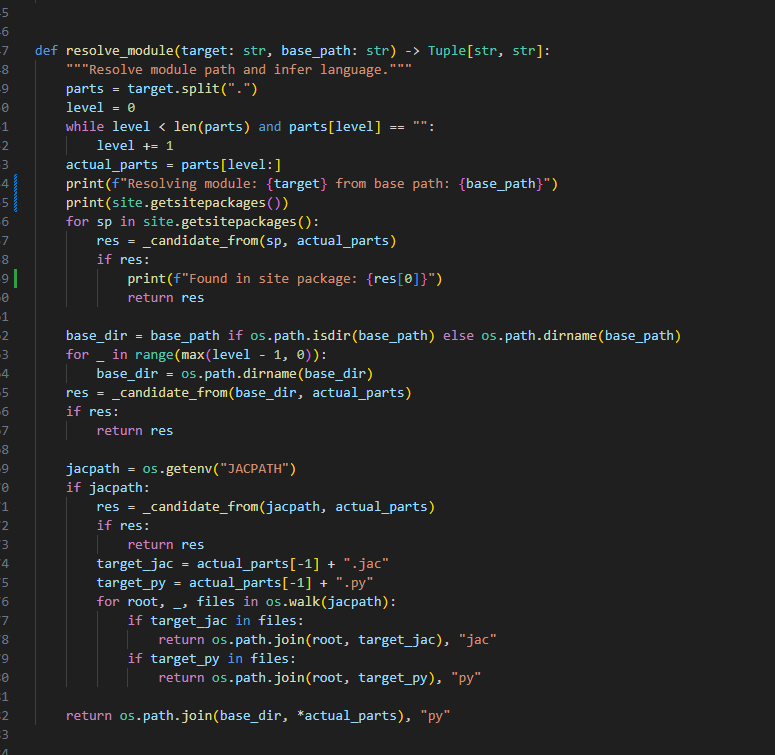
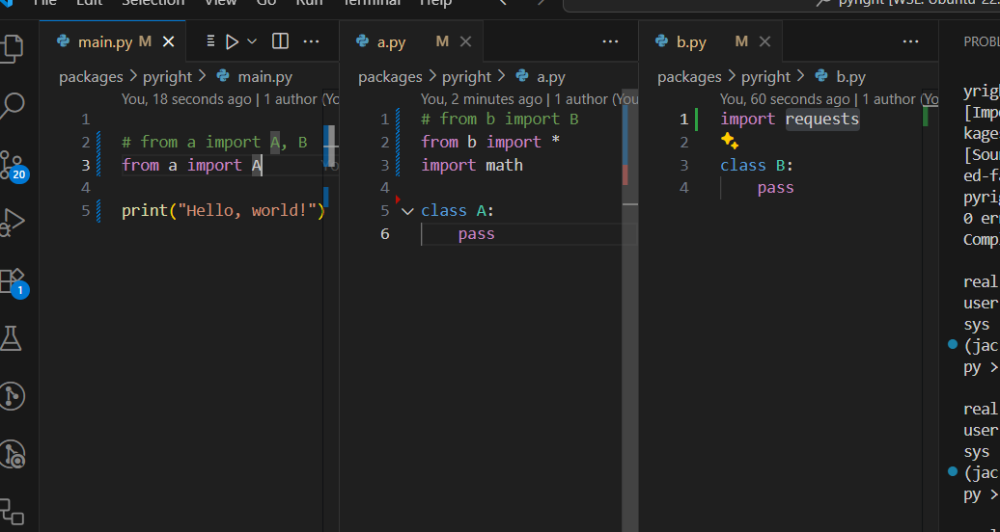
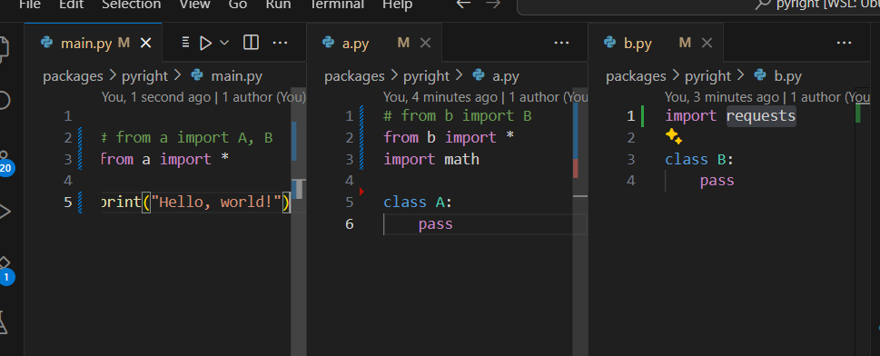

 
 
 

In this PR, currently handling  `built-in` or `standard` modules are not handled yet.

also we need to consider the 
`sys.path` and `PYTHONPATH` environment variable to resolve the modules correctly.
will be handled in the next PR.

if it is not a import *, we don't need to handle all import

this will only import main.a,b only 

## unexpected !!!! 

this will parse requests and math also !!!